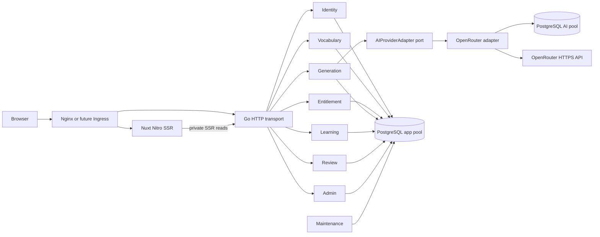

# M001 后端总体架构

> 当前效力：本文为 M001 已交付契约；正式完成状态、遗留事项和下一步见[当前交接](../handoffs/verification.md)。历史修订段中的“待实现/待审阅”仅表示当时步骤，后续接收与替代关系见[历史索引](../handoffs/archive.md)。本次只同步状态与检索入口，未新增业务批准。

> 当前交付已完成 r10 实施、QA132、前端同步及用户 UAT，证据见[当前 QA 报告](../verification/report.md)。本次 R10-ARCHITECTURE-SYNC 只同步已批准行为；有限纠正／续写的唯一规则见 [AI §3.1.1](./ai-integration.md#r10-corrections)。原文已[冻结](./archive/pre-m001-closeout-136.json)。以下 CR039/040 的历史设计与执行步骤保留追踪，不再代表待实施任务或再次清库授权；已知限制见[当前交接](../handoffs/backend-architecture.md)。

<a id="inline-mapping-115"></a>
## 历史修订：正文和hint就地原词标注（已实施）

- [需求闭环](../verification/stream-failure-diagnosis.md#inline-source-annotation)：AI输出实际形式(原词)，后端提取；stream/final均不显示标注。独立关系、全目标/重复位置和原词释义不变；不采用数组剔除或旧协议兼容。
- 最小改动：OpenRouter prompt/schema/严格Candidate → 共用标注解析与干净流式文本 → Validator在clean text计算occurrences → 现有ValidatedBatch/保存/复习。prompt m001-v5、validator m001-v5-wn31-r1，不更新词法资产。
- 公开API仍v1.5，数据库/前端形状不变；只读核对当前CompleteValid、DecodeSnapshot、createBatch和Review依赖，无数组持久化消费者。不新增SQL、迁移、重算或前端标注清理；后续隔离链路测试验证此边界。
- 复用T2–T5、CAS与额度策略。解析/流式/错误/边界、版本/探针和C39定向矩阵集中维护于[专项方案](./backend-cr039.md)，C40原词释义沿[产品合同](../product/ai-behavior.md#original-entry-meaning)，不复制第二套规则。
- 当前为设计交付，不宣称应用测试或真实质量通过；开发单工作区顺序实施，后续独立QA不重跑全站。模型调用、实际数据操作、UAT部署仍未授权。
- 本轮五份原专业文件已[完整冻结](./archive/pre-inline-mapping-115.json)；复用当前主文档和[交接](../handoffs/backend-architecture.md)，旧审批与证据不改。

<a id="cr040-scope-confirmation"></a>
## 历史修订：CR-040（已实施的切换设计记录）

### 确认闭环与不变边界

- **CR040-NAMING / CONFIRMED，2026-09-08**：用户已对全链路统一为 `entry_meaning` 及 DBA/前端有限同步回复“同意”。采用 `entry_meaning` / `EntryMeaning` / `entryMeaning`；不再保留旧名作为备选。
- **CR040-DATA-CUTOVER / CONFIRMED，2026-09-09**：用户“确定”完整清理范围，并“批准”数据库方案与后端同步，由 103 接收。保留／重置／删除对象、事务、恢复和 DB40 验证以 [DBA 当前真源](./database.md#cr040-data-cutover)为准，不在本文件再维护一份表清单。
- 撤销本轮本地切换的“全部旧批次/计量/草稿必须保留”和“组权限不调整”前提，改为上述已确认的一次性例外；**正常产品**的保存、删除、计量、TTL 和 [claim 删除规则](../reviews/claimed-batch-delete-retention-exception.md)不变。不是为其他环境或新产生的数据提供清理授权。
- 原词释义仅针对输入原词与目标语言，不依赖文章、场景、短语或派生映射，以 [AI 行为 §3.3](../product/ai-behavior.md#original-entry-meaning)为准；提示词/校验边界沿用 [AI 专项 §3.3](./ai-integration.md#cr040-prompt)。
- 保留一次调用、短文优先流式输出、CR-039 词法校验/全部挖空、两阶段答案、文章级标签和不翻译短语/正文。不增加查词服务、第二次调用、在线语义审核、文本截尾、历史释义重生成或全站重测。
- 不增加双字段、别名、旧 JSON 读取、旧端点或旧镜像支持，遵循 [USER-COMPAT-001](../reviews/first-release-compatibility-policy.md)。本次同步只承接已批准数据设计；不更改清理白名单、恢复边界或模型时限/费用。具体执行仍须后续授权。

### 后端边界与技术追踪

| 链路 / 责任 | 当前合同与本次差异 | 追踪 |
| --- | --- | --- |
| AI adapter / Validator | 维持 `EntryMeaning`、JSON `entry_meaning`、prompt/schema `m001-v4`、validator `m001-v4-wn31-r1`；词法资产与关系规则不变。 | CAP-008/009 → API-005 → DATA-010/011 |
| Generation → Learning | 新版校验成功后在既有 CAS 事务序列化当前形状；保存/claim 沿用原字符串，不重释义、不重跑映射、不二次计量。切换时旧业务数据按 DBA 方案清理，不转换旧草稿。 | CAP-010/011 → API-006 → DATA-012/013/017 |
| Library / Review / Admin | 正式目标及 spelling 初始/下一题使用新字段；详情与复习复用同一存储值。stage-two 不新增释义、原词或答案暴露。 | CAP-014/018/107 → API-007/008/103 → DATA-012/013/014；PAGE-004/006/008/103 |
| DBA（103 已接收） | `batch_targets.entry_meaning` 的列/约束、一次性清理、原子切换及恢复按 [DBA 方案](./database.md#cr040-cleanup-procedure)。后端只落实执行边界，不另写数据规则。 | DATA-003–018；不新增产品能力或数据资产 |
| Frontend（待有限同步） | strict DTO/schema → mapper → 应用状态/视图模型 `entryMeaning` → 已有组件；SSR 与客户端同合同，保留国际化和布局。 | API-005/007/008/103；[frontend.md](./frontend.md) |

[API v1.5](./api/index.md#cr040-entry-meaning) 已由 102 接收，公开路径仍是 `/api/v1`；本次不修改 API/AI 原件、HTTP 字段或错误码。API-006 外部结构不变；列表、统计、用户/组/模型 DTO 形状不变。结构迁移与本次数据清理不引入新 HTTP 端点。

### 跨角色交接

1. **DBA → 后端**：103 已完成数据库交付接收；本节以下将其接入维护入口、迁移器、同事务校验及启动顺序。不再要求 DBA 重复确认旧草稿转换或清理范围。
2. **前端**：同步 generation/learning/review strict schema、HTTP mapper、application models、create/library/review、管理员只读 presenter 及对应 mock/fixture；复习 action 返回的下一道 spelling item 不能遗漏。沿现有认证失效路径处理已清除会话，不新增旧数据恢复分支；不重做 UI/文案，不允许 API raw DTO 直接渲染。
3. **实施/验证**：本次后端/前端已接收并完成实施与验证，当前结果见[报告](../verification/report.md)。清理执行、配套部署和真实模型质量取证各自遵守执行范围，不能由“技术方案已批准”推导已执行或允许产生费用。

<a id="cr040-rollout"></a>
### 本地切换、失败与数据安全

仅本次已确认本地切换采用 [DBA 操作顺序](./database.md#cr040-cleanup-procedure)；日常部署仍运行正常 schema 迁移，不附带清理。以下接入已实施并经 CR040 定向验证；这里保留执行边界，后续任务不得自动重复这次清理。

| 后端位置 | 接入职责与边界 |
| --- | --- |
| [wordweave-admin](../../../../backend/cmd/wordweave-admin/main.go) | 已实现独立、显式调用的 `cutover-entry-meaning` 离线维护入口；其存在不是新的清理授权。使用经核实的本地目标和受控维护连接，禁止沿用普通 app 身份后再扩大其常驻权限；不初始化 AI 调用、密钥探针、HTTP handler 或后台清理任务。 |
| [postgres 迁移器](../../../../backend/internal/platform/postgres/migrate.go) | 将现有 applyMigration 的执行正文/记账边界提取为可接受调用方 tx 的内部函数，函数不自行 Begin/Commit；普通 Migrate 仍由原包装器逐迁移管理事务。本地维护入口自己持有唯一 tx，清理后执行 DBA 指定的同一份结构迁移并记账，不嵌套调用另开事务的 Migrate。正常迁移文件不夹带业务删除。 |
| postgres 验证 | 从 Verify 提取只依赖 Query/QueryRow 的只读校验边界，普通路径传 pool，本地切换传同一 tx；在既有账本、词表、组和 occurrence 检查之外核验新释义列/约束。清理零行、保留集相等和组重置检查只放在一次性维护校验，不能放进日常 readiness，使后续正常注册/学习被误判。 |
| [服务启动/停止](../../../../backend/cmd/wordweave/main.go)及 [maintenance](../../../../backend/internal/maintenance/maintenance.go) | 先关闭流量入口并停止本项目全部写入者，确认 HTTP、生成回调、清理定时任务和相关连接结束；“已发停止信号”或 readiness=false 不等于已停写。完成停止后才建立本次对账基准和数据库事务，清理不能与退出结算并发。 |

- **前置检查与拒绝重跑**：实际目标实例、结构/迁移前态、管理员、凭据引用和保留集必须匹配 DBA 前置条件；在获取固定顺序锁后再次核对。一次性入口只接受待切换前态：目标迁移未登记、源列存在且新列不存在；迁移已登记或新列已存在时在删除前拒绝，不能提供绕过开关。普通 migrate 已先完成结构切换的环境也不能被该入口再次清理。异常前态停止核对，不自动换编号、删账本或改成双读。
- **同一事务到底**：按 DBA 顺序删除/重置后，先检查所有延迟约束，再执行结构迁移及迁移账本写入，最后在同一 tx 完成保留项与后置条件核验。内部函数不得吞错、自动提交、改用 pool 读取未提交状态或调用上游；任一失败交由外层整笔回滚。
- **提交结果不明**：单独保留“未能确认提交结果”的状态，不报告成功或回滚，也不以通用 retry 再跑删除。保持停写，建立新连接核对账本/新列与 DBA 后置条件；无法证明结果则停止并报告。DBA 批准的[恢复限制](./database.md#cr040-recovery)优先，不用旧镜像、旧 reader 或新一轮清库补救。
- **提交后的运行**：只有配套新后端、Nuxt SSR/浏览器产物和目标 schema 才能共同开放；仍沿独立应用和 Nginx 路由，不改部署架构。旧 SSE、内存 review attempt/动作缓存不搬入新进程；旧会话/claim/run 不能恢复已清数据。管理员重新登录，学习者重新注册；管理员显式分配模型前，各组无可用模型，沿既有预检错误处理且不调用供应商/占用额度，不能在清理事务或启动时自动分配。
- **安全与可观测性**：维护日志仅含阶段、非敏感数量、核验结论和提交结果；不得输出 DSN、密码哈希、令牌、密文/nonce、原始数据库错误详情或学习正文。无需解密/替换现有模型密钥。备份、恢复保障及不能恢复已删业务数据的界限只引用 DBA，不新增保留期限、备份副本或长期审计资产。
- **正常业务不变**：新草稿只支持当前键，保存/claim/read/review 沿同一份释义，错误不留半批次；保持既有模型失败、退款和并发规则。释义人评失败不是新增自动拒绝/退款能力；真实模型调用时限与本轮维护超时相互独立。

### 后续实施与定向验证衔接

下表仅说明现有实施切片的依赖与增量，不是实现或本地数据操作授权；不复制 DBA 的删除清单/测试计划。

| 切片 / 责任 | 有限范围与验证依据 |
| --- | --- |
| AI / backend-ethan | 按 102 已批准的 AI 真源改字段、模板/schema 与版本，不改变 LexicalVerifier；[C40 定向技术验收](./ai-integration.md#cr040-verification)不变。 |
| 持久化与维护 / backend-ethan | 按 DBA 同步 SQL/dbgen、Generation/Learning/Review 与草稿字段；实现上述同 tx 边界及一次性前态保护。复用 [DB40-01–05](./database.md#cr040-database-validation)，覆盖错误目标/锁冲突、删除/结构/记账失败、提交不明、新数据后拒绝重跑；普通 migrate/verify 不清数据、不要求日常业务零行。 |
| HTTP / backend-ethan | 维持 v1.5 fixture 与下一题新字段一致；API-006 仅核对保存内容一致，管理员复用只读详情；不增加维护接口或错误码。 |
| Frontend / frontend-claire，依赖 frontend-bob | 同步转化链、视图模型和 mock，以相同 v1.5 fixture 覆盖工作台、保存后详情、复习与管理员只读；不扩大视觉范围。 |
| 独立验证 / qa-quinn | 将数据库/当前合同可靠性与 [C40 原词语义](../product/ai-behavior.md#cr040-acceptance)分开记证；隔离库合成数据验证切换与拒绝重跑，不拿真实 UAT 库做失败注入。实际模型、预算和留样另行授权，不重跑全站。 |

本轮风险没有新增业务选择：运行库身份、权限、锁/WAL、停止结果和恢复保障尚未实测，执行前必须核实；若实际条件不符，停止并显著报告，不改变已确认范围。同次 AI 调用仍可能发生语义偏差，技术结构通过不能代替质量人评。

### 文档整理与历史来源

本轮仅维护本文件与[当前后端交接](../handoffs/backend-architecture.md)。102 批准的这两份原文已完整保存于 [pre-cr040-backend-cutover-sync.json](./archive/pre-cr040-backend-cutover-sync.json)，包含原路径与摘要；更早四份原文仍在 [pre-cr040-design.json](./archive/pre-cr040-design.json)。两个快照分别对应不同批准版本，不覆盖旧审批或证据。

[AI 专项](./ai-integration.md)、[API 真源](./api/index.md)、DBA、产品/UI/前端与 workflow 均不修改。下方未重开的架构基线保持；发布入口只更新为本轮边界引用，旧兼容/保留文字不构成本次兼容、全量回归或运行授权。

## 1. 结论与边界

### 1.1 已确认架构

- M001 使用 **Go 1.26 当前安全补丁版**、标准 `net/http`、Chi、pgx v5 与 sqlc；不引入全栈框架或运行时 ORM，见 [`DEC-026`](../decisions/DEC-026.md)。
- 采用一个可部署进程内的模块化单体、一个 PostgreSQL 18 主数据库和一个公开 HTTPS origin。M001 不引入 Redis、消息队列、对象存储、搜索引擎、读副本或微服务。
- 浏览器通过同源 `/api/v1` 使用不透明 Cookie 会话；所有写请求经过 Origin、Fetch Metadata 与会话绑定 CSRF 校验，见 [`DEC-028`](../decisions/DEC-028.md)。
- 生成使用一次 POST SSE、独立取消接口和单应用副本；活动取消函数只在进程内，正式状态由 PostgreSQL CAS 决定，见 [`DEC-027`](../decisions/DEC-027.md)。
- AI 领域契约与供应商无关；M001 只实现 OpenRouter 原生结构化流适配器，见 [`DEC-029`](../decisions/DEC-029.md) 与 [`ai-integration.md`](./ai-integration.md)。
- PostgreSQL 原始 SQL 迁移是 schema 真源；OpenRouter 调用永远位于数据库事务之外，数据库边界继承自 [`database.md`](./database.md)。
- 前端采用 Nuxt 4 运行期 SSR；同源入口把页面与 `/_nuxt/**` 交给 Nitro，把 `/api/v1/**` 直接交给 Go。Go 不充当 Nuxt BFF，POST SSE 不经 Nitro 转发或转换，见 [`DEC-030`](../decisions/DEC-030.md)。
- API success DTO 与数据库/领域对象显式隔离，handler 只通过 projection mapper 构造 [`api/index.md`](./api/index.md) 投影；CR-040 的 v1.5 增量只替换释义字段，既有 generation_quota 等其他投影不变，继续遵守 [`DEC-031`](../decisions/DEC-031.md) 的 SSR/客户端转换边界。
- 依据 [`DEC-032`](../decisions/DEC-032.md)，同一目标词可在提示短语中以同一或不同合法词形自然出现多次；服务端保存并挖空全部提示位置，但阶段一始终只有一个原词答案。规范位置来自 `hint_occurrences`，旧 `batch_targets.hint_*` 只作为 M001 兼容影子列。
- 依据 [`DEC-033`](../decisions/DEC-033.md)，仓库根只承载跨应用规划与组合部署；Go 位于独立 `backend/`，Nuxt 位于独立 `frontend/`，Nginx 位于独立 `nginx/`。三个组件均为独立构建/镜像边界，详细合同见 [`deployment.md`](./deployment.md)。
- 依据 [`DEC-034`](../decisions/DEC-034.md)，三个组件各自拥有 Dockerfile，根级使用 `compose.yaml` 组合；不保留根级全栈 Dockerfile。
- 依据 [`DEC-035`](../decisions/DEC-035.md)，短文填空的同源关系由已验证的 `passage_occurrences.target_id` 派生；学习者 API 只返回当前短文题有效的匿名分组键，不返回原词、内部目标 ID、答案长度或可逆映射，随机颜色和纹理由前端维护。
- 依据已批准 PAGE-103 交互与 [`CR-021`](../changes/CR-021.md)，管理员用户搜索由服务端按 `(match_tier, lower(username), id)` 稳定分页，精确匹配置顶；cursor 保持不透明并绑定管理员、查询和内部版本，前端不承担跨页排序。

### 1.2 M001 明确不承担

- 不提供公共 API、第三方 API Key、OAuth/OIDC、原生客户端协议或跨源前端部署。
- 不支持生成跨刷新恢复、多副本取消协调、异步任务队列或跨模型 fallback；只允许 [r10 有限纠正／续写](./ai-integration.md#r10-corrections)，不增加传输故障重试或无限修复。
- 不增加产品未批准的审核、分享、支付、审计日志、成本报表、题目级长期进度或用户自由 Prompt。
- 不把 Go 与 Nuxt 合并到同一进程/镜像，不让 Go 托管前端产物，也不让 Nitro 充当 `/api/v1` BFF。
- 不生成 OpenAPI；首版 API 契约以 [`api/index.md`](./api/index.md) 为真源。

## 2. CAP → 用例 → API → DATA 追踪

| 产品能力 | 后端用例 | API 契约 | 主要 DATA / 表 | 责任模块 |
| --- | --- | --- | --- | --- |
| CAP-001、CAP-021 | 建立浏览器上下文、解析身份、同步界面语言 | API-001 | DATA-004/005/018；`account_sessions`、`visitor_identities`、`accounts.ui_locale` | Identity |
| CAP-002、CAP-003 | 注册、登录、退出与角色分流 | API-002 | DATA-003/004/017/018；`accounts`、`account_sessions` | Identity |
| CAP-004、CAP-005 | 自助改密、账号注销 | API-003 | DATA-003/004/009/012–018 | Identity + Learning |
| CAP-006、CAP-007 | 词条搜索、获取本组生成选项与额度 | API-004 | DATA-001/002/006/008/009 | Vocabulary + Entitlement |
| CAP-008、CAP-009 | 预检、占额、流式生成、取消、验证与退款 | API-005 | DATA-006–011；`generation_runs`、`generation_drafts` | Generation + AI Adapter |
| CAP-010、CAP-011 | 保存、放弃、访客承接与认证后绑定 | API-006 | DATA-009–013/017；`visitor_claims`、`learning_batches`、`hint_occurrences` | Generation + Learning |
| CAP-012、CAP-013、CAP-014、CAP-015、CAP-016 | 六项统计、批次列表/搜索/详情、参与状态、删除 | API-007 | DATA-002/009/012/013/015/016 | Learning |
| CAP-017、CAP-018、CAP-019、CAP-020、CAP-022 | 日期范围/单批次会话、答题、恢复、完成 | API-008 | DATA-012–016；`review_*` | Review |
| CAP-101、CAP-102 | OpenRouter 凭据与模型生命周期 | API-101 | DATA-006–008 | Admin AI |
| CAP-103 | 四个固定组策略维护 | API-102 | DATA-006/008 | Entitlement Admin |
| CAP-104、CAP-105、CAP-106、CAP-107 | 用户查询、换组、重置密码、只读学习库 | API-103 | DATA-003/004/006/009/012/013/015 | Admin Support |
| 运行保障 | 存活、就绪、指标与维护命令 | API-900 | 数据库迁移、词表摘要、运行指标 | Platform |

CAP-001 首页正文由同源静态前端提供，不需要业务数据接口；API-001 只建立当前浏览器执行上下文。

## 3. 模块化单体



### 3.1 模块职责

| 模块 | 职责 | 不允许承担 |
| --- | --- | --- |
| `identity` | 访客身份、注册登录、会话、CSRF、改密、注销、界面语言 | 生成额度、学习内容查询 |
| `vocabulary` | M001 快照搜索、精确词条解析、摘要启动校验 | 用户自由词条或后台编辑 |
| `entitlement` | 固定组策略、可用模型/长度、滚动额度只读投影 | 生成终态结算 |
| `generation` | T2/T3、活动运行、浏览器 SSE、取消、草稿、保存/放弃/claim 编排 | 供应商 HTTP/JSON 细节 |
| `ai` | 供应商无关端口、Prompt/schema、OpenRouter 适配、候选验证 | 账号授权、额度、正式学习写入 |
| `learning` | 批次保存、列表、搜索、详情、参与状态、删除、统计 | 管理员写用户内容 |
| `review` | 两类会话、固定随机顺序、内存答题尝试、短文同源匿名投影、批次结果与恢复 | 保存答案、题目级长期草稿或视觉颜色映射 |
| `admin` | 凭据/模型、组策略、用户支持用例；组合下层专用端口 | 冒充、删除账号、写用户学习内容 |
| `maintenance` | 过期数据小批清理、启动结算、初始管理员命令 | 对外业务路由 |
| `platform` | HTTP 中间件、配置、日志、指标、数据库池、加密、时钟/随机数 | 业务规则 |

### 3.2 仓库与后端目录

```text
project/
  .planning/                    跨应用规划与合同
  backend/                      独立 Go module 与 Docker context
    cmd/wordweave/              HTTP 服务入口
    cmd/wordweave-admin/        迁移、初始管理员与维护命令入口
    internal/platform/          httpx、postgres、crypto、logging、metrics、clock
    internal/identity/          domain、service、repository、transport
    internal/vocabulary/        domain、service、repository、transport
    internal/entitlement/       domain、service、repository、transport
    internal/generation/        domain、service、registry、repository、transport
    internal/ai/                contract、validator、openrouter
    internal/learning/          domain、service、repository、transport
    internal/review/            domain、service、attempt registry、repository、transport
    internal/admin/             service、只读/配置 transport
    internal/maintenance/       cleanup、startup settlement
    db/migrations/              不可修改的顺序 SQL
    db/queries/                 sqlc 查询
    assets/vocabulary/          冻结词表 JSON 与摘要清单
    Dockerfile                  后端独立镜像
  frontend/                     独立 Nuxt 应用与 Docker context
  nginx/                        独立同源 edge 与 Docker context
  compose.yaml                 本地/单机组合入口
  README.md
```

- transport 只负责 HTTP、严格解码、身份注入与 DTO；业务规则进入 application service。
- 模块通过窄接口协作，不跨模块直接调用对方生成的 sqlc 查询。
- `internal/ai/openrouter` 是唯一理解 OpenRouter SSE、字段、路由参数和密钥的包；领域层不引用供应商类型。
- 普通用户学习仓储与管理员只读仓储使用不同接口；管理员路由无法获得任何学习写方法。
- 时钟、随机数、密码哈希和 AI adapter 均通过接口注入，以便并发、过期和失败测试确定复现。
- 所有 Go、sqlc 与后端测试命令以 `backend/` 为工作目录；`go.mod` 继续保持 module path `wordweave`。Dockerfile 不得以仓库根为 context，也不得复制 `.planning/`、`frontend/` 或 `nginx/`。

### 3.3 部署单元边界

- `backend` 镜像包含 Go HTTP binary 和供一次性 job 使用的 `wordweave-admin`，但常驻入口只有 HTTP 服务；迁移/创建管理员不会作为第二个常驻进程运行。
- `frontend` 镜像只运行 Nuxt Nitro；浏览器调用相对 `/api/v1`，Nitro SSR 通过私有 internal origin 访问 backend。
- `nginx` 镜像只负责同源路径、可信转发头、安全响应策略与 SSE 透传；不解析业务 JSON、Cookie 内容或 SSE data。
- 根级 Compose 只组合 `postgres/migrate/backend/frontend/nginx`。默认只有 Nginx 端口公开，backend/frontend/PostgreSQL/metrics 都只在私网可见。
- 未来 Kubernetes Ingress 替换 Nginx 时不改变三方应用契约；backend 在 DEC-027 被替代前仍必须使用单副本和 `Recreate`/等价发布策略。

## 4. 核心用例与事务

### 4.1 身份与会话

#### 注册

1. API-001 已建立或恢复访客身份，并给出 CSRF token；当前有效界面语言由浏览器偏好与语言匹配得到，并随注册请求提交。
2. API-002 严格验证用户名、密码、确认值和支持语言；先在事务外执行 Argon2id。
3. 单事务插入学习者账号和首个账号会话；账号默认 `registered`，保存当前浏览器语言。
4. 唯一索引冲突映射为 `USERNAME_TAKEN`；不先查后插。
5. 提交后设置全新账号 Cookie；访客 Cookie 不被提升为账号会话。若浏览器持有 claim，前端随后调用 API-006 消费。

#### 登录、退出与过期

- 登录使用统一错误 `AUTHENTICATION_FAILED`，不暴露用户名是否存在。验证成功创建新会话并按账号偏好合并语言。
- 普通退出只删除当前 `account_sessions` 行并清除账号 Cookie；访客 Cookie和浏览器语言仍保留。
- 学习者会话：空闲 7 天、绝对 30 天；管理员：空闲 30 分钟、绝对 8 小时。每次认证服务端同时检查 `created_at`、`last_seen_at`、`expires_at`，过期即删行。
- `last_seen_at` 至多每 5 分钟更新一次；读取请求不会每次写数据库。

#### 改密与注销

- 自助改密在事务外验证当前密码并生成新哈希；事务锁定账号、更新哈希、删除除当前会话外全部会话。
- 管理员重置密码更新哈希并删除目标账号全部会话；管理员当前会话不受影响。
- 注销再次验证当前密码与 `confirmed=true`，在短事务删除账号，由数据库级联；提交后清除账号 Cookie。失败时不做部分删除。

### 4.2 生成主链路

```text
严格 HTTP 解码
  → 身份/CSRF
  → T2 主体行锁、白名单/组/额度/凭据预检、active run
  → 提交事务
  → 建立进程内 run registry
  → OpenRouterAdapter 建立上游流
  → 发送浏览器 SSE started + passage.delta
  → 完整候选验证
  → T3 CAS 唯一终态 + 可选 generation_draft
  → SSE validated 或 failed
```

1. API-005 请求体只允许 `entries`、内部模型 UUID、`meaning_language`、`scenario`、`length`；任何未知字段在 T2 前拒绝。
2. T2 按数据库方案锁定账号或访客，重新读取词表、组、模型、长度、额度和凭据配置；插入 `active` 运行与有序词条后提交。
3. 生成 32 字节 `run_token`。原文只发给当前浏览器；摘要和取消函数进入进程内 registry。它不是账号认证凭据。
4. OpenRouter 在事务外调用。上游成功建立前若失败，T3 结算 `provider_failed` 并在尚未发送 SSE 头时返回 Problem JSON；上游建立后发送 `generation.started`。
5. adapter 只把已解码的 passage 字符转换为 `passage.delta`；原始部分 JSON 不进入浏览器或日志。
6. 流结束后按 [`ai-integration.md`](./ai-integration.md) 完整验证。校验器独立扫描每个 `hint_phrase` 与整篇 `passage`，生成按 Unicode code point 排序且互不重叠的全部 occurrence；不信任模型位置。只有全部通过才在一个 T3 事务将运行 CAS 为 `valid`、写入草稿，并把 run token 摘要写为 `generation_drafts.access_token_hash`。
7. 任意 `active → terminal` 都使用 `UPDATE ... WHERE call_status='active'`；取消、断流、供应商失败和正常完成只能一个获胜。
8. T3 完成后删除 registry 项并发最终 SSE。若客户端已断开，数据库终态仍是唯一结果。

### 4.3 主动取消与被动断开

<a id="refund-recovery-041"></a>

#### CR-041：失败结算真实投影与恢复

CONFIRMED：[用户边界](../changes/CR-041.md)为“前端表现不变，允许内部修改与标记”。撤销先前新增用户可见“退还处理中”的建议；采用现有模块化单体/单副本/数据库唯一终态，无新表、队列服务、旧版协议兼容或模型重试。

- `generation.failed.quota_refunded` 是已确认事实，不是承诺：T3退款成功或回读确认失败且未占额时true；结算尚未确认时false。错误code/retryable、失败视图及保存限制不变。前端只将严格传输校验改为boolean；reducer不依赖此字段，需验证true/false下应用状态相同。
- 在现有run registry内部保存待结算的run ID、首个失败状态/固定code与尝试时间；不存候选、正文、密钥、token原文，不向浏览器暴露内部pending状态。实际DB保持active直到现有CAS成功；故障恢复前该主体可能仍受现有活跃互斥限制，不虚报立即可用额度。
- 每次结算以独立有限context执行；失败或CAS输家回读实际终态，区分失败已退款、用户取消、有效完成、记录已删除和仍待结算。未知/查询失败不能当作退款成功。取消/有效完成获胜时不得被补退覆盖；提交结果不确定时回读可恢复真实结果。
- 运行维护器每5秒处理最久未尝试的最多200条待结算任务，全轮最多5秒；剩余留待下轮，不为每个任务派生无限goroutine，不按生成年龄清理真正活动的运行。常规五分钟清理失败不能阻断补退。已终态/已删除任务退出队列；pending不按终态token一小时策略清理。
- 浏览器断开后任务继续保留；进程崩溃由已批准的启动恢复将遗留active结算server_failed。无需另存失败内容或新增持久化队列表：已提交active记录就是恢复依据。仅承诺数据库恢复且维护器/启动恢复运行时重试，不宣称数据库永久不可写仍能退款。
- 公开SSE继续一次失败终态并及时结束；退款未确认不令浏览器等待后台任务。所有Status回读有时间界限，日志固定分类，关联run ID，不回显数据库错误文本。补退不产生新的模型请求、学习资源或累计次数。

测试：持久失败返回false且不假报退款；解除故障后自动补退；重复/并发补退幂等；取消/有效/删除终态不覆写；查询超时/不确定提交；运行中长生成不被扫退；重启恢复；SSE/前端传输→转换→状态true/false等价。沿用现有P0矩阵，不另建分散计划。

- API-005 的读取连接关闭只代表被动断开。处理器观察 `request.Context().Done()`，尝试 CAS `stream_failed` 并退款，再取消上游。
- 用户点击取消先调用 API-005 的独立取消操作，提交 `run_id`、`X-Generation-Token` 和 CSRF token。后端先 CAS `user_cancelled`，成功后才调用 registry 中的 cancel function。
- 取消接口是状态幂等的：重复调用返回当前终态；若断流/完成已先获胜，不覆写终态。
- OpenRouter 端可能在断开后继续产生外部成本；本地额度仍严格按已确认终态结算，差异只进入运维指标。

### 4.4 保存、放弃和访客承接

- 有效草稿与活动 claim 的 M001 TTL 均为 30 分钟；这是可配置工程基线，不提供跨刷新恢复。原文 token 只存在前端内存，刷新后即使服务器行未清理也不可取得。
- 登录学习者保存：API-006 用 `run_id + X-Generation-Token` 锁定本人运行/草稿，在一个事务创建批次、目标、全部 `hint_occurrences` 与 `passage_occurrences`，将 disposition 改为 `saved` 并删草稿；唯一键保证重试返回同一批次。兼容发布期间还把第一条提示 occurrence 双写到旧 `batch_targets.hint_*`，但任何新读取不得以该影子列为规范来源。
- 放弃：本人或访客可把 valid/pending 原子改为 `abandoned` 并删草稿；重复操作返回当前 disposition，不产生批次。
- 访客点击保存先创建一次性 claim；claim token 原文仅在当前认证流程内存中。登录/注册成功后，以当前账号消费 claim，T5 原子写批次、累计归属和 consumed 结果。
- consumed claim 保留 24 小时只用于相同账号的网络重试，然后清理；不得绑定第二账号。

### 4.5 学习库与统计

- API-007 所有学习者查询由会话推导 `owner_id`；请求不能提交 owner。不存在、已删除和其他账号批次统一返回 404。
- 列表使用 `(saved_at,id)` keyset cursor，从旧到新；搜索先精确解析词表条目，再按 `vocabulary_entry_id` 查询，不搜索正文、释义或标签。
- 六项统计由 SQL 实时聚合；不建立缓存表。列表和统计可在同一请求中分别查询，不为一致快照保持长事务。
- 参与复习 PATCH 是幂等布尔赋值，只影响未来日期范围选入。
- 批次删除使用 T9；生成计量保留，当前内容/复习统计自然变化。

### 4.6 复习会话与不泄露答案

- API-008 创建日期范围会话或单批次会话时在一个事务固定批次顺序和目标顺序；数据库部分唯一索引处理重复点击。
- PAGE-007 通过 API-008 的 active-range 只读投影发现当前唯一未完成日期范围会话；该查询不创建会话，也不混入单批次会话。
- 每个账号最多一个未完成日期范围会话；每账号/批次最多一个未完成单批次会话。两种模式可并存。
- 数据库只保存批次级完成结果。当前批次的答题状态位于进程内 `ReviewAttemptRegistry`，绑定账号会话、review session 和 batch。
- 创建 attempt 会使同一账号/会话/批次的旧 attempt 失效并从阶段一重新开始；页面刷新失去原文 attempt token，符合“当前批次重来”。
- attempt 空闲 2 小时清理；进程重启全部清理。它不构成产品保存期限，也不改变已完成批次结果。
- API 从不返回 `source_entry`、任一提示 occurrence 的 surface/位置、完整未挖空提示短语或正确答案；只返回释义、已将全部提示位置挖空的安全片段、短文文本片段、不含答案的 `blank_id`，以及仅表达空位同源关系的题目级 `group_key`。
- 阶段一每个目标仍是一个 item、一个输入值和一次 answer/skip action。安全投影用服务端已验证的全部提示 span 逐段构造，可以产生一个或多个 blank segment；不得用字符串全局替换或让前端重新查找词形。
- 每次 answer/skip action 在服务端校验并更新内存错误/跳过状态；前端提供 `action_id`，registry 缓存最近结果避免网络重试重复计数。
- 最后一个题目结束时调用 T8，唯一写入 `review_results`；错误后改正仍可成功，任何 skip 使该批次 unsuccessful。写入成功后 attempt 只保留只读完成投影直至短期清理。

### 4.7 管理用例

- 用户搜索先 trim 并规范化查询。仓储层为每行派生 `match_tier`：非空查询的大小写无关精确匹配为 0，其他包含匹配为 1；使用 `(match_tier,lower(username),id)` 升序和相同三元 keyset 条件。SQL 只使用绑定参数和固定排序表达式，不拼接查询或排序字段。
- `AdminUserCursorV2` 的签名载荷包含版本、tier、规范化用户名与 ID；签名 scope 同时绑定 endpoint、管理员账号 ID 和规范化查询。旧二元 cursor、跨主体/查询 cursor 与语义非法载荷统一映射为 API-103 的 `422 cursor invalid`，不能以零值补全。
- OpenRouter 密钥替换先在事务外验证凭据；401/403 不替换，网络失败保留旧密钥并返回可重试错误。成功后 AES-256-GCM 信封加密并覆盖单例配置，只返回状态与指纹。
- 模型创建始终为 disabled。启用在事务外查询 Models API并运行最小结构参考样本；通过后短事务置 enabled。修改 provider model ID 自动置 disabled，需重新启用。
- 组策略允许保存无模型、无长度或零额度；额度可为非负整数或“不限制”，其中 0 表示禁止生成。非法组、负额度与非正词条上限拒绝。固定四组不能增删改名。
- 换组锁定目标学习者，限定 `registered/pro/plus`，同时更新 `quota_reset_at`；不能授予 admin。
- 管理员学习库只使用 `AdminLearningReader`，没有 PATCH/DELETE/review 方法；路由层和服务层都拒绝用户内容写操作。

#### CR-033 用户详情额度补充（待审）

GET 用户详情与 PUT 换组的 data.user 新增精简 generation_quota；三分支、单 SELECT 快照与同事务换组返回见 [CR-033 方案](./backend-cr033.md)。只使用 app pool 的现有账号/组/计费数据，不复用 Entitlement.Options 的模型/凭据读取。无新迁移或额度写端点；其他管理员能力不变。

### 4.8 DEC-032 多提示位置边界

- AI 原始候选不再声明提示/正文 surface、offset 或出现次数；模型只生成正文、标签、释义和提示短语。服务端用规范词条的完整允许词形集合扫描原始提示短语与正文，生成全部 occurrence，避免把模型冗余声明变成新的无效生成来源。
- 领域层的 `ValidatedTarget` 只包含 `HintOccurrences []Occurrence` 与 `PassageOccurrences []Occurrence`，不再保留单数 `HintSurface` 或 `HintBlank`。每个数组非空、按 `start,end` 升序、同数组内不得重叠，surface 必须能从原文按 code point span 精确复算。
- 保存、访客 claim 消费与任何批次复制路径必须写入全部提示 occurrence；读取批次详情和创建复习 attempt 只读 `hint_occurrences`。缺行、越界、重叠或影子列与首条规范记录不一致都视为数据不完整并 fail closed，不回退到旧单位置列。
- 对外生成结果与批次详情使用复数 `hint_blanks`；复习接口不返回这些位置，只返回服务端构造的安全 segments。M001 尚未发布，因此不并存单数/复数字段，避免两个真源。

### 4.9 DEC-035 短文同词匿名投影

`PROPOSED`：API v1.3 为阶段二每个 blank segment 增加必填 `group_key`，采用每次 attempt 随机生成的固定长度高熵不透明值。它只表达当前短文题内的等价关系，不是资源 ID、答案 ID 或提交字段。

构造规则：

1. Review repository 在所有权约束下批量读取 `passage_occurrences.target_id,surface,start_offset,end_offset`，按 `start_offset,end_offset` 排序；`target_id` 只能停留在仓储与领域组装层。
2. 从正文开头扫描 occurrence。第一次遇到一个 `target_id` 时建立下一个内部组序并生成新的 `group_key`；后续相同目标的相同或不同词形复用该键。不得按 `batch_targets.input_order` 或 `review_session_targets.target_order` 分配。
3. 为每个 occurrence 独立生成 `blank_id` 并保存 `blank_id → surface` 答案映射；另保存 `target_id → group_key` 组映射。答案 action 只使用 `blank_id`，服务端忽略并拒绝客户端提交的 `group_key`。
4. `group_key` 与 `target_id` 不得通过拼接、编码、数据库 ID 截断或可跨 attempt 的稳定 HMAC 生成。M001 复用安全随机 ID 生成器，以 16 字节 CSPRNG 原始值编码为 22 字符无填充 base64url，并加 `grp_` 前缀；若当前 item 内发生组间碰撞则重新生成。所有键格式与长度一致，避免携带答案长度、选词顺序或可关联历史。
5. 完整 passage item 连同 group key 保存在现有 `ReviewAttemptRegistry`。同一次 attempt 的错误重试、前端语言切换和组件重渲染复用同一 item；新建 attempt 时允许生成新键，但同词等价关系仍由不可变 occurrence 稳定重建。
6. 同一目标的键不一致、不同目标键碰撞、位置缺失/重叠/越界或 substring 不匹配时，attempt 创建失败并记录低基数完整性错误；不得回退到输入顺序、猜测词形或暴露内部 ID。

前端收到 `group_key` 后在状态管理层建立随机“颜色 × 纹理”映射，并可按 passage segments 第一次遇到各键的顺序派生仅辅助技术可读的匿名字母名称。视觉样式、匿名读屏名称与聚焦联动都不回传后端、不写入数据库，也不参与正确性判定。

## 5. 数据访问、并发与幂等

### 5.1 数据库池与 SQL

- 服务进程建立 `wordweave_app` 和 `wordweave_ai` 两个小型 pgx pool；迁移使用独立、短期 `wordweave_migrator` 凭据，维护命令使用专用权限。
- `wordweave_app` 无法读取 OpenRouter 密文；`wordweave_ai` 只用于凭据与生成适配路径，不能读取任意学习库。
- 池大小不在代码常量中按未知规模猜测：默认建议每池 4 个连接，生产由数据库总连接预算和压测调整；必须设置 acquire timeout 并暴露池指标。
- sqlc 生成的查询必须显式使用 `wordweave.` 限定名；禁止运行时自动迁移和 ORM schema sync。
- 事务默认 `READ COMMITTED`。只有数据库明确判定可重放且外部副作用尚未发生时，才对 `40P01`/`40001` 做最多 2 次带抖动重试。
- API-103 的派生排序键不得落库。查询可使用 CTE/子查询计算固定 `CASE` tier，并以 `limit+1` 判断 `has_more`；只有返回页的最后一项生成下一 cursor。当前前导通配符包含搜索不新增 `pg_trgm`，实现阶段按 database.md 10.5/14.4 在代表性账号量上记录 `EXPLAIN (ANALYZE, BUFFERS)` 后再决定是否提出索引迁移。

### 5.2 并发决胜规则

| 竞争 | 唯一决胜 |
| --- | --- |
| 同主体两个生成 | 主体行锁 + active 部分唯一索引 |
| 完成/取消/断流 | `active` 条件 CAS；一个终态获胜 |
| 保存/放弃 | 锁定 run/draft + disposition 条件更新 |
| 同一访客 claim 重试/跨账号 | token hash 行锁 + run unique + consumed account 固定 |
| 换组/生成 | 都先锁同一账号行；先获得锁者决定快照顺序 |
| 两次创建单批次会话 | 部分唯一索引，冲突后读取既有会话 |
| 批次结果重复提交 | `UNIQUE(session_id,batch_id)` |
| 删除批次/完成复习 | 锁定 session/batch；删除后 attempt 返回资源不存在 |

不引入通用 Idempotency-Key 存储。只有会产生重复资产的保存、claim、复习创建/完成路径由领域唯一键和能力 token 提供语义幂等。

## 6. 身份、授权与浏览器安全

### 6.1 Cookie 与 CSRF

- 生产账号 Cookie：`__Host-ww_session=<opaque>`；访客 Cookie：`__Host-ww_visitor=<opaque>`；均为 `Secure; HttpOnly; SameSite=Lax; Path=/`，无 `Domain`。
- token 使用 32 字节 CSPRNG；数据库摘要为 HMAC-SHA-256(token, 独立 pepper)，比较使用 constant-time。不同 token 类型使用不同派生 key。
- API-001 通过同源响应返回与当前会话/访客身份绑定的短期 HMAC CSRF token；前端只保存在内存并以 `X-CSRF-Token` 提交。
- 所有 POST/PUT/PATCH/DELETE 同时要求：精确匹配配置的 `PUBLIC_ORIGIN`、`Sec-Fetch-Site` 非 cross-site、正确 CSRF token、期望 Content-Type。缺失 Origin/Referer 默认拒绝；健康检查不走浏览器写路由。
- 登录/注册前也已有访客身份和 CSRF token，避免把未认证表单排除在来源校验之外。

### 6.2 密码与认证防滥用

- 密码按 Unicode code point 校验 8–128 字符，使用 Argon2id；参数至少达到当期 OWASP 基线，并在目标容器上调到单次约 100–250ms、且不突破并发内存预算。
- 哈希字符串保存算法、版本、salt 与参数；登录成功时若参数落后，生成新哈希并条件更新。
- 单实例内存令牌桶限制登录、注册、改密和管理员重置：按 HMAC 后的规范化用户名与可信代理解析出的粗粒度来源组合限速，原始 IP 不入库、不进业务日志，也不用于访客额度。
- 认证失败、未知用户名与错误密码采用同类响应和近似工作量；为未知用户名执行固定 dummy Argon2id 验证。

### 6.3 授权矩阵

| 资源 | 访客 | 学习者 | 管理员 |
| --- | --- | --- | --- |
| 词表/自身选项/生成 | 访客组 | 所属组 | 禁止 |
| 有效草稿放弃/claim | 当前浏览器 | 本人保存/放弃 | 禁止 |
| 学习库/统计/复习 | 禁止 | 仅 owner | 指定用户只读 |
| 自助改密/注销 | 禁止 | 本人 | 管理员不能注销自己或用户（M001 无该能力） |
| 密钥/模型/组/用户支持 | 禁止 | 禁止 | 允许已定义操作 |

请求永远从会话解析角色和 owner；客户端提交的角色、组、额度、provider model ID 或 owner ID 一律不受信。

## 7. API 通用约定

- 完整路由、字段、响应、错误和 SSE 事件见 [`api/index.md`](./api/index.md)。
- 普通 JSON 成功响应统一为 `{data,meta}`，`204`、SSE、健康检查与 metrics 是仅有例外。keyset 列表统一使用 `data.items + meta.next_cursor + meta.has_more`；cursor 绑定主体、endpoint、排序与筛选。
- HTTP projection 使用独立 DTO 与显式 mapper；不得直接序列化 sqlc row、数据库列结构、领域 aggregate 或供应商对象，也不得用对象展开把新增内部字段意外带入响应。
- 客户端可见方案使用稳定 `basic | pro | plus | null`，管理组使用 `visitor | basic | pro | plus`；数据库 `registered` 只在 repository/mapper 边界内转换，API 不返回已本地化方案名称。
- 复习 item 和 action outcome 是严格判别联合；不属于当前分支的字段不得序列化，任何分支都执行答案敏感字段负向测试。
- 阶段二 blank segment 必须同时含 occurrence 级 `blank_id` 和题目级 `group_key`。同组复用 group key、不同组使用不同 key；spelling blank 与 text segment 均不得携带该字段，action body 也不得接受该字段。
- `generation.validated` 与 `BatchDetailDto` 的 `hint_blanks` 是非空、升序、不重叠的安全位置数组且不含 surface；阶段一 `hint.segments` 可以含多个 blank，但 action body 仍只有一个 `answer` 字符串。
- JSON 使用 `snake_case`、UTF-8；时间使用 UTC RFC 3339，日期使用 `YYYY-MM-DD`，时区使用 IANA 名称。
- JSON decoder 拒绝未知字段、重复 key、尾随第二个值和类型强制转换；每类请求通过 `http.MaxBytesReader` 设置与字段规模相称的字节上限。
- 错误使用 `application/problem+json`，含稳定 `code`、`request_id` 和可选字段错误；前端按当前界面语言本地化，不把后端英文 detail 直接展示。
- 资源 ID 使用 UUID；分页 cursor 为服务端签名的不透明值。每个 cursor decoder 先验证签名与 scope，再验证明确的内部版本和排序键语义；禁止用 Go 零值兼容缺失字段。响应不暴露数据库序号、token hash、密码 hash、组内部代码、OpenRouter 原始 ID或密钥状态以外的信息。
- 学习者访问其他账号资源与访问不存在资源都返回 404；认证缺失 401，角色不足 403，状态冲突 409，额度/速率 429，字段语义 422，依赖不可用 503。

## 8. 可靠性与生命周期

### 8.1 HTTP 与上游连接

- 浏览器普通 API 设置 header/read/write/idle 防护；SSE 路由不使用普通 write timeout，由请求 context、代理长连接配置和显式取消控制。
- OpenRouter transport 设置有限 DNS/TCP/TLS 建连超时和连接池上限，但 M001 不设置模型首 token 或总生成硬超时；服务端每 15 秒向浏览器发送 SSE heartbeat，用户可随时取消。
- 浏览器 POST 流不实现自动重连，不接受 `Last-Event-ID`，不缓存或重放事件。
- 应用不自动重发传输失败请求；内容纠正／续写仅按 [r10 已批准规则](./ai-integration.md#r10-corrections)，同一 run 最多追加两次所选模型调用。供应商路由沿当前配置，不增加跨模型 fallback；取消、单终态与单次业务计量边界不变。

### 8.2 启动、停机与异常恢复

启动顺序：

1. 校验全部必需配置和密钥长度；建立数据库连接。
2. 校验 schema migration 版本、固定四组、M001 词表行数与 SHA-256。启用多提示位置功能时，readiness 还必须确认 `0005_hint_occurrences_expand.sql` 与 `0006_hint_occurrences_enforce.sql` 已应用，且所有批次目标都有至少一条规范提示位置和正文位置。
3. 在单实例前提下，把遗留 `active` generation CAS 为 `server_failed` 并退款。
4. 启动清理调度和 HTTP；完成前 readiness 为失败。

优雅停机：

1. readiness 变为失败并停止接受新生成/复习 attempt。
2. 普通请求最多排空 30 秒；活动生成可在部署配置的 drain 窗口内完成。
3. drain 到期后把仍 active 的运行结算 `server_failed`、退款并取消上游；未完成 review attempt 丢弃。
4. 关闭 HTTP 与数据库池。

进程崩溃无法执行第 3 步时，由下一次启动结算。M001 单副本禁止并行启动两个应用实例；部署平台必须使用 recreate/先停后启或明确的串行发布。

### 8.3 清理基线

| 对象 | 基线 | 动作 |
| --- | --- | --- |
| 过期账号会话 | 每 5 分钟 | 小批删除过期/空闲行 |
| valid draft | 30 分钟 | disposition pending → abandoned，删 payload |
| active visitor claim | 30 分钟 | 删除 claim；草稿按自身 TTL 清理 |
| consumed claim | 24 小时 | 删除幂等记录，不触碰批次 |
| visitor identity | 30 天无活动且无依赖 | 小批删除；不得短于滚动额度安全窗口 |
| review attempt | 2 小时无活动 | 进程内删除，当前批次下次从阶段一开始 |
| active generation | 无总生成 TTL | 只由取消、连接、provider、停机或启动恢复结算 |

所有数据库清理使用 `FOR UPDATE SKIP LOCKED`/主键批次，单批有上限；失败记录指标并在下轮重试，不形成用户可见审计记录。

## 9. 安全设计

### 9.1 输入与输出

- 生成请求以 Go 明确 DTO 白名单解码，再以数据库真实词表和组策略重新授权；客户端控件不构成安全边界。
- SQL 仅使用 sqlc/pgx 绑定参数；动态排序和字段由服务器枚举选择，绝不拼接用户值。
- 复习答案仅在内存中与数据库内容比较；日志、Problem JSON、metrics label 和响应 projection 都不包含正确答案。
- 学习内容、AI 输入/输出、密码、Cookie、能力 token、CSRF token、密钥和完整 Prompt 都不记录到应用日志。
- HTTP 压缩不用于包含秘密与攻击者可控反射的认证响应；SSE 不压缩，避免代理缓冲与侧信道复杂度。

### 9.2 密钥与加密

- OpenRouter API Key 使用 AES-256-GCM 信封加密；`OPENROUTER_MASTER_KEYS` 由部署 Secret/KMS 注入，数据库保存 ciphertext、nonce 与 key version。
- session/visitor/capability pepper、CSRF HMAC key、cursor signing key 与 OpenRouter master key 相互独立，可从一个部署根密钥用带上下文 HKDF 派生，但配置中必须能独立轮换版本。
- Secret 不进入镜像、迁移、CI 输出、错误响应或测试夹具；启动只记录“已配置/版本”，不记录指纹以外内容。

### 9.3 HTTP 安全头

生产同源 Nginx/Ingress 至少设置 HSTS、`Content-Security-Policy`（默认 self、禁止 object/frame、限制 base/form）、`X-Content-Type-Options: nosniff`、`Referrer-Policy: strict-origin-when-cross-origin` 与 `frame-ancestors 'none'`。CSP 最终值由前端架构按资源清单收敛，但不能允许通配脚本源或 `unsafe-eval`。edge 必须覆盖客户端伪造的内部 request/forwarded headers；Go 只信 `TRUSTED_PROXY_CIDRS` 中的实际 edge。

## 10. 可观测性

<a id="generation-evidence-042"></a>
### 10.1 CR-042：确认范围与最小方案

**需求CONFIRMED，技术设计待接收、未实施。** 来源为[CR-042](../verification/CR-042-generation-evidence.md)、[130接收](../reviews/stream-failure-capture-gates.md)、[QA核查](../verification/report.md)。USER-GENERATION-QUALITY-129要求正常生成至少90%，不是零错误；独立基线仍未知。不扩大1MiB浏览器防御上限，不以极端体积测试代替正常生成证据。

<a id="cr042-retention"></a>
**CR-042-RETENTION / 2026-09-11：用户针对“仅保存wordweave_uat最近50次生成的输入、模型原始输出及处理结果，最长保留24小时，超出自动删除，排除密钥和登录凭据”明确答复“采用”。** 范围至此闭环，不再重复确认。身份沿[UAT-ACCOUNT-129](../verification/evidence/observability-129/dedicated-account.json)：actor_kind=account，account ID `01a08e5a-2250-7854-81df-5aeb26e7f461`，显示名wordweave_uat。排除其他账号、访客、模型兼容性探针；旧证据维持原归属。50是留存容量，不是调用额度；本确认不执行部署、付费批测或数据迁移。

采用现有单副本后端内的**阶段观察器 + 私有有界证据目录 + 离线检查命令**。不引入数据库表、队列服务、对象存储、监控平台或公开诊断页面。把正文混进普通日志会扩大泄漏面；只在Candidate验证失败后保存则遗漏更早失败，均不采用。普通日志与私有内容分别投影，技术细节集中在本节；CR039就地标注、CR040独立原词释义、CR041退款恢复与全部公开DTO不变。

### 10.2 阶段事实与责任位置（OBS042-STAGES）

观察器在生成路由鉴权/安全检查前建立仅含服务端关联ID的请求追踪；完成身份校验后才能绑定上述账号的私有sink。记录request_id，Start成功后追加run_id、内部model_id；取消请求及后台结算用run_id关联原始追踪，不复制能力token。每个实际阶段记录begin/end、单调时钟耗时、ok/failed/cancelled；没执行的阶段最终为not_run，正在进行而进程中断的阶段为incomplete，不事后伪造耗时或成功。

| 阶段 / 观察位置 | 必须可区分的事实 |
|---|---|
| request / HTTP边界 | 鉴权、Origin/CSRF、JSON解码、输入校验是否拒绝；拒绝体/未知字段不进入内容证据，只有固定原因与安全计数 |
| preflight / generation.Start | T2开始、事务提交/回滚/结果未知、配额预占与实际生效GenerationSpec；未创建run就保持run_id空 |
| provider_open / OpenRouter.Open | 凭据读取是否成功、请求发出、响应头时间、HTTP状态、上游关联ID；连接失败和尚未收到模型内容分开。不为了采样而读取原来不读的非2xx错误body |
| provider_stream / Receive | 首内容、帧/内容字节计数、最后接收时间、正常DONE/EOF/读错/主动关闭、上游错误及finish_reason/usage是否提供；仅收到HTTP200绝不当生成成功 |
| passage_decode / extractor | 实际输出增量解码与去标注开始/失败/完成；记录失败的模型内容字节范围，不能把这一阶段报错误归因于最终hint校验 |
| candidate_decode / decodeCandidateStrict | JSON语法与schema分开，固定字段路径、目标序号、预期/实际类型或数量、可取得的byte offset；动态未知key只进私有证据，不进日志。拿不到准确位置就标unknown |
| content_validate / Validator | 正文、词数/语言、tags、各目标原词/释义/hint、标注归属、关系、位置/碰撞分别留下检查状态；保持现行短路次序，失败后其余检查not_run，不继续执行可能改变结果的“全量验证” |
| draft_commit / CompleteValid | 候选是否通过、T3草稿提交及CAS实际结果；提交回执丢失与确认失败分开，沿CR041回读事实 |
| settlement / Cancel、ReconcileFailure、维护器 | 区分此次尝试、最终已确认状态、退款布尔事实、pending/未知；后台恢复追加关联事实，不重写先前时间线，不用失败意图冒充DB终态 |
| delivery / SSE writer | started、正文累计写出字节、首正文时间、终态write/flush结果分别记录；validated/failed/cancelled现有忽略的写错误必须被观察，但不能因此反向退款或覆盖valid终态 |

一个请求summary只生成一次：关联ID、首个故障、实际执行阶段、DB/额度已知状态、浏览器写出状态、capture状态；后续补退是独立settlement事件，不重复累计原请求。provider goroutine、取消和维护器共用线程安全追踪；Finalize幂等，迟到事件不能复活已清理证据。HTTP结束不等于上游回调全退出，关闭/取消要记录双方实际完成状态。

### 10.3 两条严格隔离的数据通道（OBS042-CONTENT）

普通结构化JSON日志继续禁止请求/响应body、query、Prompt、正文/释义/hint、词条/surface、密码、Cookie、Authorization、CSRF和能力token，也不记录任意err.Error()、数据库错误文本或提供方message。只允许服务端ID、固定阶段/规则/字段枚举、序号、状态、计数、版本和耗时；提供方ID须限制长度/字符，非法值仅记invalid，不直接反射。

私有证据由上述账号的每次造文请求建立一份bundle，包括预检失败的无内容记录、在途、成功、失败和取消；Start成功后才保存生效的有序原词、四项配置、minimum_words和实际provider model ID。未知/越权输入不因打开监控变成可持久化的自由文本。每份使用后端新生成的内部evidence ID命名，随后关联request/run ID，不把客户端路径或token当文件名。

| 私有记录 | 内容 / 边界 |
|---|---|
| manifest | 账号ID、关联ID、创建/到期时间、schema版本、build/source/二进制/模板/schema/validator/词法资产摘要；各产物complete/truncated/redacted/not_received/unavailable和原因 |
| model_text / chunk边界 | 提取出的choices.delta.content，在业务extractor/最终JSON解析之前按原顺序记录；保留括号、空白、Unicode与分块边界。不先转Candidate再保存，不把前端去标注结果当模型原文 |
| provider事实 | 允许的响应头ID、chunk ID、choice index、finish_reason、有限usage数值、error是否存在及code类型；缺失值明确not_provided。不得保存reasoning、任意headers、error.message/metadata或整个供应商HTTP报文 |
| 处理检查点 | 已解析Candidate、去标注结果/归属/occurrence，或失败字段/目标/原文区间、期望与实际差异；只记录实际产生的部分，未产生不能凭猜测补齐。重复大文本可用已保存片段的offset引用 |
| final / later settlement | public错误类别、首个故障、草稿/退款/CAS事实及SSE写出结果；不含generation_token。后台补退在同一bundle追加，不延长到期时间 |

实现使用有界、类型化记录，不提供“把任意对象转JSON”的通用日志入口。原始模型文本也必须排除可识别凭据：供应商边界防止已知API key被回显写入，token/Authorization模式作为补充；跨chunk检测不能漏掉拆开的secret。凭据不传给通用观察器、不存凭据hash；脱敏发生的位置/长度及redacted=true仅在私有描述中体现。无法安全提取时标unavailable，不能转而dump原始错误。脱敏/截断的样本不能声称逐字可回放。

上游JSON/SSE外壳自身坏掉时，可能尚无法安全提取delta.content；记录帧序号、语法位置/类型和已收字节数，保留此前已提取内容，并明确该帧原文不可用。不能声称本方案捕获了完整网络字节或所有提供方私有数据。该边界不妨碍对正常模型内容中的JSON、标注、hint和关系错误回放。

观察finish_reason不提前结束接收、不改变现行生成判定；继续处理到现有DONE/EOF/错误边界。OpenRouter当前文档说明末尾usage帧可能再次出现finish_reason，且流中错误也可能在HTTP200后出现；usage累计值不能逐帧相加、重复终止元数据不能被当成第二次终态。[OpenRouter Streaming](https://openrouter.ai/docs/api_reference/streaming)（2026-09-11核对）。未知枚举记other/私有原值受控，不静默改模型输出契约或增加请求参数。

### 10.4 存储、容量与清理（OBS042-RETENTION）

- 仅显式启用的本地UAT诊断构建使用专用私有tmpfs目录，目录0700、文件0600、后端服务UID独占；普通构建默认无内容sink。不挂载给前端/Nginx、不进Git、镜像、日志收集、普通备份或公共下载路由。
- 单副本进程内统一管理容量与清理锁。最多50份bundle，按接收请求时分配的序号排序，包括正在写入的记录；第51份入场前撤销并删除最旧份，删除失败则拒绝新内容采集并告警，不能突破容量。轮转不改变该请求的生成过程。
- 沿用既有诊断样本1MiB总预算（含索引、原文、检查点和结算记录），与前端1MiB阈值是不同层的限制，不改provider既有防御阈值。为元数据/最终状态预留空间、原文优先；溢出后停止追加内容并标truncated/丢失字节或记录数，不扩大缓冲、不把诊断超限映射为生成失败。进程内待写数据也按同一预算约束。
- 建议实现为单bundle追加式类型化journal，首记录含固定身份/created_at/expires_at、每条带序号/类型，最后有summary；断电留下未完成行时读取工具报告incomplete，不把截断JSON当成整份不存在。观察回调只向有界队列提交，不在SSE热路径等待文件IO；单写入器、队列满/IO失败明确capture_incomplete，关闭不会无限等待。
- 每份expires_at从接收请求起算24小时；查看、回放、后台补退和修改不续期。计时器到期主动撤销writer并删除；创建/读取/追加前再次校验TTL，启动先清过期再接受采集。时间回拨不能延长本进程的单调计时期限。到期只停取证，不取消长生成、不清业务库。
- 撤销后的异步任务不能重建目录、继续持有可读旧内容或写回样本。路径以固定私有root下服务端ID解析，拒绝symlink/越界路径；显式清理只操作此目录已登记bundle，不接受任意递归删除目标。
- 读取受同一身份、TTL和完整性校验约束。程序/操作系统不可运行或删除IO失败时，不能保证物理文件即时消失：立即禁止诊断读取/新采集并暴露cleanup_failed，恢复后优先清理；不报告“自动删除成功”。tmpfs不做磁盘备份，停止/重建UAT实例可更早丢失证据，这是最大留存期而非最低保存承诺。
- 账号删除成功时撤销其采集、清理该身份bundle且不再接收迟到写入；不改变原账号注销事务或扩大清理到其他用户。关闭取证时执行同范围清理，不把“关闭写入”误称删除完成。
- 这是本轮统一采集器，不加旧ticket格式reader、双写、旧模式fallback。现有一次性failure/annotation/hint/minimal采集实现及配置在实施中统一替换；冻结旧源码/测试证据供追溯，不兼容旧窗口。部署前明确核对并移除旧采集环境变量，不能自动续用旧授权或同时开启两个采集器。

### 10.5 内部接口、回放与业务边界（OBS042-REPLAY）

新增小型供应商无关内部追踪组件（可位于internal/generationtrace），提供受限的阶段事件、私有内容sink、BindRun和幂等Finish；经context显式传递，未配置时为no-op。ai只依赖该小接口，不依赖HTTP/账号库，不把observer字段塞进Candidate/ValidatedBatch或浏览器DTO。GenerationSpec业务字段、Provider公共抽象及所选模型请求参数保持；维护器按run关联观察结算，不存原文到registry。

最小本地工具由后端admin可执行程序提供diagnostics inspect/replay/clear命令，**不是新产品管理权限或数据导出功能**。它只在持有私有目录访问权的UAT运维环境运行；默认inspect只输出安全摘要，查看内容须显式选择该bundle。命令先验证身份、TTL、文件/数据摘要；不加载登录凭据、模型key、DB连接或网络客户端，不复制内容到.planning。回放结果留在同一留存范围，不通过另存副本绕过50份/24小时。

两种离线路径共用生产解析/校验代码，不能重写一套“宽松回放器”：
1. model replay：重组原model_text → decodeCandidateStrict → 标注清理/Validator，使用原GenerationSpec和匹配词法资源；比较失败规则/字段/目标、clean text与occurrences。成功结构仍不能证明文章自然度或释义语义正确。
2. stream replay：按已保存chunk边界将内容重送同一extractor，比较清理增量和首个失败位置；这重现的是模型内容流，不是完整HTTP线包。外壳坏帧缺失、进程提前退出、脱敏/截断或版本不匹配时明确replay_unavailable/partial，不制造通过。

manifest必须可还原生效配置与版本：实际构建source manifest/hash和binary hash，真实模板/输出schema hash（不能只写m001-v5字符串），validator源/版本、词法manifest/asset hash、observer/evidence schema。进程启动输出安全build信息，私有manifest记录同值；运行镜像digest由部署核查补充，不用程序自报标签冒充已验证镜像。对比新实现时明确original/current两套指纹，仅复用不含凭据的模板和资源，不再调用模型。

公开API-005/006、SSE事件顺序/字段、原词释义、重复目标挖空、额度/CAS、已验证资源保持不变；不新增浏览器调试参数/内容接口，不让诊断回放保存草稿、写学习库、补扣/退款或发起上游请求。诊断故障只影响证据完整性，不改变生成业务状态。原错误分类/语义真有问题时须凭本轮证据另做明确修复，不在监控改造中顺手放宽校验。

### 10.6 指标与安全摘要（OBS042-OUTCOME）

metrics仍仅内部网络可访问。既有指标及隐私约束保留：

- HTTP：请求数、状态、route、延迟、在途数、body拒绝；DB：pool使用/等待、事务时长、重试、冲突、清理积压。
- Auth：注册/登录成功失败、限速、会话过期；不得以用户名/IP作label。
- Admin：用户搜索请求数、延迟、结果数bucket、是否有下一页、cursor-invalid；不得以管理员ID、查询文本、用户名、cursor或结果ID作label，日志不记录原始query。
- Generation：active、T2冲突、终态、quota charged/refunded、首passage delta、总时长、取消、断流、provider错误、取消后疑似外部继续计费、hint occurrence直方图与低基数失败原因；不得以词条/surface/短语/正文作label。
- Review：创建/恢复模式、attempt重置/过期、每题blank与匿名组数量直方图、分组完整性失败、批次完成/成功；不记录答案、提示文本、blank_id或group_key。
- 运维：readiness、词表/固定组漂移、迁移版本、最近清理和备份恢复演练由部署系统采集。

CR042补齐generation请求/在途/阶段耗时、首内容和首浏览器正文延迟、provider结束类型、schema/content拒绝、业务终态观察、结算pending/recovered、delivery失败，以及capture完整/丢弃/截断/写入/清理失败。新标签只用有限阶段/结果/规则/actor_kind，绝不使用账号、run/request ID、词条、model字符串或任意提供方错误文本。

只有持久化确认才能记录业务终态；取消和恢复与正常路径在registry内对同run幂等观测，重复CAS/回读/维护器重试不当新生成。pending不能计成失败已退款，valid但终态write失败分别计valid与delivery_failed。进程计数随重启重置、提交回执丢失时可能迟记，不能当永久精确账本；精确UAT样本以固定run集合的已确认终态和证据去重，未结算/缺失明确列出。最近50份只是留存窗口，不据此自动宣布达到90%；统计分母/真实模型预算仍由QA按原AI评测入口制定。

### 10.7 实施切片与专项验收（OBS042-VERIFY）

开发在单工作区顺序完成下列切片，owner均backend-ethan；qa-quinn独立接收。不是只补日志字段，也不重跑无关全站UI或扩大体积矩阵。

| ID | 责任文件/产出 | 完成证据 |
|---|---|---|
| OBS042-A | generationtrace；HTTP生成路由/中间件、ai adapter/schema/validator、generation settlement/registry、metrics | 从代码所有return/错误出口列出“出口→阶段→固定原因→测试”清单；每阶段正常/未执行/取消状态明确，公开DTO和业务判定不变 |
| OBS042-B | 替换failure_capture变体；服务初始化/关闭/注销清理；私有writer与admin工具 | 账号绑定、50份/24h、1MiB预算、no-op普通构建、脱敏/清理故障、inspect/replay无网络/DB能力得到测试证明 |
| OBS042-C | backend/Dockerfile构建指纹、UAT专用配置说明、当前开发报告/交接 | 产物指纹可比对、旧采集配置显式失败/退场；默认未开启采样，提供后续部署/停采/清理步骤，不实际部署 |
| OBS042-Q | 独立QA按当前源和目标镜像核查 | 同一失败内容离线重现并与修复候选比较；证据和页面投影隔离；按获批部署步骤确认真实运行版本后才交UAT |

固定正常规模样例覆盖：成功；鉴权/CSRF/预检拒绝；凭据/连接/HTTP失败；HTTP200首帧错误；内容中途断流；UTF-8/SSE/JSON/schema错误；正文增量标注失败；正文/tag/各目标释义/hint/关系/冲突；提交失败与回执未知；取消竞争；补退失败后恢复；started/delta/heartbeat/各终态write/flush失败。场景由代码出口清单驱动，至少每个错误出口有直接或等价路径证据，未覆盖项显式保留。上游code类型、重复finish/usage、无结束元数据都要能说明“观察到什么”，不能依字段名猜根因。

隐私/生命周期另测：另账号/访客/probe不落内容；拆chunk的key/token不泄露；容量51次并发轮转、fake clock到期且无新请求、活跃请求超TTL、读取不续期、删除失败/队列满/磁盘错误、注销/关闭/迟到回调、进程中断留下不完整journal、symlink/路径穿越、普通构建不能启用。合成样例不冒充真实UAT账号产文；所有后续真实UAT内容只用指定账号，不为覆盖测试收集其他用户资料。

开发检查使用合成提供方和隔离测试数据，证明observer开/关的SSE/ValidatedBatch/DB终态/额度等价；真实模型调用为0。原真实失败如没有完整授权原文就只能做明确标注的合成重建，不能称已重现历史run。无需所有业务单测重复运行，但受影响模块的单元/race/集成和离线工具检查不可缺。

### 10.8 启用与撤回

本稿只授权设计范围，不声称监控已上线。实施和专项QA接收后，按单独部署权限先停旧单副本再启动目标后端，核对binary/source/prompt/schema/validator/asset和私有目录隔离，明确移除旧ticket模式；不顺带重建前端/Nginx/DB或重置学习数据。启用绑定的是账号ID，不给Basic组整体开采样。

停采先撤销sink与reader权限、排空或作废有界任务，再清理本轮专用目录并验证；失败须报告，不删除账号/模型/业务库。监控故障可关闭该功能保持当前业务代码，不需要旧格式兼容、降级validator或回滚schema。是否进行真实造文批测、预算和候选部署仍按明确授权执行；50份配置不触发后台生成。

## 11. 构建、部署与回滚

### 11.1 构建与环境

- 共享仓库与三个构建上下文、镜像职责、Compose 网络、Nginx 路由、Ingress 映射和源码迁移清单以 [`deployment.md`](./deployment.md) 为真源。
- backend 使用 `./backend` context 的多阶段 Docker 构建，固定 Go 1.26 当前补丁与依赖校验；最终使用最小非 root 镜像、只读根文件系统和显式 CA 证书。
- `frontend`、`nginx` 分别使用自己的 context 和 Dockerfile。根级不构建全栈镜像；`.planning/` 不进入任何镜像。
- 本地/单机用根级 Compose 运行 PostgreSQL、一次性 migrate、backend、frontend 和 Nginx；生产可运行三组件容器或映射为 Kubernetes Deployment/Service/Ingress。M001 backend 不适合并行扩缩或冻结进程的无状态函数平台。

### 11.2 必需配置

| 配置 | 来源/规则 |
| --- | --- |
| `PUBLIC_ORIGIN` | 精确 HTTPS origin；开发可显式使用 localhost |
| `APP_DATABASE_URL` / `AI_DATABASE_URL` | 独立最小权限凭据，TLS 必需 |
| `SESSION_PEPPER`、`CAPABILITY_PEPPER` | 至少 256 bit Secret |
| `CSRF_HMAC_KEY`、`CURSOR_HMAC_KEY` | 独立至少 256 bit Secret |
| `OPENROUTER_MASTER_KEYS` / current version | 版本化 AES-256-GCM keys |
| `TRUSTED_PROXY_CIDRS` | 仅部署 edge，空值表示不信转发头 |
| `LOG_LEVEL`、pool/cleanup/drain 参数 | 有安全默认值并验证范围 |

OpenRouter API Key 不从普通环境变量作为运行真源；由管理员经 API 加密写入数据库。初始管理员由一次性命令读取短期 Secret 创建，命令完成后销毁该 Secret。

配置按组件隔离：backend Secret 只注入 backend/migrate；Nitro 的 backend internal origin 只在 server runtime 可见；Nginx 只接收上游 DNS/端口和监听参数。`PUBLIC_ORIGIN`、edge 实际 origin 与浏览器 origin 必须完全一致。

### 11.3 发布与回滚

CR-040 的当前发布边界见[本轮本地切换与数据安全](#cr040-rollout)：DBA 已由 103 接收，后端/前端同步与配套切换均已由后续实施、QA 和 138 收尾接收。以下六步仅保留多 occurrence 的历史来源，不在本轮重演迁移或建立兼容窗口；不能用历史单端回滚规则覆盖本次已确认的一次性本地切换。

1. 从同一 Git commit 独立构建并验证 backend/frontend/edge 镜像；在真实 Compose/Nginx 拓扑运行 API v1.3、Cookie/Origin、SSR 与 POST SSE smoke。
2. 在隔离 PostgreSQL 18 上运行迁移、种子与并发测试。生产备份后由 backend 镜像的一次性 migrate job 运行 `0005_hint_occurrences_expand.sql`。
3. 发布读取 `hint_occurrences` 且兼容双写首位置的 backend，feature gate 保持关闭；backend 使用串行停旧、启动新、readiness 通过后切流，不能并行两个副本。
4. 验证覆盖率、边界/重叠与双写一致性后运行 `0006_hint_occurrences_enforce.sql`，再发布支持多位置的最终 backend 并开启 feature gate。
5. 发布兼容 API v1.3 的 frontend，再发布/重载 Nginx；验证 `/api/v1`、页面/asset、`/health`、metrics 隔离和 SSE 无缓冲。
6. frontend/edge 可独立回滚；backend 启用多位置后只能回滚到仍读取 `hint_occurrences` 的最低版本。schema 不做 destructive down migration，目录迁移也不得以复制回根级 Go module 的方式回滚。

## 12. 验证策略

### 12.1 单元与属性测试

- 用户名/密码/locale/枚举/严格 JSON、Problem 映射。
- API-103 cursor v2 编解码与语义校验：tier 0/1、规范化用户名、非零 ID、endpoint/管理员/查询 scope；旧二元、缺字段、未知版本、跨 scope 与篡改载荷全部拒绝且不进入仓储查询。
- quota 计算、状态 CAS、保存/claim/disposition、统计口径。
- Unicode code point offset、词数、词形、表面形式边界与重叠属性测试；覆盖同一 surface 多次、不同合法词形、多词词条、短语首尾命中、跨目标碰撞和 occurrence 稳定排序。
- 增量 JSON parser 对任意字节分块、UTF-8、转义、代理对、截断和未知字段的 fuzz。
- Cookie、CSRF、Origin、Fetch Metadata、session idle/absolute 与 key rotation。
- review attempt 状态机：错误改正、skip、刷新重置、action dedupe、批次删除，以及同词单次/多次/不同词形/多目标交错时的首次出现分组。

### 12.2 PostgreSQL 18 集成测试

- 执行全部迁移和固定词表摘要断言；sqlc 查询与迁移 schema 一致。
- 复现 database.md 第 14 节全部约束、事务、并发、删除和权限检查。
- 验证 `0005` 回填、兼容双写、`0006` 完整性门、保存/claim 全量 occurrence 写入以及旧影子列只等于第一条规范位置；多位置启用后证明缺少新表记录会 fail closed。
- 使用真实两个数据库角色证明普通池无法读取密钥、AI 池无法读取任意学习库。
- 并发运行生成/取消/断流、保存/放弃、claim、换组、复习创建/完成与删除竞态。
- API-103 使用至少三页的固定账号集覆盖：精确用户名、大小写不同精确查询、字典序更早/更晚的包含用户名、无精确项、空结果和 limit 1/20/100；逐页拼接验证三元键严格递增且静态集合无重复/遗漏，并保存代表性账号量的查询计划证据。

### 12.3 HTTP 契约测试

- 对 [`api/index.md`](./api/index.md) 每个操作覆盖成功、认证/授权、未知字段、大小限制、重复提交和错误 code。
- success contract test 以当前 v1.5 原始 JSON fixture 逐字段断言 envelope、可空性、严格枚举、分页不变量和未列字段拒绝；同一 fixture 作为前端 DTO/schema 测试输入，不另维护页面友好版响应。CR-040 仅改释义字段；用户详情额度、换组及其余未受影响 fixture 不改。
- API-005/API-007 必须断言 `hint_blanks` 可包含多个位置且不再出现 `hint_blank`；API-008 必须断言一个 spelling item 可含多个 blank segment，但只有一个输入/answer action。所有复习分支继续负向断言不含答案、surface、位置或完整短语。
- 使用真实流式测试服务器覆盖 pre-stream Problem、SSE 任意分块、heartbeat、中途错误、浏览器 abort、取消竞争和代理不缓冲。
- 验证所有 learner owner 资源的横向越权；管理员只读路由不存在写方法。
- API-008 阶段二 fixture 必须证明：每个 blank 都有 `blank_id + group_key`；同一目标的相同/不同词形共享 group key，不同目标不同；键在 retry 响应中不变，新 attempt 可变；spelling segment、text segment、action 请求、Problem/完成投影与日志不得出现 group key 或正确答案之外的不当字段。
- API-103 保持 v1.3 `AdminUserSummaryDto` 不变，但必须断言精确项置顶、普通项稳定排序、`limit+1` 分页、cursor v2 错误映射和查询不进入日志。旧 cursor 失败后重新发起第一页应成功，不能让客户端循环重试旧 cursor。

### 12.4 AI 契约与端到端

- 供应商 adapter 使用录制后脱敏的协议夹具；不把真实密钥/学习内容提交到测试仓库。
- 每个启用模型运行 `ai-behavior.md` 的最小参考样本；发布前运行完整固定矩阵。
- 浏览器 E2E 覆盖访客生成→登录/注册→claim 保存、学习记录、两种复习、删除、注销和管理员配置/只读路径。
- 失败注入覆盖 OpenRouter 401/402/429/5xx、无兼容 provider、流内错误、进程停机、数据库暂不可用和清理重试。

### 12.5 仓库与代理合同测试

- 分别以 `backend/`、`frontend/`、`nginx/` 为 context 构建镜像，禁止跨 context COPY；根级扫描不得残留第二份 Go module 或全栈 Dockerfile。
- `docker compose config`、三个镜像探活和全栈 smoke 必须通过；默认只有 Nginx 公开端口，metrics 与 PostgreSQL 不得经公网 route/port 访问。
- Nginx 路由矩阵验证 API/health 直达 Go、页面/asset 到 Nitro、内部 metrics 被拒绝；Host、scheme、request ID、Cookie 与 `Set-Cookie` 保持安全语义。
- 在真实 Nginx 后验证 POST SSE 首段、15 秒 heartbeat、浏览器断开与独立取消；任何 proxy buffering/compression/cache 都必须使测试失败。
- CI 以组件路径过滤，并在 Nginx/Compose/共享契约变化时同时运行 backend、frontend 和 edge 集成验证。

## 13. 已知风险与演进触发条件

| 风险 | 当前处理 | 触发重新设计 |
| --- | --- | --- |
| 单实例是取消和 review attempt 前提 | 明确部署约束、启动结算、串行发布 | 需要多副本/无中断发布时引入租约与跨实例协调，并回看 DEC-027 |
| 生成无总超时且正文无上限 | heartbeat、用户取消、连接/内存指标 | 连接长期占用或成本不可接受时先回产品确认上限/超时 |
| 结构化输出端点能力变化 | 启用探测、运行 require_parameters、失败退款 | 需要兼容非结构化模型时新增 adapter 策略并回看 DEC-029 |
| 未来多模型源 | 供应商无关领域端口和浏览器契约 | 实施时对 DATA-007/008 与凭据表做增量迁移；不假装零数据库变化 |
| 词形验证可能误拒绝罕见形式 | 确定性规则、版本化例外表、样本回归 | 真实失败样本证明需要扩展形态规则；不得放宽为仅信模型声明 |
| 多提示位置发布存在新旧读取分歧 | expand → 新表读取/双写 → enforce → feature gate；缺失即 fail closed | 需要删除旧影子列或支持多副本混合版本时单独设计 contract migration |
| 独立镜像的版本组合不兼容 | 同 commit 构建、API v1.3 fixture、组合 smoke、不可变 SHA tag | 需要前后端独立发布节奏时引入明确兼容矩阵与版本窗口 |
| 匿名分组键被误当稳定资源 ID或写入日志 | attempt 级 CSPRNG key、DTO 白名单、禁止回传/持久化、负向 contract/log 测试 | 未来要求跨 attempt 保持视觉映射或开放第三方复习客户端时重新设计作用域 |
| Nginx 与未来 Ingress 行为漂移 | 固定路径合同与 SSE/headers/cookie E2E；Ingress 上线前跑同一套测试 | 更换 controller、TLS 层或增加 CDN/WAF 时重新验证 |
| 无运行时内容审核 | 严格输入、一般受众 Prompt、固定样本 | 增加自由输入、儿童定位、分享或地区法规时回产品阶段 |
| 无 RLS | owner 复合外键、仓储隔离、越权测试 | 多租户、第三方访问或分析副本时重评 |
| 管理员用户名包含搜索缺少专用索引 | 先保证三元顺序正确，使用现有 schema 并在代表性账号量记录查询计划 | 持续慢查询、扫描放大或排序内存不可接受时评估 `pg_trgm` 与前滚索引迁移 |

## 14. 实现交付条件

本轮先等待 CR-033 的具体技术方案批准，再交 frontend-bob 同步 strict schema/mapper/状态和发布组合；没有自动进入实现。backend-ethan 的新增责任为 [backend-cr033.md 第 8 节的 16 组额度验收场景](./backend-cr033.md)，不得把文档校验当开发/独立测试通过。下段 CR-021 为历史责任基线，其“不得修改成功 DTO”只约束原排序纠错，不否定本轮已授权的额度投影扩展。

后端实现角色必须以本文、[`deployment.md`](./deployment.md)、[`ai-integration.md`](./ai-integration.md)、[`api/index.md`](./api/index.md)、[`database.md`](./database.md) 与 DEC-025–035 为共同真源。CR-021 需要把现有 `UserCursor{Username,ID}` 和 `(lower(username),id)` 查询升级为有强制版本的三元 cursor/排序键，增加仓储、HTTP、跨页、错误和查询计划测试；不得修改成功 DTO 或让前端修补排序。现有 v1.3 复习分组与多 occurrence 行为必须保持回归通过。若实现发现 API 需要新增产品字段、数据库不变量无法表达、单实例不可部署、代理无法保持 SSE 语义或模型兼容门槛无法满足，应提交变更请求；不得以代码默认值静默改变额度、保存、退款、答案保护、角色权限或 DTO 边界。
