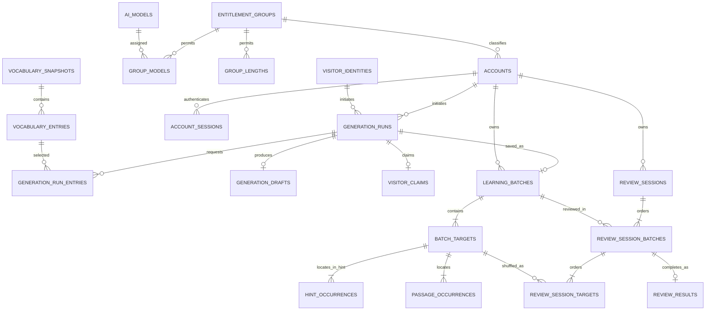

# M001 数据库设计

> 当前为 [102 有限 DBA 修订](../reviews/backend-cr040-database-sync-approval.md) 的待审交付。2026-09-09 用户已确认清理白名单；以下技术切换与恢复安排供审阅，不代表已清库或获得执行授权。原批准版本保存在[修订前快照](./archive/pre-cr040-database.json)。

## 当前修订：CR-040 数据切换

### 确认闭环与替代关系

- **CR040-DATA-CUTOVER / CONFIRMED，2026-09-09**：用户先提出“数据库除了模型数据之外目前全部清理”，随后对已展示的“保留模型、密钥、管理员、词库及结构；重置组别并清空模型分配；清空其他账号、全部会话和业务数据”明确回复“确定”。这是清理范围确认，不再重复询问；实际数据库操作须另经执行授权。
- [CR040-NAMING](./backend.md#cr040-scope-confirmation) 已确认使用 `entry_meaning`；释义仅针对输入原词和目标语言，以[产品 §3.3](../product/ai-behavior.md#original-entry-meaning)为真源。不增加双字段、旧 reader、JSON 转换或旧客户端支持，遵循 [USER-COMPAT-001](../reviews/first-release-compatibility-policy.md)。
- 此前“保留并转换旧草稿／等待旧草稿自然到期”不再是本环境的切换方案。本次是一次性本地测试数据清理，不新增产品重置入口，不改变正常账号注销、配额、批次删除及[已批准 claim 删除例外](../reviews/claimed-batch-delete-retention-exception.md)。
- 用户自行清理浏览器缓存；服务端会话、生成中的进程状态与数据库清理由各自操作负责，不能互相代替完成证据。运行数据库实例、数据量、锁等待和恢复条件尚未实测。

### 已确认的对象白名单

下列名称均位于 `wordweave` schema；以 [0002 核心结构](../../../../backend/db/migrations/0002_core_tables.sql)、[0005 位置表](../../../../backend/db/migrations/0005_hint_occurrences_expand.sql)与[初始组种子](../../../../backend/db/migrations/0003_fixed_groups.sql)为源码依据。未知新增对象不自动纳入删除。

| 类别 | 已确认处理 | 对账边界 |
| --- | --- | --- |
| 模型与密钥 | 保留 `ai_models`、`openrouter_credentials` 全部现有行。 | 模型 ID、名称、说明、启用状态、时间与凭据密文/nonce/密钥版本/指纹/更新者等全部保持；不重建模型、不轮换或探测密钥。外部解密配置不动。 |
| 管理员 | 保留 `accounts.role = 'admin'` 的完整行；删除其登录会话。 | 不改账号 ID、用户名、密码哈希、偏好、状态或时间，不擅自创建管理员。凭据 `updated_by` 若指向将删除账号须在写入前停止，不能静默置空破坏保留承诺。 |
| 系统基础 | 保留 `vocabulary_snapshots`、`vocabulary_entries`、固定组身份、结构及既有 `schema_migrations` 记录。 | 词表 ID/顺序/内容不变；不删除数据库、schema、卷或迁移账本。结构只作已确认的释义列改名，账本只追加对应新迁移。 |
| 组别 | `entitlement_groups` 策略和 `group_lengths` 恢复初始值；清空 `group_models`。 | visitor 的额度为 5，其余三组不限；四组单次词条上限为 5，均有四种长度。保留组 code/created_at，配置更新的 updated_at 正常变化。模型仍在，须管理员重新分配后才能供学习者/访客使用。 |
| 身份与会话 | 删除 `accounts.role = 'learner'`；清空 `account_sessions`、`visitor_identities`。 | 管理员重新登录；其他账号需重新注册。全部旧会话、访客和承接令牌不能恢复原身份或数据。 |
| 生成与学习复习 | 清空 `generation_runs`、`generation_run_entries`、`generation_drafts`、`visitor_claims`、`learning_batches`、`batch_targets`、`hint_occurrences`、`passage_occurrences`、`review_sessions`、`review_session_batches`、`review_session_targets`、`review_results`。 | 包括生成次数、额度占用、旧释义、草稿和承接状态；统计随事实清零，不重生成历史内容或伪造新版本来源。 |

### 目标结构与迁移边界

技术方案为 **PROPOSED，待本次交付审阅**；已确认的白名单和命名不再作为未决项。

1. `batch_targets.contextual_meaning` 改为 `entry_meaning`，仍是 `text NOT NULL`，现有 `batch_targets_text_nonempty` 仍要求其非空；无语义审核、文本截尾、新长度限制或新索引。所有者复合外键、目标唯一性、输入顺序、全部 occurrence 和匿名分组规则不变；存量 hint 影子列的历史处置不在本轮扩展。
2. 当前 [Migrate](../../../../backend/internal/platform/postgres/migrate.go) 按文件名跳过已执行脚本，因此保留 `0001–0006` 原文，新增结构迁移 `0007_entry_meaning.sql`（计划路径，尚未创建）。它只断言目标结构/无旧草稿等前置条件并改列，**不包含清理账号、模型分配或学习数据的 DML**。新空库走同一迁移链；不是为旧运行版本提供兼容。若实施时编号/实际结构不同，停止核对，不能覆盖已存在迁移或猜测双列来源。
3. 新版 schema 必须仅有新释义列，类型、非空约束及约束表达式正确；迁移记录和实际结构同时核验。现有 Verify 仅检查账本、词表、组集合和 occurrence，不能代替新增的列形状断言。
4. 草稿在本次切换清空；此后仅写当前 `targets[].entry_meaning`。新草稿的保存/claim、重启读取、复习与管理员投影沿同一字符串，不重译或按文章选义。API v1.5、prompt/schema v4 等版本以[后端真源](./backend.md#cr040-scope-confirmation)为准，DBA 不另定 API。

列改名不会自行改写 JSON，且 ALTER TABLE 的默认锁级别是 ACCESS EXCLUSIVE；维护窗口不能承诺无锁或无等待。[PostgreSQL ALTER TABLE](https://www.postgresql.org/docs/18/sql-altertable.html)

### 一次性清理与结构切换的事务设计

清理与正常迁移保持独立入口，但本次本地切换由离线维护入口组合在**同一数据库事务**中提交，避免“数据已删、字段迁移却失败”。不接 HTTP、不随服务启动/普通 migrate 自动运行，不提供持续清理功能。

1. **核对并停止写入**：执行角色先核实确切本地实例/数据库、PG 版本、迁移账本与表集合，核对管理员存在、凭据引用和保留集；记录各清理表行数、库/WAL 可用空间和经演练确定的超时。停止所有本项目写入者，包括旧后端、生成结束回调、维护定时任务及客户端重试入口；不影响其他项目或数据库。不能只停 Nginx 而留下后台写入。
2. **单事务保护**：使用受控维护连接，不提升常驻 app 权限；按固定对象顺序锁定本轮涉及的表，锁超时失败即停止，不强杀未知会话。事务内保存保留行的临时对账基准，不把密码哈希、token、密文、nonce 或正文输出到终端/日志。核对与删除之间不得让新账号或生成混入。
3. **按依赖删除与重置**：先清 `visitor_claims`，避免 consumed claim 的 SET NULL 与状态 CHECK 冲突；再依次清 `review_results → review_session_targets → review_session_batches → review_sessions`，`passage_occurrences/hint_occurrences → batch_targets → learning_batches`，`generation_drafts/generation_run_entries → generation_runs`，`account_sessions → visitor_identities → learner accounts`。最后清模型分配、重置组策略和长度。使用显式对象与条件，不用全库 TRUNCATE CASCADE、删卷、禁用触发器或清空迁移账本。
4. **约束检查后改结构**：原有完整性触发器为延迟检查；所有关联删除完成后执行 `SET CONSTRAINTS ALL IMMEDIATE`，再做结构迁移，不能在子表刚清空而父批次仍在时提前强制检查。只运行同一份 `0007` 正文，在当前事务追加账本记录并核验全部后置条件；不得先提交清理，也不得调用另开事务的 Migrate 来假装原子化。后端需抽出可接收同一 tx 的迁移应用/验证边界，保留普通迁移独立行为，验证查询不能改用 pool 读取未提交状态。
5. **提交与重新开放**：确认所有删除目标为零、保留行逐字段一致、组策略/长度准确、新列和账本一致后才提交。配套新后端、Nuxt SSR/浏览器产物启用前完成 readiness 核验，旧内存 attempt 和生成状态不迁入新进程。管理员重新登录并分配模型属于清理后的显式配置操作，不在清理事务中偷偷回填。准备完成前不开放造文。

`SET CONSTRAINTS` 可在事务中提前检查已挂起的可延迟约束；当前完整性函数发现父批次不存在时直接返回，因此删除顺序和检查时点必须联合测试。[PostgreSQL SET CONSTRAINTS](https://www.postgresql.org/docs/18/sql-set-constraints.html)、[0006 完整性实现](../../../../backend/db/migrations/0006_hint_occurrences_enforce.sql)

### 失败、恢复与敏感数据边界

| 时点 | 处理与恢复边界 |
| --- | --- |
| 前置核对、锁获取、清理、约束、结构迁移或提交前对账失败 | 整笔事务回滚，保留集与待清业务数据均不应发生部分变化；保持入口关闭并报告实际失败，不换用宽泛级联或自动放宽条件。 |
| COMMIT 返回不明 | 不将断连等同回滚，也不盲目重跑清理。保持停写，以新连接检查迁移账本、新列和后置条件；未能判明结果则停在人工核对。 |
| 已确认提交、尚未开放流量 | 业务删除已经生效；不承诺通过旧镜像或重命名回退恢复已删内容。若新版本启动失败，保持维护状态，修复配套版本。 |
| 新版本已产生学习数据 | 该清理入口不可重复执行。任何再次删除、回退或恢复都属于新操作；先明确将受影响的新数据和权限，不借原确认清掉新生成内容。 |

事务失败的回滚能力不等于提交后删除可撤销。[PostgreSQL Transactions](https://www.postgresql.org/docs/18/tutorial-transactions.html)

本方案不为被明确清理的业务数据另建保留/兼容库或长期备份，也不承诺取回它们；当前库已有备份、WAL、磁盘残留和仓库测试样本未纳入擦除范围，不能宣称安全擦除。保留项以事务内受保护对账为基础，数据库级灾难恢复仍沿部署恢复政策，执行前须核实实际可用保障；任何恢复旧备份不得让已确认删除的账号或内容重新进入开放服务。若需要新增含待删内容的备份或改变恢复保留期限，须显著说明后再由用户决定，不在本设计中偷偷增加。未核实恢复保障前不执行。

### 定向验证与追踪

本表是后续测试设计，不是当前测试结果；只覆盖本次变更，不重跑全站视觉或无关业务。

| 验证点 | 应有证据 |
| --- | --- |
| DB40-01 保留与清空 | 隔离库包含 admin/learner、配置模型与加密凭据、四组自定义策略、普通及 consumed claim、全部学习/复习关联；运行后管理员及保留集逐字段相同、非管理员/会话/业务表为零，组默认值精确匹配且模型分配为空。敏感内容只在库内比较，外部报告只有计数/通过与否。 |
| DB40-02 原子性与误操作防护 | 在删除中途、约束检查、迁移/账本及提交前断言处注入失败，确认清理和结构均回滚；覆盖待处理延迟触发器、锁冲突、未知表/列、错误实例、凭据更新者异常、COMMIT 结果不明；新数据产生后重跑必须拒绝。 |
| DB40-03 迁移真源 | 空库顺序安装与已清理本地库得到相同目标结构；新列唯一、NOT NULL/非空约束仍有效，原迁移原文及账本不改，旧草稿不转换。正常 migrate 不清任何账号、配置或新学习数据；不能只检查账本有新文件名就判通过。 |
| DB40-04 当前版本可靠性 | 用合成当前合同草稿覆盖生成→保存/claim→读取→复习→管理员只读及同版本重启；释义逐字符串一致，仅当前键，失败不留半批次，不泄漏阶段二答案。不是旧版本兼容测试，也不调用真实模型。 |
| DB40-05 运行交接 | 清理后的旧会话无效、管理员原密码可登录、未分配模型时预检拒绝且不调用上游/计量；重新注册与显式分配后才能准备造文质量测试。功能检查产生的新会话或账号须单独标记，不能再要求“运行后永远零行”。 |

追踪：[DATA-003–018](../product/data-assets.md)及 [CAP-002/003/007/008/010/011/012/014/018/101–107](../product/abilities.md)；释义持久化核心为 DATA-011/013/017 → API-005/006/007/008/103。C40 原词语义必须另做人评，数据库结构和合成样本通过不能冒充造文质量通过；模型调用、样本与费用仍待对应授权。

### 文档整理与交接

- 当前真源为本节及[当前 DBA 交接](../handoffs/database.md)。沿用 CR040-DATA-CUTOVER 和既有路径，合并已失效的建议；旧批准两份原文继续冻结，不新建问答、计划或整理报告。
- 下一步建议由 backend-alex 有限同步 [后端跨角色事项及发布边界](./backend.md#cr040-rollout)：将“保留全部历史、不得清草稿/组权限”的旧前提替换为本次一次性例外，接入同事务切换与拒绝重跑要求；正常产品删除/计量规则、API 投影与 AI 语义不变。随后 frontend-bob 完成既定字段消费同步。DBA 不改其冻结原件，也不直接激活下一角色。
- 本轮仅静态核对源码、上游与官方数据库机制；未连接实际数据库、读取密钥、导出/删除数据、执行迁移/测试、调用模型、部署 UAT 或改写流程状态。新方案待审，CR-039/040 保持 open。
- 下方为未重开的历史基线，其旧保留/兼容/回滚文字不覆盖上述已确认范围或本次待审方案；范围外结构不作顺带整理。

## 1. 结论与边界

### 1.1 已确认选型

- `CONFIRMED`：依据 [`DEC-025`](../decisions/DEC-025.md)，M001 使用一个 PostgreSQL 主数据库。
- 实现基线采用 **PostgreSQL 18，始终安装当前 18.x 小版本**。PostgreSQL 官方对主版本提供 5 年支持，并建议始终使用该主版本的当前小版本；18 的支持期覆盖到 2030 年。[PostgreSQL Versioning Policy](https://www.postgresql.org/support/versioning/)
- 使用 PostgreSQL 18 核心能力：`uuidv7()`、事务、行级锁、外键、命名 `CHECK`、表达式索引和部分唯一索引。部分唯一索引用于“只有活跃行必须唯一”的规则，符合官方约束能力边界。[PostgreSQL Constraints](https://www.postgresql.org/docs/18/ddl-constraints.html)
- M001 不引入分库分表、读副本、独立搜索引擎、Redis、消息队列或对象存储。固定词表、账号、计量、短文、复习及管理配置进入同一关系数据库；生成中的流式分块不逐块写库。
- 本文不指定后端语言、ORM、HTTP API、OpenRouter SDK、部署厂商或地区；这些由后续架构角色决定。

### 1.2 数据库存储边界

| 数据 | 存储位置 | 说明 |
| --- | --- | --- |
| DATA-001/002 固定词表 | PostgreSQL 种子表 + 项目内冻结 JSON | 数据库用于搜索与服务端白名单；冻结 JSON 是迁移输入和摘要基线 |
| DATA-003–010、DATA-012–015 | PostgreSQL 规范化表 | 需要事务、关系、查询与级联删除 |
| DATA-011 临时生成结果 | PostgreSQL 短期 `jsonb` 草稿 | 只存完整校验后的临时结构，不把流式分块当正式记录；客户端令牌丢失后不可恢复 |
| DATA-016 学习统计 | SQL 实时派生 | M001 不维护重复统计快照，避免删除与退款导致漂移 |
| DATA-017 访客承接令牌 | PostgreSQL 哈希令牌与一次性状态 | 原文令牌不入库；支持并发下的单次绑定与幂等结果 |
| DATA-018 账号偏好 | `accounts.ui_locale` | 访客偏好只在浏览器本地，不写入数据库 |
| OpenRouter 密钥明文 | 不进入 PostgreSQL | 数据库只存应用层信封加密后的密文、随机数、密钥版本和脱敏指纹；主密钥独立保存 |

### 1.3 已测事实与规模假设

| 分类 | 内容 |
| --- | --- |
| `FACT` | 当前仓库已有 Go 后端、PostgreSQL 迁移 `0001`–`0006` 与可执行集成测试；`hint_occurrences` 和 `passage_occurrences` 已按目标资源规范化保存全部命中位置，`batch_targets.hint_surface/hint_start/hint_end` 仅保留第一处兼容影子 |
| `FACT` | DATA-001 源文件为 144,527 字节、13,860 个非空唯一字符串，SHA-256 为 `de75e77fdff529b4e6726730c80c11415abbce215ec7852a6c4a670b061dea75` |
| `FACT` | 短文只设词数下限，不设上限；数据库不得人为增加产品未批准的最大文本长度 |
| `FACT` | `accounts.username` 只允许 3–32 个 ASCII 字母、数字或下划线，现有 `accounts_username_lower_unique_idx` 已保证 `lower(username)` 全局唯一；用户名注册后不可修改 |
| `FACT` | 当前 PAGE-103 仓储查询使用 `lower(username) LIKE '%' || lower(query) || '%'`，并只按 `(lower(username), id)` 做 keyset 分页，尚未表达 CR-021 要求的精确匹配层级 |
| `FACT` | 用户规模、并发、地区、部署平台、可用性和成本目标均未确定 |
| `INFERRED` | M001 先按单应用、单写主库、普通公众 Web 负载设计；不基于未知增长预分区或分片 |
| `INFERRED` | 使用连接池且严格限制连接数；具体池大小由部署实例和压测确定，不在本文硬编码 |

## 2. 产品数据追踪

| 产品数据 | 物理模型 | 主要能力 |
| --- | --- | --- |
| DATA-001 固定词表快照 | `vocabulary_snapshots` | CAP-006、CAP-008 |
| DATA-002 词条 | `vocabulary_entries` | CAP-006、CAP-010、CAP-013 |
| DATA-003 用户账号 | `accounts` | CAP-002–005、CAP-104–106 |
| DATA-004 登录会话 | `account_sessions` | CAP-002–005、CAP-106 |
| DATA-005 访客身份 | `visitor_identities` | CAP-007–009 |
| DATA-006 固定组策略 | `entitlement_groups`、`group_models`、`group_lengths` | CAP-006–008、CAP-103、CAP-105 |
| DATA-007 OpenRouter 凭据 | `openrouter_credentials` | CAP-101 |
| DATA-008 AI 模型配置 | `ai_models`、`group_models` | CAP-007、CAP-008、CAP-102 |
| DATA-009 生成计量事件 | `generation_runs` | CAP-007–011、CAP-105 |
| DATA-010 生成请求 | `generation_runs`、`generation_run_entries` | CAP-008–010 |
| DATA-011 临时生成结果 | `generation_drafts` | CAP-008–011 |
| DATA-012 学习批次 | `learning_batches` | CAP-010–017、CAP-022、CAP-107 |
| DATA-013 批次目标资源 | `batch_targets`、`hint_occurrences`、`passage_occurrences` | CAP-010、CAP-013/014、CAP-018/019、CAP-022 |
| DATA-014 复习会话 | `review_sessions`、`review_session_batches`、`review_session_targets` | CAP-017–020、CAP-022 |
| DATA-015 批次复习结果 | `review_results` | CAP-012、CAP-016、CAP-019/020 |
| DATA-016 学习统计 | SQL 查询视图/仓储查询 | CAP-010、CAP-012、CAP-015/016、CAP-020 |
| DATA-017 访客承接令牌 | `visitor_claims` | CAP-002/003、CAP-011 |
| DATA-018 界面语言偏好 | `accounts.ui_locale`；访客浏览器存储 | CAP-002/003、CAP-021 |

全部 18 个 DATA 都有明确存储或派生位置；没有新增用户可见数据资产。

## 3. 逻辑关系

## 4. 全局物理约定

### 4.1 Schema、主键与时间

- 业务对象放在受信任的 `wordweave` schema；运行角色无 `CREATE` 权限，`PUBLIC` 不得在应用 schema 创建对象。所有迁移和安全函数使用限定名，避免不安全 `search_path`。官方文档明确指出，把可被不受信任用户写入的 schema 放进 `search_path` 会扩大劫持风险。[PostgreSQL Schemas](https://www.postgresql.org/docs/18/ddl-schemas.html)
- 公开业务标识使用 `uuid PRIMARY KEY DEFAULT uuidv7()`；词表条目使用紧凑的 `bigint GENERATED ALWAYS AS IDENTITY`。UUIDv7 提供不可枚举外部标识与时间有序索引写入。
- 所有事件时间使用 `timestamptz`，由数据库 `transaction_timestamp()`/`clock_timestamp()` 生成，不信任客户端时间。只有复习筛选边界使用 `date`，并保存创建会话时的 IANA `timezone_name`。
- 文本统一 UTF-8；英文词条按冻结快照原值保存。用户名只允许 ASCII，因此大小写唯一性使用 `UNIQUE INDEX ON lower(username)`，不依赖部署机器的自然语言排序规则。
- 稳定枚举采用 `text + CHECK`，不使用 PostgreSQL ENUM，便于后续以普通迁移扩展；约束必须命名。
- 正式学习内容使用规范化列；仅 DATA-011 临时结构和策略快照可用 `jsonb`。不对短文、释义或标签建立全文索引。

### 4.2 所有者防串联

- 每张用户内容表显式保存 `owner_id`。
- `learning_batches`、`review_sessions` 建立 `(owner_id, id)` 唯一键；下游关系使用复合外键，使数据库拒绝把 A 用户的会话关联到 B 用户批次。
- M001 不启用行级安全（RLS）：最终用户不直接连接数据库，应用使用服务角色；每请求动态设置 RLS 上下文会增加连接池和管理员只读路径复杂度。替代防线为复合所有者外键、仓储层强制 `owner_id` 条件、应用权限检查及跨账号集成测试。若未来开放查询、多租户或第三方数据访问，必须重新评估 RLS。

## 5. 表设计

### 5.1 固定词表

#### `vocabulary_snapshots`

| 列 | 类型与约束 | 用途 |
| --- | --- | --- |
| `id` | `uuid PK DEFAULT uuidv7()` | 快照标识 |
| `version` | `text UNIQUE NOT NULL` | M001 固定为 `m001` |
| `sha256` | `char(64) UNIQUE NOT NULL` | 冻结摘要 |
| `byte_size` | `integer CHECK > 0` | 必须为 144,527 |
| `entry_count` | `integer CHECK > 0` | 必须为 13,860 |
| `imported_at` | `timestamptz NOT NULL` | 种子时间 |

#### `vocabulary_entries`

| 列 | 类型与约束 | 用途 |
| --- | --- | --- |
| `id` | `bigint identity PK` | 内部紧凑外键 |
| `snapshot_id` | `uuid FK NOT NULL` | 所属冻结快照 |
| `entry` | `text NOT NULL` | 精确原始词条 |
| `source_order` | `integer NOT NULL CHECK >= 0` | 稳定种子顺序 |

约束：`UNIQUE(snapshot_id, entry)`、`UNIQUE(snapshot_id, source_order)`、`entry = lower(entry)`、`btrim(entry) = entry`、`entry <> ''`。词表运行角色只有 `SELECT`；写入只允许迁移角色。

### 5.2 账号、会话与访客

#### `accounts`

核心列：`id`、`username varchar(32)`、`password_hash text`、`role`、`group_id`、`status`、`ui_locale`、`quota_reset_at`、`created_at`、`updated_at`。

关键约束：

- `username ~ '^[A-Za-z0-9_]{3,32}$'`，表达式唯一索引 `lower(username)`；用户名不允许更新。
- `role IN ('learner','admin')`；`status = 'active'`。M001 不引入停用流程，注销使用硬删除。
- 学习者 `group_id IN ('registered','pro','plus')` 且非空；管理员 `group_id IS NULL`，数据库拒绝把访客组或管理员身份通过换组混入学习者。
- `ui_locale IS NULL OR ui_locale IN ('zh-CN','en-US')`。空值支持初始管理员尚未完成登录合并；注册学习者应在创建事务中写入当前浏览器语言。
- `quota_reset_at` 在学习者换组时更新；滚动额度只统计 `started_at >= greatest(now()-interval '24 hours', quota_reset_at)` 的计费事件。

#### `account_sessions`

列：`id`、`account_id FK ON DELETE CASCADE`、`token_hash bytea UNIQUE`、`created_at`、`last_seen_at`、`expires_at`。数据库不保存会话令牌原文；退出和失效直接删除行。

#### `visitor_identities`

列：`id`、`token_hash bytea UNIQUE`、`created_at`、`last_seen_at`。客户端持有高熵随机原文，数据库只存带服务端 pepper 的不可逆摘要；不存 IP、设备指纹或浏览器指纹。

### 5.3 权益、模型与凭据

#### `entitlement_groups`

| 列 | 规则 |
| --- | --- |
| `code` | `PK`，只能为 `visitor/registered/pro/plus` |
| `rolling_quota_limit` | `integer NULL`；`NULL` 表示不限，0 表示不可生成，禁止负数 |
| `max_entries_per_run` | 正整数，无产品硬上限 |
| `updated_at` | 数据库时间 |

四行只由迁移种子创建。应用运行角色仅获准更新额度和词数列，不获准 `INSERT/DELETE` 或更新 `code`，从数据库权限层落实“固定四组”。

#### `ai_models`

列：`id`、`display_name`、`description NULL`、`provider_model_id UNIQUE`、`enabled boolean`、`created_at`、`updated_at`。M001 不提供删除能力，运行角色无 `DELETE` 权限；停用只影响新请求。

#### `group_models` / `group_lengths`

- `group_models(group_code, model_id)` 复合主键，两个方向均有外键索引。
- `group_lengths(group_code, length_code)` 复合主键；`length_code IN ('short','medium','long','xlong')`，分别对应短、中、长、特长四档 50/100/200/400 英文词下限。
- 允许某组没有模型或长度；这种配置可保存但新生成预检失败，符合 CAP-103。

#### `openrouter_credentials`

单例表，主键固定为 `provider='openrouter'`。列：`ciphertext bytea`、`nonce bytea`、`encryption_key_version integer`、`display_fingerprint text`、`updated_by uuid NULL`、`updated_at`。

- 明文在应用进程内完成信封加密后才写库；主密钥来自部署 Secret/KMS，不进入数据库、迁移、日志或备份。
- 普通应用角色无 `SELECT`；仅 AI 提供方适配角色可读取密文，仅凭据管理路径可写入。
- 替换密钥覆盖单例密文，不保留历史明文或旧密文审计；M001 明确不做操作审计。

### 5.4 生成、计量与临时结果

#### `generation_runs`

一个表同时承载 DATA-009 的计量事实与 DATA-010 的已接受请求。

主要列：

- 主体：`account_id NULL`、`visitor_id NULL`，`CHECK` 恰有一个非空；`credited_account_id NULL` 表示累计生成次数归属。
- 配置：`group_code_snapshot`、`model_id`、`model_display_name_snapshot`、`provider_model_id_snapshot`、`meaning_language`、`scenario`、`length_code`、`minimum_words_snapshot`、`quota_limit_snapshot`、`max_entries_snapshot`。其中 `meaning_language IN ('zh','en','ja')`、`scenario IN ('discussion','story','business','news')`、`length_code IN ('short','medium','long','xlong')`。
- 状态：`call_status IN ('active','valid','user_cancelled','provider_failed','server_failed','stream_failed','validation_failed')`；`disposition IN ('pending','saved','abandoned')`。
- 计量：`quota_charged boolean`、`counts_toward_cumulative boolean`、`started_at`、`completed_at NULL`、`failure_code NULL`。

数据库约束：

- 两个部分唯一索引分别保证每个 `account_id` 和 `visitor_id` 最多一条 `call_status='active'` 的记录。
- `valid` 与 `user_cancelled` 必须 `quota_charged=true` 且计入累计；系统/供应商/流/校验失败必须 `quota_charged=false` 且不计累计。
- 只有 `valid` 可进入 `saved/abandoned`；其他状态的 `disposition` 固定为 `pending`。
- 登录用户调用的 `credited_account_id=account_id`；访客成功承接时原子写入目标账号并保持 `quota_charged` 只属于访客主体，因此账号滚动窗口不增加。

#### `generation_run_entries`

列：`run_id`、`vocabulary_entry_id`、`input_order`、`source_entry_snapshot`。主键 `(run_id, vocabulary_entry_id)`，唯一 `(run_id,input_order)`；同一次请求不允许重复词条，顺序稳定。

#### `generation_drafts`

列：`run_id PK`、`access_token_hash UNIQUE`、`payload jsonb`、`validated_at`、`expires_at`。只允许关联 `call_status='valid'` 的运行；`payload` 必须为 JSON object。流式分块在应用内缓冲，完整结构通过校验后才写一次草稿。

草稿是短期操作状态，不属于学习历史。确切 TTL 由后端架构结合认证流程设置；清理任务删除过期草稿并把仍为 `pending` 的有效运行标为 `abandoned`。客户端只在当前内存路由持有原文访问令牌，因此刷新后即使数据库尚未清理也无法恢复。

#### `visitor_claims`

列：`id`、`run_id UNIQUE`、`visitor_id`、`token_hash UNIQUE`、`status IN ('active','consumed')`、`consumed_account_id NULL`、`consumed_batch_id NULL`、`expires_at`、`consumed_at NULL`。

消费后短期保留 `consumed` 状态用于网络重试幂等；令牌不能指向第二个账号或第二个批次。令牌原文不入库，过期清理不会删除已经保存的批次。

### 5.5 学习批次与词条资源

`PROPOSED`：采用规范化 `hint_occurrences` 子表作为提示位置真源。与把位置数组塞入 `batch_targets.jsonb` 相比，子表多一次批量读写，但可由数据库直接执行所有者外键、顺序唯一、区间、对应子串、不重叠和至少一行约束；与增加多组 PostgreSQL 数组列相比，也不会产生 surface/start/end 数组长度漂移。提示短语很短且读取总是按目标批量完成，当前没有证据值得牺牲完整性来减少这张小表。用户批准本数据库交接即确认该方向。

#### `learning_batches`

主要列：`id`、`owner_id`、`generation_run_id UNIQUE NULL`、`saved_at`、`group_code_snapshot`、`model_display_name_snapshot`、`provider_model_id_snapshot`、`meaning_language`、`scenario`、`length_code`、`passage text`、`tags text[]`、`participates_in_range_review boolean DEFAULT true`、`expected_target_count`。

约束：

- `UNIQUE(owner_id,id)` 供下游复合外键使用。
- `cardinality(tags) BETWEEN 1 AND 3`，无空字符串；标签只在批次层保存。
- `passage <> ''`，不设置最大长度，不建立全文索引。
- `expected_target_count > 0`；延期约束触发器在事务提交时核对实际 `batch_targets` 数量。
- `generation_run_id` 使用 `ON DELETE SET NULL`：删除批次不删除计量事件，清理访客身份也不删除已绑定账号的学习内容。

#### `batch_targets`

权威目标列：`id`、`owner_id`、`batch_id`、`vocabulary_entry_id`、`source_entry_snapshot`、`input_order`、`entry_meaning`、`hint_phrase`。CR-040 的目标命名与清理范围已确认；当前实现仍为旧列名，切换设计见[CR040-DATA-CUTOVER](#cr040-data-cutover)，尚未实施。

约束：同一批次词条唯一、输入顺序唯一、文本非空；复合外键 `(owner_id,batch_id)` 防止跨账号目标资源。已执行的 `0002_core_tables.sql` 中 `hint_surface/hint_start/hint_end` 是旧单位置兼容列；`DEC-032` 生效后它们不再是提示挖空真源，只在迁移兼容窗口保存第一处提示位置，待旧应用回滚窗口关闭后由后续 contract 迁移删除。

#### `hint_occurrences`

每个提示短语的全部合法目标位置单独成行，结构与短文位置一致：`id`、`owner_id`、`batch_id`、`target_id`、`occurrence_order`、`surface`、`start_offset`、`end_offset`。

约束与语义：

- `(batch_id,target_id)` 外键关联同批次 `batch_targets`，`(owner_id,batch_id)` 外键关联同一所有者批次；两者均 `ON DELETE CASCADE`。
- 每个目标至少一行；`UNIQUE(target_id,occurrence_order)` 固定呈现顺序，`UNIQUE(target_id,start_offset,end_offset)` 拒绝重复记录同一区间。
- `occurrence_order >= 0`、`surface <> ''`、`start_offset >= 0 AND start_offset < end_offset`。
- 延期约束触发器以目标行的 `hint_phrase` 核对 Unicode code point、0 基半开区间及对应子串，并拒绝同一 `target_id` 内任何重叠区间。不同目标拥有不同提示短语，其 offset 坐标系彼此独立，不做跨目标重叠比较。
- 数据库保存的是确定性重建资料，不保存额外答案副本；阶段一仍只以 `batch_targets.source_entry_snapshot` 作为唯一原始词条答案。多个 `hint_occurrences` 只控制同一道题的多个遮蔽位置，不产生多道题或多次作答。

#### `passage_occurrences`

列：`id`、`owner_id`、`batch_id`、`target_id`、`occurrence_order`、`surface`、`start_offset`、`end_offset`。每个目标至少一行；延期触发器验证表面形式与短文对应子串完全一致，并拒绝同一短文中的重叠挖空区间。

提示与短文位置永远来自保存时通过的校验结果；复习阶段不得重新调用模型或临时猜测词形。两类 occurrence 均使用相同 offset 标准，但分别以 `hint_phrase` 和 `learning_batches.passage` 为坐标源。

#### `DEC-035` 同词匿名分组的数据库边界

- 不新增 `group_order`、`group_color`、`group_label` 或会话级颜色映射列。`passage_occurrences.target_id` 已是同源关系真源：同一 `batch_targets` 的全部短文位置天然属于同组，不同目标资源天然属于不同组。
- 后端读取一个批次时，以每个 `target_id` 的最小 `start_offset` 为正文首次出现位置，按该位置升序派生批次内匿名组序；数据库现有“不允许同批次位置重叠”约束保证首次位置不会冲突。`target_id` 只用于服务端关联，不得进入学习者安全投影。
- 派生组序只表达同源等价关系，不保存原始词条映射，不参与答案判定。后端可把组序转换为仅当前短文填空题有效的匿名 `group_key`；API 不得返回 `source_entry_snapshot`、`vocabulary_entry_id`、`target_id` 或可逆标识。
- 随机颜色、纹理、边框和聚焦联动属于界面视图状态。它们可在重新开始短文填空阶段时重新分配，但输入、错误重试、语言切换和组件重渲染期间应由前端状态保持；这些值不得写入学习批次、复习会话或复习结果。
- 批次内容及 occurrence 位置在 M001 保存后只读，因此每次从数据库重建时，同源关系和正文首次出现顺序稳定。若未来允许编辑正文或目标位置，必须另行定义版本化与进行中复习会话的一致性规则。

### 5.6 复习会话与结果

#### `review_sessions`

主要列：`id`、`owner_id`、`mode IN ('range','single')`、`single_batch_id NULL`、`range_start_date NULL`、`range_end_date NULL`、`timezone_name NULL`、`status IN ('in_progress','completed')`、`created_at`、`updated_at`、`completed_at NULL`。

约束：

- `range` 必须有有效起止日期和时区，`single_batch_id IS NULL`；`single` 必须有本账号的 `single_batch_id` 且日期/时区为空。
- 部分唯一索引保证每个账号最多一个未完成 `range` 会话。
- 部分唯一索引 `(owner_id,single_batch_id)` 保证同一批次最多一个未完成 `single` 会话。

#### `review_session_batches`

列：`owner_id`、`session_id`、`batch_id`、`batch_order`；主键 `(session_id,batch_id)`，唯一 `(session_id,batch_order)`。复合外键保证会话与批次属于同一账号。随机顺序只在创建事务中写入一次，恢复时按 `batch_order` 读取。

#### `review_session_targets`

列：`session_id`、`batch_id`、`target_id`、`target_order`；每个会话批次内目标和顺序均唯一。`(session_id,batch_id)` 必须引用同一条 `review_session_batches`，`(batch_id,target_id)` 必须引用同一批次的 `batch_targets`，不能把其他批次的词条塞入既有会话。创建会话时一次写入，恢复时不重新洗牌。

#### `review_results`

列：`id`、`owner_id`、`session_id`、`batch_id`、`completed_at`、`successful`、`error_count`、`skip_count`、`stage1_completed`、`stage2_completed`。

- `UNIQUE(session_id,batch_id)` 保证一个会话中的批次只完成一次。
- 结果只在两阶段都结束时插入，因此两个阶段完成标记必须为真；中途中断不写题目、答案或尝试明细。
- `successful=true` 要求 `skip_count=0`；允许先答错后改对，所以成功结果的 `error_count` 可以大于 0。

### 5.7 DATA-016 统计派生

M001 不建 `learning_statistics` 快照表。一次只针对一个账号，用索引支持的聚合得到：

1. 累计生成次数：`generation_runs` 中 `credited_account_id=$account` 且 `counts_toward_cumulative=true`。
2. 已学习词条数：当前 `learning_batches` 下 `batch_targets.vocabulary_entry_id` 去重。
3. 参与/不参与日期范围复习批次数：按 `participates_in_range_review` 分组。
4. 累计成功复习次数：当前未删除批次关联的 `review_results.successful=true` 行数。
5. 已成功复习批次数：成功结果的 `batch_id` 去重。

删除批次会通过级联删除目标与复习结果，使内容型统计自然变化；生成计量事件保留，因此累计生成次数不回退。

## 6. 数据库不变量与触发器

优先使用 `NOT NULL`、`CHECK`、`UNIQUE`、部分唯一索引和外键。PostgreSQL 官方说明 `CHECK` 不应引用其他表，因此跨表不变量使用受信任的 `DEFERRABLE INITIALLY DEFERRED CONSTRAINT TRIGGER`，而不是伪造跨表 `CHECK`。[PostgreSQL Constraints](https://www.postgresql.org/docs/18/ddl-constraints.html)

| 不变量 | 实现 |
| --- | --- |
| 用户名忽略大小写唯一 | `UNIQUE INDEX ON lower(username)` |
| 固定四组不可新增/删除/改名 | `code CHECK` + 迁移种子 + 运行角色列级 `UPDATE`、无 `INSERT/DELETE` |
| 同一主体最多一个活跃生成 | 两个部分唯一索引 |
| 同一批次最多一个未完成单批次会话 | `review_sessions` 部分唯一索引 |
| 每账号最多一个未完成日期范围会话 | `review_sessions` 部分唯一索引 |
| 批次目标数量完整 | 延期约束触发器核对 `expected_target_count` |
| 每目标至少一个提示位置，位置有效且不重叠 | `hint_occurrences` 延期约束触发器验证表面形式、Unicode code point 区间、对应子串和同目标不重叠；完整性触发器验证非空集合 |
| 每目标至少一个短文位置，位置有效且不重叠 | 延期约束触发器验证子串与区间 |
| 同词匿名组关系稳定且不串组 | `passage_occurrences.target_id` 外键定义同源关系；同批次全局不重叠约束使最小 `start_offset` 可确定性排序；匿名化由服务层安全投影完成 |
| 单批次会话恰有一个指定批次，范围会话至少一个 | 延期约束触发器 |
| 会话标记完成前全部批次均有结果 | 延期约束触发器 |
| 用户内容关系不能跨账号 | `owner_id` 复合外键 |

触发器函数由不可登录的 schema owner 持有，固定安全 `search_path`，运行角色无 `CREATE FUNCTION/TRIGGER` 权限。

## 7. 索引与访问路径

| 访问路径 | 索引 |
| --- | --- |
| 登录与用户名精确命中 | `accounts(lower(username)) UNIQUE`；大小写无关精确命中至多一行 |
| 管理员用户名包含搜索 | M001 保留现有 `accounts(lower(username)) UNIQUE`，不新增迁移；前导通配符不能依赖该 B-tree 完成筛选，先在代表性账号量上测量，持续不达标时再评估 `pg_trgm` 表达式 GIN/GiST 索引 |
| 会话令牌验证 | `account_sessions(token_hash) UNIQUE`；`expires_at` 清理索引 |
| 访客令牌验证 | `visitor_identities(token_hash) UNIQUE` |
| 词表前缀搜索 | `vocabulary_entries(snapshot_id, entry text_pattern_ops)` |
| 词表包含搜索 | 13,860 行顺序扫描；不引入 `pg_trgm`，先以实测决定是否需要 |
| 组可用模型 | `group_models(group_code, model_id)` PK；反向 `(model_id,group_code)` |
| 账号滚动额度 | `generation_runs(account_id,started_at DESC) WHERE quota_charged` |
| 访客滚动额度 | `generation_runs(visitor_id,started_at DESC) WHERE quota_charged` |
| 账号累计生成 | `generation_runs(credited_account_id,started_at DESC) WHERE counts_toward_cumulative` |
| 活跃生成互斥 | 账号、访客各一个 `UNIQUE ... WHERE call_status='active'` |
| 草稿/承接清理 | `generation_drafts(expires_at)`、`visitor_claims(expires_at) WHERE status='active'` |
| 学习记录从旧到新 | `learning_batches(owner_id,saved_at,id)` |
| 日期范围批次 | `learning_batches(owner_id,participates_in_range_review,saved_at,id)` |
| 按精确词条搜索学习库 | `batch_targets(owner_id,vocabulary_entry_id,batch_id)` |
| 批次目标展示 | `batch_targets(batch_id,input_order)` |
| 提示位置重建 | `hint_occurrences(target_id,occurrence_order)` 唯一索引；无需独立全文或表面形式索引 |
| 短文匿名分组与首次出现排序 | `passage_occurrences(batch_id,start_offset,end_offset)` 现有索引；读取时同时取得 `target_id`，无需新索引 |
| 复习会话恢复 | `review_sessions(owner_id,status,mode,updated_at DESC)` |
| 会话批次/词条顺序 | 唯一索引 `(session_id,batch_order)`、`(session_id,batch_id,target_order)` |
| 复习统计 | `review_results(owner_id,successful,batch_id,completed_at)` |

外键引用列根据删除路径补齐索引；PostgreSQL 不会自动为引用端外键建立索引，需在迁移中显式验证。[PostgreSQL Foreign Keys](https://www.postgresql.org/docs/18/ddl-constraints.html#DDL-CONSTRAINTS-FK)

## 8. 事务与并发

外部 OpenRouter 调用和用户等待期间绝不保持数据库事务或行锁。行锁只覆盖短事务；PostgreSQL 官方也明确不应在等待用户输入时长期持锁。[PostgreSQL Explicit Locking](https://www.postgresql.org/docs/18/explicit-locking.html)

### T1 注册

1. 校验格式并计算密码哈希。
2. 单事务插入 `accounts` 与首个 `account_sessions`。
3. `lower(username)` 唯一冲突映射为用户名占用；不先查询再插入。

### T2 生成预检与占用额度

1. 按主体 `SELECT ... FOR UPDATE` 锁定 `accounts` 或 `visitor_identities`；账号组变更使用相同锁顺序。
2. 读取组策略、模型分配、词表精确条目、当前滚动 24 小时计费事件和账号 `quota_reset_at`。
3. 校验未知字段、模型、长度、词数、额度与 DATA-007 配置状态。
4. 插入 `generation_runs(call_status='active', quota_charged=true)` 与有序词条；部分唯一索引是并发兜底。
5. 提交后才调用 OpenRouter。

默认隔离级别 `READ COMMITTED` 足够，因为主体行锁串行化同一主体的额度决策；调用方必须以固定顺序先锁主体、再锁运行/批次/会话，死锁或序列化错误可安全重试。

### T3 生成结束、取消或失败

- 以 `UPDATE ... WHERE id=? AND call_status='active'` 做一次状态转换；并发的取消、网络失败和正常完成只能一个成功。
- 用户取消：`user_cancelled`、保留计费、计入累计。
- 系统/供应商/流/校验失败：对应失败状态、`quota_charged=false`、不计累计。
- 有效完成：`valid`、计费并计累计；写入一次 `generation_drafts`。事务提交后活跃互斥释放。

### T4 登录用户保存/放弃

- 锁定运行和草稿，验证主体、`valid`、`pending` 与令牌摘要。
- 保存时在一个事务内写入 `learning_batches`、全部目标、每目标全部 `hint_occurrences` 与全部 `passage_occurrences`，延期约束在提交前验证整批；随后把 `disposition='saved'` 并删除草稿。
- 放弃只把 `disposition='abandoned'` 并删除草稿。
- `learning_batches.generation_run_id UNIQUE` 保证网络重试最多产生一个批次。

### T5 访客承接

- 访客对有效草稿点击保存时，当前浏览器随请求提交一次高熵随机承接令牌，服务端只保存其带 pepper 摘要；短事务校验运行、草稿与访客主体后创建 `visitor_claims(status='active')`。`run_id UNIQUE` 与浏览器重试时复用同一原文令牌共同保证不重复创建能力记录。
- 以承接令牌摘要锁定 `visitor_claims`，验证未消费、未过期、当前草稿存在。
- 同一事务创建账号批次、目标和位置，把 `generation_runs.credited_account_id` 设为当前账号并计入该账号累计生成，将 claim 标为 consumed 并记录批次，再删除草稿。
- 不改变原访客 `quota_charged` 主体，不创建账号滚动额度事件。重复请求返回已经消费的批次，不重复写入。

### T6 换组与额度重置

- 锁定账号，校验只能在 `registered/pro/plus` 间调整，更新 `group_id` 与 `quota_reset_at=clock_timestamp()`。
- 不删除历史 `generation_runs`；额度查询自动忽略重置点之前的事件，累计生成统计保持不变。
- 已经开始的生成继续使用其快照，不被改写。

### T7 创建复习会话

- 锁定账号和可能存在的未完成会话。
- 日期范围模式在指定 `timezone_name` 下筛选起止日期、勾选批次；单批次模式验证本人所有且未删除，并优先返回现有未完成单批次会话。
- 应用生成可测试随机顺序，一次写入 session、batch order、target order。部分唯一索引处理重复点击竞争。
- 不把短文填空颜色或匿名组映射写入会话。进入阶段二时从不可变的 `passage_occurrences.target_id + start_offset` 重建同源关系与首次出现顺序；同一次阶段二交互中的随机视觉映射由短期尝试状态负责。

### T8 完成一个复习批次

- 锁定 session 与当前 `review_session_batches`，插入唯一 `review_results`。
- 更新 session 的 `updated_at`；如果所有现存 session batch 都已有结果，则原子改为 `completed`。
- 当前批次中断不写入题目级草稿，因此下次从该批次阶段一开始。

### T9 永久删除批次与注销账号

- 批次删除：锁定本人批次；级联目标、位置、复习结果和会话关系；单批次未完成 session 由 `single_batch_id ON DELETE CASCADE` 删除；范围 session 若变空则在同事务删除，否则保留稀疏顺序。生成计量事件不删除。
- 账号注销：验证密码与确认后，在一个短事务删除 `accounts`；外键级联会话、账号生成事件、批次、复习与账号偏好。访客生成后承接的原访客计量可保留，但 `credited_account_id ON DELETE SET NULL`，不再形成账号统计。

## 9. 生命周期与级联规则

| 父对象删除/变化 | 数据库动作 |
| --- | --- |
| `accounts` 删除 | CASCADE 账号会话、账号主体生成、学习批次、复习会话/结果；SET NULL 已消费访客运行的累计归属 |
| `learning_batches` 删除 | CASCADE 目标、位置、结果、会话关系和单批次 session；保留 generation run |
| `visitor_identities` 清理 | CASCADE 未绑定访客运行/草稿；已保存账号批次因 run FK `SET NULL` 保留 |
| `ai_models` 停用 | 只更新 `enabled`；组映射可保留但新预检过滤，历史快照不变 |
| 组策略更新 | 新请求读取新策略；历史运行和批次快照不变 |
| 草稿/claim 过期 | 清理临时 payload/active claim，不触碰已消费批次 |
| 账号密码自行修改 | 删除除当前行外全部 `account_sessions` |
| 管理员重置密码 | 删除该账号全部 `account_sessions` |

账号生成事件保留到账号注销；访客计量至少保留完整滚动窗口。无活动访客的更长垃圾回收周期由部署配置，但不得短于 24 小时窗口与时钟偏差安全量。

## 10. 迁移、种子与回滚

### 10.1 迁移原则

- 迁移文件单向、按序、不可修改；SQL 是数据库契约来源，ORM 只能消费，不能另行漂移 schema。
- DDL 默认放在事务中；`CREATE INDEX CONCURRENTLY` 等不能同事务执行的操作拆成明确迁移，并配置有限 `lock_timeout` 与 `statement_timeout`。
- 使用 expand → backfill → validate → contract：先加可空列/新表，分批回填，再 `VALIDATE CONSTRAINT`，最后在后续发布删除旧结构。
- 生产迁移前对近似数据量副本测量锁时间；大表不得直接使用会长时间持有 `ACCESS EXCLUSIVE` 的重写操作。

### 10.2 初始迁移序列

1. `0001_roles_and_schema`：受信 schema、角色、权限、基础函数。
2. `0002_core_tables`：账号、配置、生成、学习与复习表、约束和索引。
3. `0003_fixed_groups`：精确插入 `visitor/registered/pro/plus` 四行与四种长度元数据。
4. `0004_vocabulary_m001`：把冻结 JSON 复制到实现仓库后导入 13,860 行；迁移结束同时断言条目数、唯一数、字节数与 SHA-256。
5. 初始管理员由一次性部署命令创建；密码哈希在应用内生成，迁移和仓库不含明文默认密码。

### 10.3 `DEC-032` 增量迁移与发布顺序

既有迁移文件保持不可变，不回写 `0002_core_tables.sql`。实施角色新增前滚迁移，推荐序列如下：

1. `0005_hint_occurrences_expand.sql` 创建 `hint_occurrences`、外键、唯一/范围约束、索引和 substring/重叠校验触发器；将表所有者设为 `wordweave_owner`，显式授予 `wordweave_app` 所需 DML 权限（既有 `GRANT ... ON ALL TABLES` 不会自动覆盖未来表）。为每条既有 `batch_targets` 从旧 `hint_surface/hint_start/hint_end` 回填一行 `occurrence_order=0`。迁移在同一事务内断言回填后每个目标恰有至少一行、旧三列与第 0 行完全一致；本步暂不启用“每目标至少一行”的跨表完整性触发器，以保持旧应用仍可写入。
2. 先部署兼容应用：读取优先使用 `hint_occurrences`，保存时写入全部新行，并在兼容窗口把第一处同步写入旧三列。此时通过运行开关继续拒绝多位置结果，完成历史读、保存、承接、批次详情与复习回归。
3. 验证 `count(batch_targets)=count(distinct hint_occurrences.target_id)`、无 substring 不匹配、无同目标重叠，并确认新旧第一处一致后，执行 `0006_hint_occurrences_enforce.sql`：更新批次完整性函数，使每个目标必须同时至少有一条 `hint_occurrences` 和一条 `passage_occurrences`；为两类 occurrence 的 `INSERT/UPDATE/DELETE` 增加延期完整性触发器。级联删除批次/目标时，父行消失应令检查安全返回，不阻塞合法删除。
4. `0006` 与兼容应用均验证通过后才启用多提示位置。启用点之后禁止回滚到只读取旧列的应用版本，否则可能只遮蔽第一处而泄露答案；允许回滚的最低版本必须仍以 `hint_occurrences` 为读取真源。
5. M001 保留旧三列作为只保存第一处的非权威兼容影子，不在本轮冒险删除。未来清理需另做 expand/contract：先放宽旧列非空约束与旧 span 触发器、部署停止双写但仍读新表的版本、经过回滚窗口后再删除旧列。所有新代码与 API 自 `0005` 起均不得把旧三列视为真源。

该方案选择规范化子表，而不是把 occurrence 数组放入 `jsonb`：子表可直接执行外键、唯一、区间、substring、重叠和至少一行约束，也能沿用 passage occurrence 的事务模式。代价是每个目标多写少量行，但提示短语短、读取总是按 `target_id` 批量完成，M001 没有证据需要以较弱约束换取反规范化。

回滚优先回滚应用版本并保持向后兼容 schema。删除列、改类型和大规模回填不承诺自动逆向；执行前必须有通过恢复演练的备份。开发/测试可重建数据库，生产不得用 `down` 迁移冒险恢复已删数据。

### 10.4 `DEC-035` 影响结论

`DEC-035` 不需要 `0007` 迁移。已落地的 `batch_targets` 与 `passage_occurrences` 已完整表达“原始词条资源—全部短文表面形式位置”的一对多关系，且现有 `(batch_id,start_offset,end_offset)` 索引支持按正文顺序批量读取。新增持久化组号会重复存储可派生事实，并引入正文位置与组号漂移；持久化颜色则会把纯展示状态污染为业务数据。

发布只需修改后端读取与安全投影、前端状态和相应测试。部署前运行只读完整性检查：每个 `batch_targets` 至少一条 `passage_occurrences`、同一批次无重叠位置、每行 substring 与正文一致；若检查失败，应阻止受影响批次进入阶段二并记录数据完整性错误，不得临时猜测词形或把 `input_order` 当分组顺序。

### 10.5 `CR-021` 用户搜索排序与游标影响结论

CR-021 不新增数据资产、列、表、约束或持久化排序状态，也不需要 `0007` 迁移。精确与否完全由同一个已规范化查询值和不可变用户名派生，持久化 `is_exact` 会把请求相关事实错误写入账号数据。

数据库层向后端固定提供以下顺序键：

1. `normalized_query = lower(trimmed_query)`；查询范围仍只匹配 `lower(username) LIKE '%' || normalized_query || '%'`。
2. `match_tier = 0` 当 `lower(username) = normalized_query`，否则为 `1`。由于 `lower(username)` 唯一，tier 0 至多一行。
3. 总顺序固定为 `(match_tier ASC, lower(username) ASC, id ASC)`；等价于“精确匹配置顶，其余结果忽略大小写升序”。`id` 是确定性尾键，不向客户端显示。
4. keyset 条件使用同一三元组严格大于上一页末项；opaque cursor 必须带 `match_tier`、规范化用户名和 `id`，并由后端继续绑定规范化查询与 endpoint scope。旧的二元游标不能按默认 tier 解读，应由后端版本化或拒绝。
5. 前端不得把各页局部重排；否则精确账号可能跨页、重复或消失。

M001 推荐在现有 schema 上用 `CASE`/等价查询表达 tier，并通过参数绑定生成 SQL。可选的 `pg_trgm` 能加速大规模前导通配符搜索，但会引入扩展、额外磁盘和写放大；当前没有代表性账号规模或延迟目标，不能据猜测新增索引。实现阶段必须在接近预期账号量的数据集上执行 `EXPLAIN (ANALYZE, BUFFERS)`；只有出现可复现慢查询后，才另提可前滚的扩展和索引迁移。

## 11. 安全与最小权限

建议数据库角色：

- `wordweave_owner NOLOGIN`：拥有 schema、表、函数；不被应用直接使用。
- `wordweave_migrator`：部署时临时 `SET ROLE wordweave_owner`，无常驻应用连接。
- `wordweave_app`：普通业务最小 DML；无 DDL、无凭据表读取、无组/模型删除权限。
- `wordweave_ai`：仅服务端 AI 适配模块使用，可读取加密凭据和写生成状态；不能读取其他账号学习库。
- `wordweave_maintenance`：备份、监控和清理所需最小权限，不可登录产品接口。

其他要求：

- 所有连接强制 TLS；数据库不暴露公网，网络只允许应用和运维来源。
- 数据库凭据和 OpenRouter 主加密密钥分别轮换，不能共用；日志、异常、迁移输出和测试夹具不得出现密码、会话原文、claim 原文或 OpenRouter 密钥。
- SQL 日志只记录慢查询与结构化请求关联，不记录绑定参数中的短文和释义；`application_name` 或事务局部上下文携带请求 ID。
- 不创建通用操作审计表，符合 M001 范围；`generation_runs` 和 `review_results` 是产品事实，不是管理员审计日志。
- 备份加密，备份密钥与数据库/应用凭据分离。

## 12. 备份与恢复

PostgreSQL 官方提供 SQL dump、文件级备份和连续归档/PITR 三类机制；M001 生产环境优先选择托管平台的连续 WAL/PITR，并保留独立逻辑备份。[PostgreSQL Backup and Restore](https://www.postgresql.org/docs/18/backup.html)

由于产品未确认可用性 SLA，以下为 `INFERRED` 工程基线，部署时必须据平台能力复核：

- 生产：连续 WAL/PITR，建议 7 天恢复窗口；每日一份加密基础快照。
- 独立逻辑备份：每日 `pg_dump -Fc`，保留 7 份日备和 4 份周备；自定义格式可由 `pg_restore` 选择性检查和恢复。[pg_dump](https://www.postgresql.org/docs/18/app-pgdump.html)
- 暂定恢复目标：RPO 不超过 15 分钟、RTO 不超过 4 小时；这是运维目标，不是已批准的产品 SLA。
- 至少每月在隔离环境完成自动恢复演练：恢复 schema、种子、行数、约束、词表摘要，并运行关键统计和跨账号隔离检查。未验证恢复的备份不得视为有效。
- 账号/批次删除在在线主库立即生效；加密备份按固定轮换自然过期，不能由产品选择性访问。灾难恢复必须恢复到包含最新已确认删除的时间点；若只能恢复到删除之前，不得直接开放服务，必须先完成隐私补救核对。这是部署地区未确定前的残余风险。

## 13. 监控与维护

利用 `pg_stat_activity`、`pg_stat_database`、`pg_stat_user_tables/indexes`、`pg_locks` 与可选 `pg_stat_statements` 观察运行情况；PostgreSQL 官方提供累计统计、锁、I/O、WAL 和数据库冲突视图。[Monitoring Database Activity](https://www.postgresql.org/docs/18/monitoring.html)

必须监控：

- 连接使用率、长事务、锁等待、死锁、事务回滚率和慢查询；
- 数据库、表、索引、TOAST 与 WAL 增长；`generation_runs`、`learning_batches.passage` 是重点容量来源；
- autovacuum 最近执行、dead tuples、事务 ID 年龄、未使用/重复索引；
- `generation_runs.call_status='active'` 超过后端定义时限、过期 draft/claim 清理积压、过期 session 清理积压；
- WAL 归档失败、备份失败、最近恢复演练时间与校验结果；
- 词表摘要与固定四组行数漂移。

清理任务小批量执行，使用 `FOR UPDATE SKIP LOCKED` 或主键范围，避免一次删除大量临时行。不要使用 `VACUUM FULL` 作为例行维护；常规 autovacuum 参数在取得真实写入和膨胀数据后按表调整。

## 14. 验证计划

### 14.1 Schema 与种子

1. 全部表有主键；所有外键引用列有匹配索引；约束名称唯一、可定位。
2. 四组恰有四行且应用角色无法新增、删除或改名。
3. 词表导入后断言 144,527 字节、13,860 行/唯一行和固定 SHA-256；四个多词词条精确存在。
4. 所有稳定枚举、数组数量、正数和状态组合的非法写入被数据库拒绝。

### 14.2 并发与事务

1. 两个并发生成请求对同一账号/访客只有一个占用成功；不同主体互不阻塞。
2. 额度边界 N-1/N/N+1 并发请求不会超发；失败退款与取消计费幂等。
3. 生成完成与取消、保存与放弃、claim 双击/跨账号竞争都只产生一个合法终态。
4. 两个并发“复习本篇”只创建一个未完成单批次会话；日期会话与单批次会话可同时存在。
5. 批次完成重复提交只产生一个结果；中断批次不留下题目级进度。
6. 换组与生成并发按账号行锁得到确定顺序，历史快照与累计统计不被重写。

### 14.3 数据完整性与隔离

1. 用复合外键尝试跨账号关联 batch/session/target/result 必须失败。
2. 空标签、4 个标签、缺少目标、任一目标缺少提示/短文位置、位置越界/不匹配/重叠、重复目标均在提交前失败。
3. 提示短语分别覆盖一处、相同表面形式多处、不同自然词形多处和多词词条；保存后按 `occurrence_order` 可确定性重建全部空，且只关联一个原始词条答案。
4. 构造同词单次出现、多次相同词形、多次不同词形、多个目标交错的批次；按每目标最小 `start_offset` 派生的匿名组顺序必须稳定，同一目标的所有 occurrence 同组、不同目标不串组，且不依赖 `input_order`。
5. 学习者复习投影不得包含 `source_entry_snapshot`、`vocabulary_entry_id`、`target_id`、答案长度或可逆组标识；数据库与复习结果中不得出现颜色、纹理或当前视图组样式。
6. 批次删除后的目标、提示位置、短文位置、结果和会话关系消失，但累计生成次数不回退。
7. 账号注销后账号、会话、账号生成、批次、复习和账号语言偏好均不可取得。
8. 普通应用角色无法读取密钥密文、执行 DDL、删除组或模型；AI 角色也不能越权查询学习库。

### 14.4 查询与恢复

1. 用代表性数据执行 `EXPLAIN (ANALYZE, BUFFERS)` 验证用户名、额度、学习列表、词条搜索、复习恢复和六项统计命中预期索引。PAGE-103 需要分别测量无精确项、有精确项、大小写不同精确项、常见短查询和无结果查询，并记录扫描行数、排序内存和执行时间。
2. 覆盖极长短文、提示多位置与短文多位置，确认保存、删除、备份和恢复不截断内容或丢失位置顺序。
3. 从逻辑备份和 PITR 各完成一次隔离恢复，核对迁移版本、词表摘要、固定组、约束和数据行数。

CR-021 的静态数据验收还必须覆盖 limit 边界和至少三页：精确项只能出现在第一项，随后结果严格按 `(lower(username),id)` 递增；逐页拼接后不得重复或遗漏静态数据集中的匹配账号。cursor 的 tier、用户名或 ID 缺失/非法，以及绑定到不同查询的 cursor，必须在进入 SQL 前失败。

仓库已提供 PostgreSQL 18 容器与集成测试入口，但本轮处于技术设计角色，没有把尚未实现的 `0005/0006` 当作可执行结果。DDL、回填断言、权限、延期触发器和并发测试必须由实现阶段在隔离数据库中执行并记录证据。

## 15. 已知风险与演进触发条件

| 风险 | 当前处理 | 重新评估触发条件 |
| --- | --- | --- |
| 用户规模与并发未知 | 单主 PostgreSQL、短事务、针对访问路径建索引 | 连接池饱和、锁等待或查询目标持续不达标 |
| 短文无上限导致 TOAST/备份增长 | 不违反产品语义；监控正文大小与库增长，不索引正文 | p95/p99 正文、备份时长或存储成本不可接受时回到产品决策 |
| 访客标识可清除 | 保持软限制；不加 IP/指纹 | 产品改为严格防滥用时必须回产品阶段 |
| DATA-011 需短期服务器保存但刷新不可恢复 | 哈希访问令牌 + 短期草稿 + 客户端内存令牌 | 产品要求跨刷新恢复时新增产品数据与交互决策 |
| 没有审计日志 | 只保留产品事实和基础设施日志 | 合规、客服审计或管理员追责成为需求时回产品阶段 |
| 账号删除与历史备份 | 在线硬删除、加密短窗口备份、恢复前隐私核对 | 部署地区或法律要求明确后重新确认备份保留和删除证明 |
| M001 不用 RLS | 复合所有者外键 + 服务层强制过滤 + 越权测试 | 多租户、直接数据访问、分析副本或第三方查询出现时重评 |
| 词表包含搜索目前顺序扫描 | 13,860 行可控，不安装扩展 | 实测延迟不达标或词表显著扩大时评估 `pg_trgm` |
| 管理员账号包含搜索缺少专用索引 | M001 不凭未知规模引入扩展；用三元排序键保证正确性，并要求代表性数据 `EXPLAIN` | 账号量增长后出现持续慢查询、扫描放大或排序内存不可接受时评估 `pg_trgm` 与表达式索引迁移 |
| 多提示位置发布期间存在旧列 | 新表为真源、第一处短期双写、启用多位置后禁止回滚旧读路径 | 兼容窗口验证完成后执行 contract 迁移删除旧列 |
| 匿名组投影泄露原词或被持久化样式污染 | 数据库只保留目标—位置关系；服务端派生匿名同源键，颜色/纹理只留在当前视图状态 | 需要跨复习保存自定义组样式、允许编辑正文或向第三方开放学习数据时重评 |

## 16. 交给后端架构的固定输入

`backend-alex` 必须继承以下数据库边界：

1. PostgreSQL 18 当前小版本，单数据库、`wordweave` schema、迁移 SQL 为 schema 真源。
2. OpenRouter 调用在数据库事务之外；T2/T3 分开，状态转换必须幂等。
3. 所有用户内容查询带 `owner_id`；管理员只读路径也不能复用写仓储。
4. 密码、会话令牌、访客令牌、draft/claim 令牌和 OpenRouter 明文都不能直接入库。
5. 提示与短文 occurrence offset 的唯一标准均为 Unicode code point、0 基半开区间；保存前后端必须使用同一算法。`hint_occurrences` 是提示全部位置的唯一真源，多个位置仍只对应一次原始词条作答。
6. 短文填空查询必须读取 `passage_occurrences.target_id`，以每组最小 `start_offset` 派生正文首次出现顺序，再输出不可逆、仅题目范围有效的同源 `group_key`；不得把数据库 `target_id`、词表 ID、原词、答案长度或选词 `input_order` 投影给学习者。
7. 不为 `DEC-035` 新增迁移或持久化颜色/组样式；随机视觉映射由前端当前阶段状态维持，重启阶段可重新随机。
8. 统计实时派生，不另建缓存表；若后端发现实测不达标，先提供查询证据再提反规范化方案。
9. 后端需要定义草稿/claim TTL、会话过期、生成超时与清理调度，但不得改变刷新不可恢复、额度退款或一次性承接语义。
10. API 契约需区分运行 ID、临时访问令牌和正式批次 ID；不能让客户端通过提交任意 `owner_id` 选择数据归属。
11. 后端修订必须按 10.3 的兼容顺序实现；在多位置数据可写之后不得回滚到只读取 `batch_targets` 旧三列的版本。
12. CR-021 的 PAGE-103 数据顺序必须使用 `(match_tier, lower(username), id)`：精确项 tier 为 0、其余为 1；opaque cursor 携带完整三元键并绑定查询。该变更不需要 schema 迁移，不得持久化请求相关的 `is_exact`，也不得由前端跨页重排。
