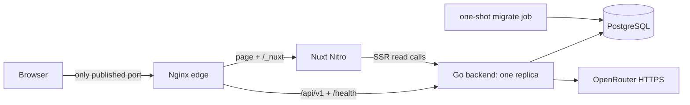

# M001 仓库与部署架构

## 1. 结论

### 1.1 已确认边界

- 依据 [`DEC-033`](../decisions/DEC-033.md)，WordWeave 保持一个仓库，但源码分为独立 `backend/`、`frontend/` 和 `nginx/`。
- Go 后端与 Nuxt SSR 是两个独立应用进程、构建上下文和镜像；Nginx 是第三个 edge 单元。根目录只保存跨应用规划、组合部署与说明，不承载业务运行时。
- 浏览器始终访问同一公开 origin。`/api/v1/**` 直接进入 Go；页面与 `/_nuxt/**` 进入 Nuxt Nitro；POST SSE 不经过 Nitro BFF。
- M001 的 Docker/单机部署运行 Nginx。未来 Kubernetes 部署由 Ingress 替换 Nginx 的公开路由职责，应用路径、Cookie/CSRF 和 API DTO 不变。
- 数据库仍是独立 PostgreSQL 服务；OpenRouter 仍是后端出站依赖，不属于仓库内部署单元。

### 1.2 已确认落值

[`DEC-034`](../decisions/DEC-034.md) 已确认三个组件各自持有 Dockerfile，根级使用 `compose.yaml` 编排。根级全仓库 Dockerfile 和前后端合一镜像均不采用。

## 2. 方案比较

| 方案 | 构建隔离 | 独立发布 | 本地组合 | K8s 演进 | 结论 |
| --- | --- | --- | --- | --- | --- |
| 组件内三个 Dockerfile + 根级 Compose | 强 | 强 | 直接 | 直接映射三个镜像 | `CONFIRMED` |
| 根级多 target Dockerfile | 弱，context 为全仓库 | 可实现但易耦合 | 直接 | 仍需约束 target | 不推荐 |
| 单一全栈镜像 | 无 | 不支持 | 表面简单 | 必须重构 | 与 DEC-033 冲突 |

当前没有共享构建阶段、统一静态链接或单进程托管需求，无法证明根级 Dockerfile 带来的耦合成本合理。

## 3. 目标仓库结构

```text
project/
├── .planning/                     # 跨应用产品、设计、技术与流程真源
├── backend/                       # 独立 Go module / build context
│   ├── cmd/wordweave/
│   ├── cmd/wordweave-admin/
│   ├── internal/
│   ├── db/migrations/
│   ├── db/queries/
│   ├── assets/vocabulary/
│   ├── go.mod
│   ├── go.sum
│   ├── sqlc.yaml
│   ├── Dockerfile
│   ├── .dockerignore
│   ├── .env.example
│   ├── Makefile
│   └── README.md
├── frontend/                      # 独立 Nuxt package / build context
│   ├── app/
│   ├── server/
│   ├── tests/
│   ├── package.json
│   ├── pnpm-lock.yaml
│   ├── nuxt.config.ts
│   ├── Dockerfile
│   ├── .dockerignore
│   ├── .env.example
│   └── README.md
├── nginx/                         # 独立同源 edge build context
│   ├── Dockerfile
│   ├── nginx.conf
│   ├── templates/default.conf.template
│   └── snippets/proxy-headers.conf
├── compose.yaml                   # 本地/单机组合与 E2E 拓扑
├── .env.example                   # 只含组合层非秘密示例值
├── .gitignore
└── README.md                      # 全仓库启动、部署与角色边界
```

- `backend/` 内路径均相对于 Go module 根；现有 module path `wordweave` 不因物理目录下移而改变。
- `frontend/` 的内部目录由 `frontend-bob` 最终修订；本文件只固定其应用根和部署边界。
- `.planning/` 不进入任何生产镜像。三个 build context 均限定为自己的目录，禁止使用 `COPY ../...` 或根级 context 绕过隔离。
- 根级 `.env.example` 只描述 Compose 公开端口和本地服务名；后端/前端运行配置分别在各自目录说明。Secret 不进入任何示例文件或 Compose 默认值。

## 4. 镜像与应用职责

| 镜像 | build context | 运行内容 | 不包含 |
| --- | --- | --- | --- |
| `wordweave-backend:<git-sha>` | `./backend` | Go HTTP binary；同一镜像可由一次性 job 改入口运行 migrate/create-admin | Nuxt、Nginx、`.planning`、真实 Secret |
| `wordweave-frontend:<git-sha>` | `./frontend` | Nuxt Nitro Node SSR `.output` | Go binary、数据库迁移、Nginx |
| `wordweave-edge:<git-sha>` | `./nginx` | Nginx 配置与静态 edge 运行时 | 前后端源码和业务凭据 |

- 后端 Dockerfile 继续使用多阶段构建，最终非 root、只读根文件系统；`wordweave-admin` 可与 HTTP binary 同镜像，但只被迁移/初始化 job 显式调用，不启动第二个常驻服务。
- 前端 Dockerfile 必须只复制 Nitro 运行所需 `.output` 与 Node 生产依赖；精确 Node/包管理器版本由前端架构固定。
- Nginx 配置镜像不得烘焙 TLS 私钥、账号凭据或上游 Secret。生产证书由部署平台挂载或由外层负载均衡/Ingress 终止。
- 三个镜像可分别构建、扫描、签名、发布与回滚；镜像 tag 至少包含不可变 Git SHA，不能只使用 `latest`。

## 5. Compose 拓扑



根级 `compose.yaml` 的最小服务为 `postgres`、`migrate`、`backend`、`frontend`、`nginx`：

- 默认只发布 Nginx 端口；backend、frontend、PostgreSQL 与 metrics 端口只在 Compose 网络内可见。需要直连排障时使用显式 debug profile 并只绑定 `127.0.0.1`。
- `edge` 网络只连接 Nginx、frontend、backend；`data` 网络只连接 backend、migrate、PostgreSQL。frontend 通过 `edge` 私网地址调用 backend，不能连接数据库。
- `migrate` 使用 backend 镜像的一次性 `wordweave-admin migrate` 入口；迁移成功后 backend 才可进入 ready。初始管理员命令也是显式一次性操作，不成为常驻服务。
- 本地公开 origin 建议固定为 `http://localhost:3000`，由 Nginx 监听；生产为精确 HTTPS origin。浏览器不直接使用容器 DNS 名称。
- Compose 是组合与验证工具，不是应用依赖管理器。backend/frontend 各自的 Dockerfile 单独构建时不能要求根目录文件存在。

## 6. Nginx 同源路由契约

按优先级匹配：

| 公开路径 | 上游 | 必需行为 |
| --- | --- | --- |
| `POST /api/v1/generations/stream` | backend `:8080` | HTTP/1.1；关闭 request/response buffering、proxy cache 和 gzip；SSE heartbeat 立即 flush；idle read timeout 至少 60 秒且不是总生成时限 |
| `/api/v1/**` | backend `:8080` | 不改写 path/query/body；保留 Cookie 与 `Set-Cookie`；普通 API 可使用安全缓冲 |
| `/health/live`、`/health/ready` | backend `:8080` | 直接探测 Go；不经 Nitro；不得缓存 |
| `/_nuxt/**` | frontend `:3000` | hashed asset 可 `public, immutable` 长缓存；不把 HTML fallback 返回给缺失 asset |
| 其他页面路径 | frontend `:3000` | 支持直接 URL SSR；用户相关 HTML/payload 为 `private, no-store` |
| `/internal/metrics` | 无公网 upstream | 明确拒绝；只在内部采集网络访问 backend metrics listener |

入口还必须：

- 覆盖客户端伪造的内部 request ID/forwarded 标头，生成可信 request correlation；转发原始 Host 与可信 scheme，backend 只信 `TRUSTED_PROXY_CIDRS` 内的 edge。
- 不重写 Cookie path/domain，不终止或转换 SSE 事件，不把生成流升级为 WebSocket。
- 对 API 请求体大小使用不低于后端逐路由限制的防御值；最终字段/语义校验仍由 Go 执行。
- Nginx 与 Nitro 都不得再创建 `/api/v1` BFF；公开 API 的唯一处理者是 Go。

## 7. SSR 私网调用

- 浏览器 transport 始终使用相对 `/api/v1`，确保 Cookie、Origin 与 CSRF 都处于同一公开 origin。
- Nitro server transport 使用私有 `BACKEND_INTERNAL_ORIGIN=http://backend:8080`；该值不进入 public runtime config、SSR payload 或浏览器 bundle。
- SSR 只转发批准的 Cookie、locale 与 request correlation；`Set-Cookie` 按白名单附加到当前页面响应。SSR 不代理写操作或 POST SSE。
- 即使 SSR 可直连 backend，应用层仍必须执行 API DTO 校验与转换后才能进入状态；私网不代表可信数据可直接渲染。

## 8. Kubernetes Ingress 等价演进

M001 不预先提交与厂商/Ingress controller 绑定的 Kubernetes manifest，但保留下列一一映射：

| Docker/Compose | Kubernetes |
| --- | --- |
| backend service | 单副本 backend Deployment + ClusterIP Service |
| frontend service | frontend Deployment + ClusterIP Service |
| migrate one-shot | migration Job，成功后再发布 backend |
| Nginx path rules | Ingress paths；TLS 在 Ingress 或外层 LB 终止 |
| Compose Secret/env | Secret/ConfigMap 或外部 Secret 管理器 |
| Nginx readiness | Ingress controller 自身探活；应用各用 HTTP probe |

- 迁移到 Ingress 时不再额外部署仓库内 Nginx，避免双重 proxy；`nginx/` 继续作为本地部署与路由合同参考。
- 所选 Ingress controller 必须通过 POST SSE 不缓冲、心跳及时到达、长连接断开传播、request ID 与 `Set-Cookie` 回归；控制器注解属于部署实现，不进入浏览器 API。
- backend 在 DEC-027 被替代前仍严格一副本；不能因为 Kubernetes 默认滚动更新而短暂并存两个实例。Deployment 必须使用 `Recreate` 或等价单实例发布策略。
- frontend 可在未来独立扩容，但 M001 无容量证据时先按一副本运行；扩容不能让 SSR 状态跨请求共享。

## 9. 配置与 Secret 分层

| 层 | 示例 | 规则 |
| --- | --- | --- |
| 根级组合 | public host/port、Compose project name | 不含产品 Secret；只供本地组合 |
| backend | DB URL、pepper、HMAC keys、OpenRouter master keys、可信 proxy CIDR | 只注入 backend/migrate；生产来自 Secret/KMS |
| frontend private | backend internal origin、SSR runtime 参数 | 只注入 Nitro server；不得进入 public config |
| frontend public | 极少量非敏感 UI 构建值 | 不包含内部 DNS、模型/数据库信息 |
| nginx | upstream DNS/port、public listen 参数 | 不包含业务凭据；TLS key 外部挂载 |

`PUBLIC_ORIGIN`、Nginx 暴露 origin 与浏览器访问 origin 必须完全一致。生产 Cookie 继续使用 `__Host-`、`Secure`、无 Domain；内部容器主机名永远不写入 Cookie 或重定向。

## 10. 现有仓库迁移清单

| 当前根级对象 | 目标 | 实现注意事项 |
| --- | --- | --- |
| `cmd/`、`internal/`、`db/`、`assets/` | `backend/` 同名路径 | 使用 `git mv` 保留历史；Go import/module path 不变 |
| `go.mod`、`go.sum`、`sqlc.yaml` | `backend/` | 所有 Go/sqlc 命令以 `backend/` 为工作目录；sqlc 相对路径保持有效 |
| `Dockerfile`、`.dockerignore`、`Makefile` | `backend/` | Docker context 改为 `./backend`；Make 命令不再扫描仓库其他目录 |
| 根级 `.env.example` | 根级组合示例 + `backend/.env.example` | 拆分非秘密组合值与后端运行值；不复制真实 Secret |
| `compose.yaml` | 根级保留并重写 | build context 分别指向三个组件；默认只发布 Nginx |
| `README.md` | 根级总览；可增加应用内 README | 命令改为 `make -C backend ...`、组件独立 build 与全栈 compose |
| 尚不存在前端/Nginx | `frontend/`、`nginx/` | 分别由前端实现与共享部署实现按批准设计创建 |

迁移不创建兼容 symlink，不同时维护根级和 `backend/` 两套 Go 路径。实现提交必须在移动后一次性修正 Docker、Compose、CI、测试和文档引用，避免主分支出现两个 Go module 真源。

## 11. 构建、发布与回滚

1. 同一提交分别构建、测试并标记 backend/frontend/edge 三个镜像；任一组件失败不发布该版本组合。
2. 先备份并运行数据库迁移 job；迁移顺序继续遵守数据库 expand/backfill/validate/contract 与多提示位置 feature gate。
3. 串行停止旧 backend、启动新 backend 并等待 `/health/ready`；M001 不并行运行两个 backend。
4. 发布 frontend 并验证 SSR/readiness；随后发布或重载 Nginx 路由，执行同源页面、API、Cookie 和 SSE smoke。
5. frontend 与 edge 可独立回滚到兼容 API v1.3 的镜像。backend 启用多提示位置后只能回滚到仍读取 `hint_occurrences` 且为阶段二 blank 提供 `group_key` 的最低兼容版本。
6. 目录迁移本身通过 Git revert 恢复源码；生产 schema 不因目录移动回滚。不得为回滚重新建立根级重复 Go module。

## 12. 验证门

- `docker build ./backend`、`docker build ./frontend`、`docker build ./nginx` 分别成功，且三个 Dockerfile 不从自身 context 外复制文件。
- 根级 `docker compose config` 成功；默认公开端口只有 Nginx，PostgreSQL、backend、frontend 和 metrics 无公网映射。
- Nginx 镜像执行配置语法检查；路由测试证明 `/api/v1`/`/health` 到 backend、页面/asset 到 frontend、`/internal/metrics` 被拒绝。
- 真实代理拓扑下验证 POST SSE 首段和每个 heartbeat 不被缓冲，浏览器 abort 能传播到 Go，取消 API 保持独立可用。
- 验证 Host、scheme、request ID、Cookie、`Set-Cookie` 与 `private, no-store` 不被代理破坏；伪造内部 forwarded header 不被 backend 信任。
- backend 目录内运行 generate/fmt/vet/unit/integration；frontend 目录内运行 install/typecheck/lint/test/build；根级只运行组合 smoke。
- CI 使用 path filter：后端变更必跑 backend；前端变更必跑 frontend；Nginx/Compose/共享契约变更同时跑两个应用构建与 edge E2E。
- 迁移前后扫描仓库，根级不得残留第二份 `go.mod`、`cmd/`、`internal/`、`db/` 或前后端合一 Dockerfile。

## 13. 当前状态

- `CONFIRMED`：DEC-033 的单仓库目录隔离、独立应用部署、Nginx edge 与未来 Ingress 等价边界。
- `CONFIRMED`：DEC-034 的三个组件 Dockerfile + 根级 Compose 具体落值；CR-007 已解决并由实现产物落地。
- `OPEN`：CR-017、CR-018 归属前端实现，与部署拓扑无新增冲突；API v1.3 仍需前后端同 commit 组合验证。
- 本次 DEC-035 技术修订只提升兼容 API 基线，不改变 Docker、Compose、Nginx 或 Ingress 拓扑。
