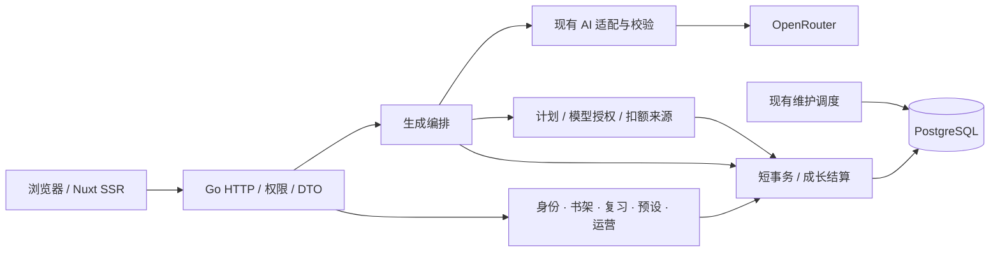

## CR029-F05 当前技术增量

admin.ProviderWorkspace聚合，API以technical/api/model-connections.md为准。共享配置锁读取连接及全部模型两组查询，无旧20条分页截断；保存独占锁+CAS，完整modelID所有权校验，原位连接+凭据更新和模型新增修改原子提交。0016只增加窄权限函数；请求中的ID不改变引用，保存不触发测试。集成测试须证明回滚与角色权限。

# CR029-F03/F04 当前增量

复用0015表/约束，新增SaveModels原子事务及models/batch；先验证所有项，连接创建一次，模型逐个INSERT，revision仅递增一次，冲突回滚全批。无数据库迁移。Gateway.Probe需有效SSE delta和正常结束，普通JSON/假流拒绝；受控HTTP检查3协议延后结束及负例，禁止真实收费测试。契约见api/model-connections.md。

> 当前CR029模型配置与协议以 [通用模型契约](api/model-connections.md) 为准，替代本文旧OpenRouter全局部分，其余功能不变。

---
milestone: M002
stage: technical-design
role: backend-architect/base
agent_name: backend-alex
version: M002-BE-04
status: awaiting_user_review
date: 2026-10-01
blocking_alignment: null
input_database: M002-DB-03
revision_scope: M002-CR-027
---

## CR026 / BE05 一次提醒

API207 NoticeInput/AdminNotice与API205 Notice添加remind_once布尔值；创建/整份更新缺省false，输出总是包含该字段。保留原身份鉴权、Markdown净化、visible/remind过滤、排序、revision冲突和原子写入。只提醒一次资格由浏览器按已确认账号+消息去重，后端不接收个人提醒历史，也不按此字段隐藏列表。先执行0014迁移；测试新旧默认、修改/关闭再开启、可见/提醒前置及配置冲突。

# M002 后端架构方案

## 1. 当前结论、输入与边界

继续一期 **Go模块化单体＋PostgreSQL＋同源Nuxt/Nginx**。本期在原模块内扩展身份、学习库、复习与授权，增加成长、道具、预设、通知及分析领域模块；不拆服务，不引入Redis、外部队列或另一套生成引擎。本文是设计交付，不是实现/上线记录。

当前增量输入：[UI26 批准 065](../reviews/design-acceptance-065.md)、[FE03 接收](../handoffs/frontend-architecture.md)、[CR027](../changes/CR-027.md)与[角色激活 066](../reviews/backend-cr027-entry-066.md)。产品仅使用 PRODUCT04、D2-89 与已批准选词交互；PRODUCT05 中 CR026 缓存范围不在本版。固定词表 DATA-001 已明确所有角色可搜索，CAP-218/ UIA-PAGE-212-WORDS26 要求后台预设选词；本版只补 API004 的管理员契约及其验证边界。

DB03/BE03/FE02 分别由 014/015/016 批准；CR003/004 设计接收已经关闭。原实现与 UAT 见 [060](../reviews/verification-acceptance-060.md)，批准不覆盖本轮新稿/新 UI 的未执行验证。锁定 consumer-ai-web@1.0.0、原 Go/PostgreSQL/Nuxt 架构与部署边界保持，不迁移 Profile 或数据。当前工作区尚未提交，以 [BE04 输入摘要](evidence/M002-BE-04-inputs.json) 的实际代码路径/hash 定位，不把 Git HEAD 当作全部工作区版本。

### 1.1 已确认决策的落实

- DB2-Q01已纠正：未提交答案仅当前浏览器IndexedDB恢复，服务器只保留attempt最小事实及固定题序，不做跨设备答案同步。
- DB2-Q02已确认：基础/体验同计划分别记账；管理员重置目标base epoch，trial用量和到期不动。
- DB2-Q03已确认：个人分析明细90天，之后只匿名汇总，不收集答案/正文；注销清关联个人数据。
- D2-43：当次总结响应不留历史答案；D2-51：退换取当前下架积分；D2-56：签到自动、其他奖励手动；D2-65/73：模型卡逐模型加时、计划优先扣次数；D2-81/82：私有标题可编辑、预设单标题无说明。
- 一期原词释义/全部提示及正文位置/随机词序/日期范围与单篇独立/六项库统计/注册登录/模型计划用户管理均继承。USER-COMPAT-001不承诺旧客户端；USER-CLAIM-DELETE-001明确删除时移除consumed claim。M001历史一次性清库批准不适用于M002。

### 1.2 BE2-D01 数据接收完成（历史规则保留）

[M002-CR-003](../changes/CR-003.md)三项已由 DB-02/BE-02 接收，并经 012 关闭设计接收；下表为继续有效的规则定位，相关运行验证按原实现/QA 证据判定，本轮不重开旧 CR。DB/BE 原冻结包及历史批准保留。

| 接收项 | 已批准数据依据 | 后端同步及验证入口 |
|---|---|---|
| BE2-D01.1 最小复习概况 | DB2-R07 / DB §5.1/5.3/5.4 | API-008：首次提交保进度，按 attempt_no 取每批最新 submitted；累计仍看所有成功尝试。旧 has_answer 保留 null、skip_count>0 转 has_unanswered；BE2-V05 / DB2-V17 |
| BE2-D01.2 日期范围替换 | DB2-R08 / DB §5.5 / DB2-T14 | API-008：同事务旧 draft→restarted、旧 range→abandoned、新范围建立；版本冲突/空范围/失败不关闭旧安排；旧会话写入先拒绝再处理重复提交；BE2-V05 / DB2-V18 |
| BE2-D01.3 消息标题 | DB2-R09 / DB §4.3 | API-205/207：独立标题、完整语言对校验/整套回退、稳定游标与原子保存；BE2-V12 / DB2-V19 |

BE-03 继承 BE-02 并接收 CR-004；其未变规则由本版继续保留。原 [BE-02 快照](evidence/M002-BE-02.tar.gz)与[冻结清单](evidence/M002-BE-02-manifest.json)保留，已批准 DB-03 正文/交接及审批不由本角色修改。

### 1.3 有实际取舍的技术选择

| 项目 | 采用 | 另一方案的实际代价 |
|---|---|---|
| 成长结算 | 与原业务同Postgres事务 | 事件队列需要额外恢复/幂等系统，反而推迟已要求的全或无到账 |
| 复习 | 可重建安全题面＋本机最终答案＋最小DB状态 | 服务器答案仓库扩大未要求的留存/同步；全内存attempt无法满足刷新恢复 |
| 预设预览 | 复用AI校验流程、独立preview run/用量 | 塞进generation_runs会冲突现有有效生成计费/累计约束 |
| Markdown | goldmark解析＋bluemonday白名单清洗 | 浏览器各自解析会令后台预览和弹窗安全策略不一致 |
| 随机词 | 当前约1.386万词过滤后random limit1 | 先建缓存或推荐模型没有规模/效果证据；先随机再排除可能假报无候选 |
| 分析 | 现有maintenance分钟聚合＋90天删除 | 独立分析平台超出本期，且会扩大个人数据副本 |
| 成长一次保存 | 三个领域命令＋完整集合校验＋同库事务；等级/同类成就配置整表读取 | 逐行HTTP保存无法回滚先成功行；通用批处理/任意配置JSON扩大范围；分页配置在当前完整表格中徒增跨版本拼接 |

goldmark默认不启用不安全HTML；仍在输出后做显式HTML清洗，依赖版本在实施时锁go.mod/go.sum并做漏洞检查。[goldmark官方](https://github.com/yuin/goldmark)、[bluemonday官方](https://github.com/microcosm-cc/bluemonday)。不为Markdown增加插件执行、模板语言或远程资源抓取。

### 1.4 BE2-D02 CR-004 专业接收（已由 016 关闭设计缺口）

来源为 PRODUCT-03 CAP-214/217/218、DATA-206/208/209/212/214、UI22 operations/growth 与 FE-01 的 [CR-004](../changes/CR-004.md)。DB2-R10/11 已获 014 批准。当时补齐下列严格契约，已由 015 批准、016 接收；下表保留有效规则，不作为本轮待批准项。

| 接收项 | 后端结论与原始契约 | 验证 |
|---|---|---|
| BE2-D02.1 / FE2-G01 | API-206 保存可空双语 description，API-203 按当前配置逐字段选译并返回 string或null；独立于名称和达成时称号 | BE2-V18 / DB2-V20 |
| BE2-D02.2 / FE2-G02 | API-206 签到五值一个 PUT；等级/同类成就 changes 一个 PUT；完整配置读、整组影响预览/token、稳定 id、行错误/结果不明重读 | BE2-V19/20 / DB2-V21–23 |
| BE2-D02.3 / FE2-G03 | API-202 AdminGenerationOptions 定义完整字段、枚举、空值、can_preview/reason及非200失败；读取无模型调用或用户额度 | BE2-V21 |

三项请求/响应和 mock 示例沿用 BE-03；CR-004 设计接收已完成，原实现证据从当前验证交接追溯，不因本轮修订重开。描述字段长度、行 client_key、整表配置读是本职责内的传输/输入细化，不增加业务数据资产、任务体系或卡片能力。[示例集](evidence/M002-BE-03-contract-examples.json)仅合成契约示例，不是服务实现或业务种子。

### 1.5 BE4-D01 / CR027 管理员词库搜索

**契约澄清完成，待前端接收**。权限单一真源为 [API004 search](api/generation-presets.md#api-004-search)：V/L/A 共用，只读 DATA-001/002；管理员搜索支撑 CAP-218 的 PAGE-212，结果是完整 entry 字符串。关联 DATA-212 只表示选词的后续使用，不表示 GET 写入预设。此为 DATA-001 已明确的权限，非新增业务授权；无待用户选择的技术方案、无 DB 迁移，不需要第二个管理搜索端点。

代码核对路径：`httpapi/server.go → resolveActor → analyticsBrowser → vocabularySearch → vocabulary.Service.Search → SearchVocabulary/GetVocabularySnapshot`。路由及处理函数不拒绝 A；两条词库 SQL 只 SELECT，不调用生成、计划扣额或预设写模块。普通随机在 Service.Random 拒绝 A，普通生成在 generation.Start 拒绝 A；各自边界保持。有效管理员身份绕过分析浏览器初始化；会话无效时的公共访客回退不是管理员认证证据。源码摘要见 inputs，本轮为静态核对，尚未执行管理员 HTTP 请求。

**BE4-I01 / 实现待修**：`catalog_handlers.go` 先 `strconv.Atoi` 再直接 `int32(limit)`，Search 在收窄后才校验。64 位进程中 `limit=4294967297` 会变为 1，超界整数可能被当作合法 limit。实现时在转换前验证 1–20，保留现有不能解析的 400 与超界的 422；无需重构服务或改表。该项来自本次错误边界核对，只影响输入校验，不否定现有管理员搜索权限。交 backend-ethan 定向修复，不能由架构稿宣称代码已修。

前端接收只需将已有 `vocabulary.search` 数据访问用于后台的 WordPicker，保留取消/过期响应/账号隔离、完整词条去重及旧预览失效编排；不引入新 DTO/字段/释义调用，不把每次最多20个候选当作管理员预设总选词上限。FE3-G01 的契约缺口可据本版接收；BE4-I01 的实际修复与下列运行验证独立保留至实施/QA，不由静态文档通过自动关闭。

| 本轮验收 | 范围与通过条件 | 当前证据状态 |
|---|---|---|
| BE4-V01 | 使用有效管理员会话 GET 搜索，200 与 V/L 相同封套；缺省10/指定20，大小写与前缀优先，无匹配空数组，包含空格/标点的词条完整；版本与 admin/generation-options 一致；响应无私有数据 | 静态调用链/SQL已核对；真实角色 HTTP 未执行 |
| BE4-V02 | q空/超过64字符、limit=0/21/4294967297 返回422；不可解析整数返回400；读取失败500且无伪成功；前端仍保留已选内容 | BE4-I01 待实现；HTTP/故障路径未执行 |
| BE4-V03 | 搜索请求前后生成/预览run、次数、成长及预设内容不变、provider调用0；管理员随机/普通生成仍403、个人私有接口边界保持；公共会话/日志机制照旧 | 静态权限隔离已核对；隔离 HTTP/业务事实对比未执行 |

验收在现有隔离 HTTP harness 中补少量定向覆盖即可，不运行真实模型，不复制全套历史QA，不以此要求新的监控、缓存或测试平台。

## 2. 模块与内部调用

| 模块/入口 | 责任与边界 |
|---|---|
| `identity` | 原Cookie/密码/角色/语言；新增资料和欢迎事实。last_login与last_learning分开，认证不代替学习 |
| `vocabulary` | 固定词表搜索/规范化、lexeme映射与随机过滤，不在本期做考试词库管理 |
| `entitlement` | ResolveEffectivePlan、ResolveModels、ReadQuota、ReserveChargeInTx、RefundChargeInTx；统一普通/预设/后台读投影来源 |
| `generation` | 预检/预占/上游运行/终态CAS/临时草稿/取消；调用growth的事务方法，不让模型层操作积分 |
| `learning` | 原收录/claim/库/六项统计/参与/删除，新增title及收录成长；管理员通过只读reader |
| `review` | 会话快照、稳定匿名题面、整批比较/提交/重来、最小进度；替换原内存逐题actions，拒绝任何历史答案读取 |
| `growth`（新增） | 学习日、签到/补差、实际mastery插入计经验、等级/成就资格和手动领取、唯一结算账本；ReadOperatingSettings/SaveOperatingSettings、PreviewLevelChanges/SaveLevelChanges、SaveAchievementChanges 持有一次领域事务 |
| `items`（新增） | 四类型定义/库存/兑换/预览/启用/下架退换；不成为可任意混搭的权益规则引擎 |
| `presets`（新增） | 草稿版本/完整预览/发布，解析服务端固定spec；预览复用AI Runner，隔离计费目的；ReadAdminGenerationOptions 只读支持集合/安全模型/凭据配置标志，不复用用户计划扣额 |
| `notices`（新增） | 双语Markdown、可见/提醒、渲染清洗与排序，无个人收件/已读 |
| `analytics`（新增） | 固定访问事件、业务事实写入、指定指标聚合与保留；无通用事件属性平台 |
| `admin` | 八模块HTTP权限与DTO，调用领域命令；不能直接SQL调余额/冒充学习者 |
| `maintenance` | 原退款/过期清理；新增资格重算、模型退款资格补判、分钟分析/04:00成熟结算/90天清理 |
| `httpapi`/`platform` | strict decode、CSRF/认证、mapper、Problem/SSE/健康；领域层不依赖页面copy或前端状态 |

只抽实际共用的事务协作方法，不引入通用事件总线/通用workflow。`...InTx(ctx,tx,lockedActor,command)`只接收已开启短事务，不自己Begin/Commit；由原业务服务持有事务并一次提交。成长服务无反向HTTP/生成调用；AI Runner不访问用户账号/奖励。数据库操作通过现有pgx/sqlc，可逐域新增query文件；不在设计阶段生成DDL或正式代码。

用量Observer只记录每次provider call的token/cost，独立于原CR042内容取证；普通日志继续无内容。配置影响查询、Preview与Command共享纯计算函数，Command必须重新读当前状态，预览不能充当权限缓存。

## 3. 全量继承与用例追踪

API详见[当前目录](api/index.md)。UC列指模块用例；一行一个稳定CAP避免遗漏一期。DATA-015是替代索引，不新增结果仓库。

| CAP | UC / 本期去向 | API | DATA |
|---|---|---|---|
| CAP-001 | 首页/试用入口保留，静态首页不触发AI | API-001/202 | DATA-018/212 |
| CAP-002 | 注册basic、轮换会话 | API-002 | DATA-003/004/018 |
| CAP-003 | 登录退出/角色路由 | API-002 | DATA-003/004/204 |
| CAP-004 | 本人改密/撤其他会话 | API-003 | DATA-003/004 |
| CAP-005 | 注销全个人数据 | API-003 | DATA-003/004/009–018/201–211/213 |
| CAP-006 | 词表精确合法选词 | API-004 | DATA-001/002 |
| CAP-007 | 一份有效计划、合并模型、分别次数 | API-004 | DATA-005/006/008/009/211 |
| CAP-008 | 流生成/严格完整结果 | API-005 | DATA-007/009/010/011 |
| CAP-009 | 取消/系统失败原来源退款 | API-005 | DATA-009/010/011/211 |
| CAP-010 | 完整收录/放弃、默认标题 | API-006 | DATA-009/011/012/013/208 |
| CAP-011 | 访客认证claim一次绑定 | API-006 | DATA-005/017/012/013/206 |
| CAP-012 | 原六项统计/旧到新库列表 | API-007 | DATA-012/016/202 |
| CAP-013 | 完整目标词搜索，不搜标题 | API-007 | DATA-002/012/013 |
| CAP-014 | 完整正文/词义/位置详情 | API-007 | DATA-012/013 |
| CAP-015 | 参与范围开关，仅影响新会话 | API-007 | DATA-012/014 |
| CAP-016 | 永久删批次/claim，不回退成长 | API-007 | DATA-012/013/014/017/202 |
| CAP-017 | 浏览器日期范围/固定随机安排 | API-008 | DATA-012/013/014 |
| CAP-018 | 替代索引→CAP-201原词填空 | API-008 | DATA-013/201 |
| CAP-019 | 替代索引→CAP-201逐occurrence填空 | API-008 | DATA-013/201 |
| CAP-020 | 独立会话恢复/最小完成概况（DB2-R07/08 已接收） | API-008 | DATA-014/015/201/202 |
| CAP-021 | 账号语言持久/访客本机语言 | API-001 | DATA-018 |
| CAP-022 | 单批复习，忽略参与开关 | API-008 | DATA-012/014/202 |
| CAP-101 | 凭据脱敏/加密替换/探针 | API-101 | DATA-007 |
| CAP-102 | 模型新增编辑启停，完整保留 | API-101 | DATA-008 |
| CAP-103 | 四基础计划全权益配置 | API-102 | DATA-006/008 |
| CAP-104 | 用户查询/详情/成长读投影 | API-103 | DATA-003/006/009/204/207/208 |
| CAP-105 | 指定用户base调整重置 | API-103 | DATA-003/006/009/211 |
| CAP-106 | 管理员重置密码/撤会话 | API-103 | DATA-003/004 |
| CAP-107 | 管理员只读学习库 | API-103 | DATA-012/013/016 |
| CAP-201 | 整份匿名题面/本机移动/整批提交 | API-008 | DATA-013/201/202 |
| CAP-202 | 本机概览/最新完整草稿提交 | API-008 | DATA-201/202 |
| CAP-203 | 当次对照/最小结算/重来 | API-008 | DATA-014/202/203/208 |
| CAP-204 | 校验服务端状态后本机恢复 | API-008 | DATA-014/201/202 |
| CAP-205 | 模型正式移除/计划解引用/卡资格 | API-101/204 | DATA-006/008/210/211/212 |
| CAP-206 | 设计布局/真实成功失败toast | API-004及各命令 | DATA-006/211；无额外UI表 |
| CAP-207 | 首页示例/动效前端，公开预设读 | API-202 | DATA-212 |
| CAP-208 | 排除已选/当前库的随机词 | API-004 | DATA-002/013/203 |
| CAP-209 | 本人资料/登录欢迎事实 | API-002/201 | DATA-003/204 |
| CAP-210 | 独立平台消息/登录提醒（DB2-R09 标题已接收） | API-205/207 | DATA-205 |
| CAP-211 | 04:00学习日/有效生成自动签到 | API-005/006/203 | DATA-206/207/208 |
| CAP-212 | 补签/历史规则后续差额 | API-203 | DATA-206/207/210 |
| CAP-213 | owner+lexeme首次掌握/累计 | API-008/203 | DATA-202/203/207/208 |
| CAP-214 | 动态等级/成就/手动全或无领取 | API-203 | DATA-207/208/209/210 |
| CAP-215 | 兑换/库存/手动下架退积分 | API-204 | DATA-207/210/211 |
| CAP-216 | 逐模型加时/计划体验/额度组合 | API-004/204 | DATA-006/009/210/211 |
| CAP-217 | 成长配置/类型道具/正数补分 | API-103/206 | DATA-206/207/208/209/210 |
| CAP-218 | 预设词库搜索/目录/固定台/草稿预览发布 | API-004/202/208 | DATA-001/002/010/011/012/212/214 |
| CAP-219 | 访问/学习漏斗/留存/概览 | API-209/900 | DATA-009/202/213/214 |
| CAP-220 | 本人新旧批次标题编辑 | API-007 | DATA-012 |

32 DATA索引均有承接；账号删除覆盖全部个人数据，不意味着删除平台配置/公开预设。25 PAGE读取与命令见API索引/各专题；PAGE-215两视图、PAGE-208两模块分别承接，不把八模块压成一个简化管理表。

## 4. 新旧事务统一

真源[DB §11](database.md#11-事务边界并发与失败恢复)。Read Committed短事务＋唯一/FK；锁顺序：配置共享/排它 →账号稳定序（涉及访客先account后visitor）→run/claim稳定序→session/attempt/batch→定义→余额/库存/权益/settlement。无外部HTTP、密码昂贵校验或全用户重算持有配置锁。

### 4.1 实际旧入口的改造点

| 实际位置 | 现状与M002必须调整 |
|---|---|
| `generation/service.go Reserve` | 已锁主体；前置配置共享锁，改用统一quota state+charge，不再只查quota_reset_at |
| `generation/service.go CompleteValid` | app pool事务CAS+draft；改配置→主体→run顺序并同事务加入charge consumed、签到/有效学习/成长/分析 |
| `generation/service.go CompleteFailure`、`settlement.go` | 原单UPDATE退款；改短事务锁原主体/run/charge，恢复实际plan/extra来源，回读也核对charge，不能只看quota_charged=false |
| `learning/service.go ConsumeClaim` | 原先claim FOR UPDATE再run/draft；先无锁读取索引用于定位，再配置→account→visitor→run/claim锁，重验所有权/状态/过期，避免逆序 |
| `learning` save/delete | 增account锁并复核run/批次存在，收录成长/删除claim完整事务；不先锁draft再去账号 |
| `review/attempt.go completeBatch` | 原先session锁＋内存结果；改配置→account→session/attempt/batch，数据库draft最小状态，提交whole answers不写入数据库 |
| `admin/user_detail.go` | 已锁账号且事务内读新详情；前置配置共享锁，target base epoch及新配额投影，trial不变；后台编辑配置拿排它锁，不能账号锁后升级 |
| `identity` 删除/密码 | 密码计算在事务外，锁账号后重验凭据版本/会话；注销协调所有个人事实与分析关联，不能跟并发发卡错开 |
| `maintenance.SettleActiveGenerations` | 原直接UPDATE所有active run；逐run查定位后走相同failure settlement，不绕过extra退款、取消/valid赢家 |
| 原draft/claim/visitor cleanup | 原run/claim先SKIP LOCKED；改先枚举候选ID、按统一主体/对象顺序小批重验删除，不能把批清理反向锁带入新事务 |

新增模块必须接收同一个tx；只读聚合用一致快照不拿全用户锁。配置编辑短排它写完成就提交，资格重算分批在独立用户事务做，避免把全用户扫描放在全局配置事务中。

### 4.2 业务原子边界

| BE用例 | DB事务 | 提交与失败边界 |
|---|---|---|
| 有效普通/预设生成 | DB2-T01 | validated必须在run+draft+charge+签到/活跃/自动奖励+分析提交确认后发送；失败不能只保留奖励 |
| 收录/claim | DB2-T02 | 完整资源/title+disposition+成长/激活；同日claim可签到，不重复生成/扣次；删批后旧claim404 |
| 整批复习 | DB2-T03 | attempt状态/最小flag+进度+实际新增masteries+成长/分析；唯一attempt；不存答案hash或comparison |
| 补签/手动奖励 | DB2-T04/05 | 卡/日期差额/整档积分经验奖品全或无；正常签到自动，成就/等级只主动领取 |
| 兑换/启用/退换 | DB2-T06/07/08 | 商品/数量/余额幂等；当前计划覆盖拒绝模型卡；覆盖确认绑定旧trial；refund只撤本卡 |
| 补分/基础计划调整 | DB2-T09/10 | 仅正数，来源去重；base目标epoch重置不动trial及卡；返回事务内完整详情 |
| 预设发布 | DB2-T11 | current draft/成功preview/配置一致→发布指针原子，失败旧线上不动 |
| 删除/注销 | DB2-T12/13 | 先账号锁与并发写串行；删批保留成长、注销全删；分析个人关联不可仅置空owner |
| 替换日期范围 | DB2-T14 | 账号锁下验证确认/旧版本/新范围非空；旧草稿失效、旧范围 abandoned 和新固定安排同事务。两次替换最多一次成功，提交先赢使旧版本失效，替换先赢拒绝旧页提交；不产生完成/成长事件 |
| 成长五值保存 | DB2-T15 | 配置排它锁/expected_revision/拿锁后学习日；当前首次掌握经验+下一日签到规则+revision/重算目标同事务；失败五值不部分落库 |
| 多档等级/成就保存 | DB2-T16 | 合并全部现有配置后校验；原 id 更新/新档插入，指定唯一约束延迟后强制检查；全局 revision 一次推进，整组投影，既有 award/settlement 不改 |

结算键保存已确认非敏感参数指纹；same key/different input拒绝。growth_settlements.config_snapshot采用类型化版本，保存实际奖励/价格/到账后余额等最小结算回执字段，便于后续余额变化后仍返回原receipt，不保存HTTP全文；管理补发原因保存在该来源快照，不混入学习内容。自然幂等(run/attempt/card/tier)加数据库唯一，不能只依赖浏览器disable。只对完整DB事务的明确死锁/序列化回滚做至多2次重试，抖动短退避；不重试外部AI，不把COMMIT异常当明确回滚。未知提交结果读领域唯一事实，失联期间不宣称已到账/已退款。

### 4.3 复习流程闭环

详见[API-008](api/review.md)：服务端固定安排、draft事实和匿名题面；用户全部输入/前后/概览在本机；submit一次生成临时comparison并持久最小事实。首提交将该批标completed，重来建立独立attempt且旧事实不撤；下批仅显式start建立。最后提交使session completed，完成按钮只是离开；当次末批重来检查无同模式新会话冲突后，同事务置 in_progress、清 completed_at 并建立 draft。get submitted只最小回执，不提供last-result。

has_answer 表示最终有非空输入，has_unanswered 表示最终仍有空题，服务端以完整词题和短文题集计算，缺键补空；不互为取反。会话概况按最新 submitted 的 attempt_no 投影，首次完成进度和累计成功次数分别保留各自来源；用一个查询快照保持总数一致。M001 迁移将 skip_count>0 转为 has_unanswered，但 has_answer 无法还原，回执返回 null，不能猜成 false 或据此补发活跃/成长。

范围替换终态 abandoned 先于 attempt 幂等判断：旧页 start/submit/restart 返回冲突，包括对旧 submitted 的写重试；GET 仍只允许最小收据/概况。旧 draft 标 restarted 并 revision+1，不另造 attempt 终态或答案库。前端拿到 abandoned/restarted 后清对应本机残留；替换响应不明先查当前 active-range，不以新键反复替换。

题目ID/domain-HMAC需进程重启稳定，正常部署保留密钥。提交前不投影标题、标准答案、surface、目标ID或短文答案长度；原词字母槽的长度是批准提示。GET题面可续签2h能力，不使草稿2h失效。本机恢复需认证account ID隔离；切账号不读取上个账号内容；当服务端submitted/restarted/abandoned/deleted及时清对应残留。

### 4.4 权益与时间

统一`LearningDay(t)=(t in Asia/Shanghai -4h).date`；仅签到/欢迎/成长/分析。日期复习用浏览器IANA，quota用滚动24h；三种时钟不得合并。duration一天=24h，体验关页面不暂停。

ResolveEffectivePlan比较唯一priority、同plan取base；ResolveModels取plan+有效model贡献排除禁用/retired。ReserveCharge取生效plan当前origin/epoch、无余额才extra最早到期；记录来源后，不因后来plan改变或卡过期换退款来源。管理员base Pro重置、原trial Pro已用8保持；回trial还是原8（随滚动窗口自然恢复）。

逐模型贡献使用owner锁串行，甲乙3+乙丙6为3/9/6，反向不会覆盖；plan模型权限不计入卡时间。高档覆盖plan trial确认绑定旧trial/ends/config，同档续期不重置quota。下架资格由最后retired时刻与卡当时有效性判定，延迟job也能懒补；refund按最新积分、一次到账，其他卡及plan不改。临时禁用/供应商失败不作为正式下架。

### 4.5 成长配置命令接收

字段及失败契约只有 [API-206](api/administration.md#api-206-growth-config) 一份真源；本段定位内部职责。HTTP strict decode/身份校验后，growth 服务持事务并按 DB2-T15/16 完整验证；各仓储方法只接收 tx，不在逐档循环中自行提交。内容弹窗不会调用持久接口。新档 client_key 仅请求内对照，不入库；返回完整配置及 saved_rows 后前端才能绑定正式 id。

等级影响预览先以短共享锁读取同 revision 的配置，合并/校验候选后释放；用候选参数在一个 SQL 语句快照中汇总账号现有经验对应的前后等级，再短共享锁重验 revision 后签名。两次间配置改变即409；不长持配置锁扫描用户。人数只是当时影响估计，确认 token 绑定完整修改和管理员/会话，不以旧经验代替提交后资格判定。token 校验、真正配置写入和 revision 推进在最终短事务内；任何中间错误全回滚。

管理列表按当前 kind/等级完整读取，避免前端拿多个分页 revision 组装保存；变化集只包含新增/修改，未改行仍参与最终集合校验。个人读/领奖与配置编辑共用既有锁序，得到一整份旧或新配置；配置成功后重算游标原子登记，后台任务不自动发奖。提交未知先 GET 当前完整投影；不建保存响应历史，也不拿当前投影谎称旧请求收据。

## 5. 安全、数据与输入

- 身份/CSRF/Origin/Fetch Metadata/会话期限沿现有M001，不新增OAuth、找回密码或账户锁定产品流程。昂贵密码哈希与只读凭据探针避免持业务锁；验证后事务重查目标，防密码变更/注销竞争。
- 所有私有query带owner条件，服务层再次验角色，管理员reader不暴露writer；签名token/不透明ID都不是ownership替代。随机词查询只能排本人库。
- 类型化四类卡/严格生成参数拒绝隐藏越权字段；确认token绑定操作、主体、对象与相关当前状态，预览过期需重算。最大HTTP体积沿现有防御值，不能变成用户可见的预设词数/正文上限；合法超限需在调优保护时告知，不静默截断。
- 普通标题/昵称/道具名称及成就说明纯文本，Markdown仅公告，goldmark不启用unsafe，bluemonday显式允许段落/标题/列表/强调/代码/安全链接等；移除raw HTML、style、on*、iframe、javascript/data协议。后台预览和用户展示同pipeline；不执行远程图片下载。
- 数据库app/ai/maintenance/migrator权限依DB §13逐表授予。app可读/插账本，不授予任意UPDATE/DELETE账本（账号CASCADE按批准删除）；AI池仍专门凭据访问，不扩大到个人成长。不得给新表复制`GRANT ALL ON ALL TABLES`。当前schema的旧宽授权需迁移时按DB计划审计，不以运行账号superuser解约束。
- SSE与所有私有响应no-store；正文/答案不进日志、APM、分析、错误或幂等响应缓存。唯一CR042有界专用账号诊断保留原授权50次/24h/容量与访问隔离，不顺带采集所有用户，不导入管理分析。
- account删除即时清在线关联个人数据；后端无法物理遥删离线IndexedDB，客户端下次展示前校验。匿名汇总可保留，不含自由UTM文本/可逆身份键；90天过期不以成长记录重新拼个人分析。

## 6. 可靠性、维护与可观测

沿现有5秒退款重试、5分钟小批清理（当前batch200）。分析每分钟聚合，04:00结算成熟cohort；成长config扫描按revision游标分批、个人读取同步兜底；模型下架资格批判＋本人读/退时兜底。使用一个现有maintenance调度，不开额外服务。

运行active状态由DB可信，registry只持取消函数/短期状态。进程启动和shutdown对遗留active执行真实来源退款；反向写入迟到valid必须CAS失败，不能生成部分奖励。shutdown沿现有30s预算，先readiness下线、停止接新写/AI、取消在途并尽力结算，未完成由下次startup恢复；单副本前提下旧进程退出才启动新接受流量，不能两个进程互相退款对方active任务。

DB在AI结束后暂不可用：已有有限失败恢复逻辑持续核对，SSE不会伪造已退；断连/重启依据持久active/charge收敛。额外次数已过期退款可记回原余额，但读时仍不可消费，不能凭补偿延期限。卡和trial以绝对时间判有效，job停摆也不延权。

日志：request_id、run/attempt的技术关联ID、有限error code、stage、duration、charge来源类别、settlement成功/待确认；无输入文本/账号名字/凭据；trace仅诊断不等于永久分析数据。指标：原生成首段/总时长/失败/退款待确认；增加事务冲突率、领奖/兑换失败枚举、维护滞后、90天清理滞后、配置重算滞后、预览调用/未知用量计数。labels只固定类别，无user/run/card IDs或词。

健康检查复用API-900，provider故障不让登录/书架不可用。超时沿现有连接10s/TLS10s/响应头30s，generation无新增总时限，heartbeat15s；不重设产品“生成30秒必须结束”。容量/SLO与真实负载未测，不虚构性能达标；公开preset全文分页、随机词过滤与大用户成就计算需实施后测查询计划。

## 7. 发布、配置和回滚

1. **当前增量门**：DB03/BE03/FE02 原批准及 CR004 关闭保持。BE04 只接收 CR027，交 frontend-bob 复收 FE3-G01；BE4-I01 由后端实施定向修复，BE4-V01–03 由实施/QA 留证。本次文档不自行批准新方案或迁移阶段，既有上线/回滚约束仍见下文。
2. **实施顺序**：新增不可变后续SQL迁移→生成/学习旧入口锁与charge改造→review→growth/items→admin/presets/notices/analytics→配套前端。DB2-M01–07为DDL/数据迁移真源。保留0001–0007和原账号/批次/全部资源/统计，不重新AI生成历史内容。
3. **隔离验证**：从脱敏M001代表数据恢复到一次性测试库，执行新迁移、检查原六项统计/账号/库/固定计划一致。旧active进程安排停写并退款，无迁移跨新旧client混跑。
4. **运营初始化**：准备真实priority、初始level、签到/首次掌握经验、奖品/商品规则；由用户后台配置，fixture示例只测试。growth activated_at在确认配置可用后正式写一次，不靠每次启动默认now，不补一期成长。配置缺失维持可见不可用反馈，不能“暂填奖励”污染账本。
5. **构建部署**：backend/、frontend/、nginx/独立Docker contexts与现有compose，planning不进镜像；应用/migrator/密钥分离。先备份+校验恢复，再单次migrator，匹配backend/frontend schema后开放；现有runtime secrets继续复用，不输出明文、不自动探针所有真实模型。
6. **上线验证**：账号与原库/日期复习/单篇/正常及预设生成/卡扣额/消息/管理八模块冒烟，未授权不真实调用模型；可先用隔离fake provider契约链。真实模型小样本须明确模型/次数/预算和采集边界后执行，保留AI-QUALITY-90未验证状态。
7. **回滚**：迁移前可还原备份；若已有M002用户写入，不直接运行down丢成长/库存/私有新数据或用M001镜像读新schema。停写诊断优先前修，确需整库恢复必须用户明确接受恢复点后的数据损失。DB2回滚检查与镜像版本配套，不把“可构建”当已演练恢复。

## 8. 验证要求与证据边界

沿现有Go unit/integration、race、strict DTO/HTTP测试、sqlc与golangci检查。下表保留 BE2 原验收定义；历史执行结果以实施/验证交接及 060 对应证据为准，不全部重新标待做。本轮只新增 §1.5 的 BE4-V01–03，静态检查不能代替这些 HTTP 运行结果。

| ID | 必需验证及可观察结果 |
|---|---|
| BE2-V01 | 一期登录注册/密码/语言/注销；admin完整模型/计划/用户，角色/CSRF/未知字段/对象归属均拒绝越权 |
| BE2-V02 | M001迁移前后账号/六统计/库资源等价；title默认/所有来源编辑/冲突；管理员只读；claim删后不重建 |
| BE2-V03 | words半截、短文部分、全空、全对提交；前后/概览不判分；submitted重复不返回comparison/不重奖 |
| BE2-V04 | 固定随机题序、HMAC题目重启稳定、token到期续取；no title/entry/surface泄题；本机多标签冲突由前端验证 |
| BE2-V05 | 对齐 DB2-V17/18：4 批概况 3/1/2/1，重来 draft 不变、新成功提交后 3/2/1/0；相同提交时间按 attempt_no 取最新，累计不被最新覆盖；M001 has_answer=null/skip_count 迁移；范围替换空集/版本冲突/创建失败均回滚，提交与替换两种顺序/重复替换/响应丢失；旧 abandoned 写重试拒绝，旧最小事实与单批保留；末批 redo 清 completed_at、新同模式冲突及删除竞争 |
| BE2-V06 | 计划base/trial隔离、同计划base重置+trial8保持；计划→extra最早到期；失败原来源一次退款/取消不退/重启退款 |
| BE2-V07 | 普通权限限制vs预设例外；访客/账号各自次数；版本过期/模型下架不换配置；仅标题重用preview、参数变更必须重预览 |
| BE2-V08 | 04:00自动签到、同日claim/跨日不签、历史补签及后续差额/无历史签到经验；两个卡并发补同日只扣一份 |
| BE2-V09 | masteries跨批原词去重、首次经验；跨级逐档/满级新增档/降级暂停/称号快照；一奖品无效整档积分经验均不发 |
| BE2-V10 | 模型甲6+3、甲乙3+乙丙6及反向、计划全覆盖阻新启用/不暂停旧；高盖低过期确认拒绝；退款gift/已用/后过期资格/当前金额/仅本卡 |
| BE2-V11 | 历史删除/注销与发卡领奖生成并发，账本不可恢复正文；余额对账非负，重复键异参409，管理员零负补分拒绝 |
| BE2-V12 | 对齐 DB2-V19：独立双语标题/正文往返，单语言完整可存、另一语言不完整则整套回退，跨语言拼凑/全空拒绝；revision 冲突不部分保存、编辑不改 published_at；remind DESC/published_at DESC/id ASC 游标一致；Markdown攻击/URL协议/隐藏提醒；显式login+claim编排，bootstrap不重复弹 |
| BE2-V13 | 模型enable探针事务外，配置并发不覆盖；四优先级交换；商品ever_issued删除保护、奖励引用竞争；游标稳定排序 |
| BE2-V14 | UV跨登录、重复PV、30分钟bounce、7日激活与D7区别、迟交开始队列、3/1/1/1失败率25%、预览不污染 |
| BE2-V15 | 90天刚过读取过滤/物理清理、停止job/延迟告警、注销关联清除、历史UV不可相加；Clarity无私有采集 |
| BE2-V16 | fake provider SSE任意分块/usage末帧/最多3call/取消/断流/数据库commit未知；只有最终valid可收录 |
| BE2-V17 | 新旧SQL锁顺序并发压力、死锁重试不重发AI、数据迁移回放/恢复演练、公开全文与随机词EXPLAIN；记录实测而非预设成功 |

| BE2-V18 | FE2-G01 / DB2-V20：管理 description 两语言实际槽完整往返、缺键/整体null拒绝、双null合法；空白归null，单侧回退/双侧当前语种、两空不显示；纯文本尖括号/XSS不执行、长度溢出不截断；已达成/已领说明更新但称号快照/账本不变 |
| BE2-V19 | FE2-G02 / DB2-V21/22：签到五值单事务、04:00等待跨界、同future day唯一pending、当前/历史不改；多档修改加第五/第六档，隐藏未改行保持并参与校验、稳定id；合法门槛迁移不被中间唯一值阻挡；最后一行/约束失败全回滚，行错误定位本次changes，旧单项body/路由拒绝 |
| BE2-V20 | FE2-G02 / DB2-V23：整组等级影响预览/5分钟token、改一字段或会话/配置变更重确认；进度变化不伪冻用户；两个管理员同revision至多一成，领奖/卡下架竞争保持整份配置；只推进一次revision、重算目标原子；未知COMMIT重读，旧revision重放不重复新增，不能将当前状态当原请求收据 |
| BE2-V21 | FE2-G03：管理员选项严格字段/完整枚举/稳定模型序/词表版本；描述null、缺凭据优先、无模型、读失败503与缺配置200区分；无providerID/凭据/计划/额度字段，不调用探针或计次；访客401/普通用户403，加载后模型或凭据变化在preview前重验并拒绝 |

实施命令以backend/Makefile及既有test harness为准，隔离库和fake provider优先；测试金额/时長是合成夹具不写运营配置。CR039-L1的safe派生、CR042-L1单回复replay和AI-QUALITY-90继续开放，不在本期结构变更中顺手扩大调优或诊断平台。

## 9. 本轮交付证据与交接

继承任务编号保留：BE2-R01→§2–3 全量继承；BE2-R02→API专题；BE2-R03→API008复习；BE2-R04→API203/204成长权益；BE2-R05→管理/API202预设；BE2-R06→API209分析；BE2-R07→AI与旧锁序；BE2-R08→§7–8工程验证。原结果从060与既有实现/QA证据追溯，本轮不是重做这些任务。

当前真源为本文、[API索引](api/index.md)、[API004](api/generation-presets.md#api-004-search)及[后端交接](../handoffs/backend-architecture.md)。[BE04 静态检查](evidence/M002-BE-04-check.json)、[输入与保护摘要](evidence/M002-BE-04-inputs.json)、[冻结清单](evidence/M002-BE-04-manifest.json)定位五份变更专业稿；[改前原件](evidence/M002-BE-04-before.tar.gz)及 BE03/FE03 冻结包保持可恢复。

本版没有修改应用/DB/前端方案/产品/设计，未执行应用测试、真实 HTTP、AI 调用或发布；控制角色先完成 066，后端工作期间控制面未变。CR027 的权限契约澄清已完成，待 frontend-bob 接收；BE4-I01 仍需实际修复，BE4-V01–03 未运行。CR025 后续实现/QA、CR026 未决缓存范围、CR039-L1、CR042-L1、AI-QUALITY-90、W01、QA26-MINIMAX 均保留，详见当前交接。不重开已关闭的 CR003/004，不将原 UAT 接受扩大为本次新 UI 已验收。
